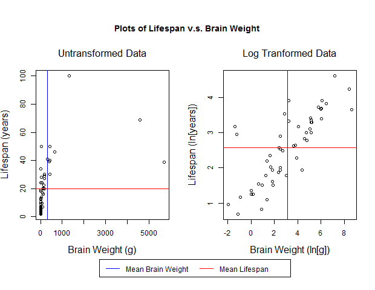
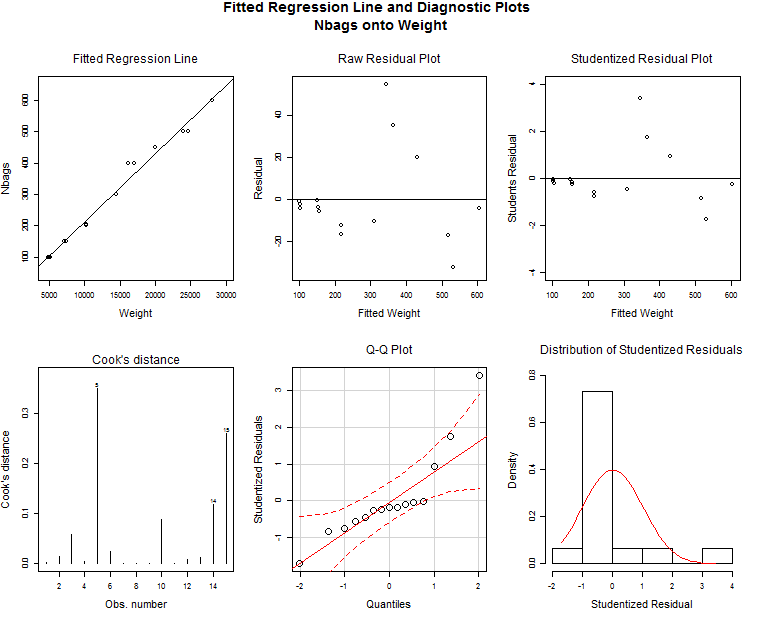
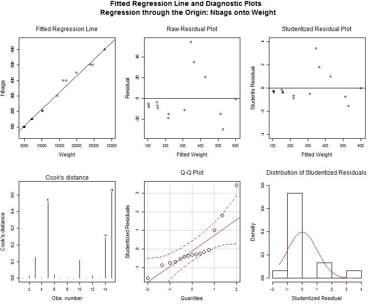
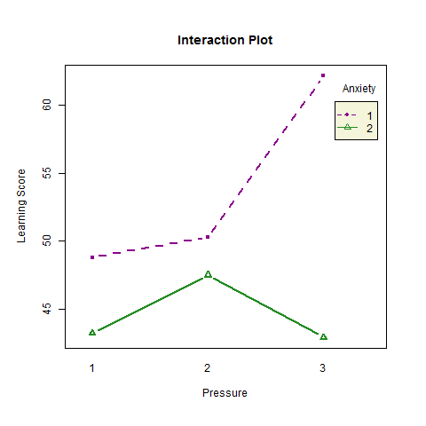
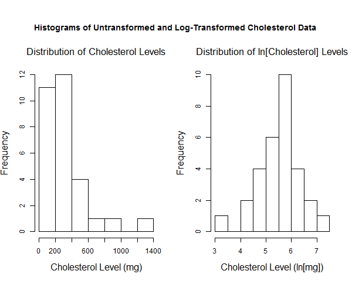
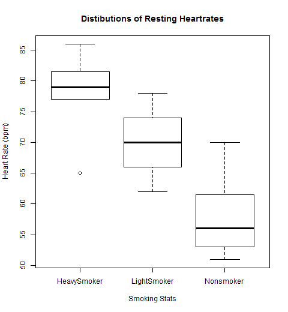
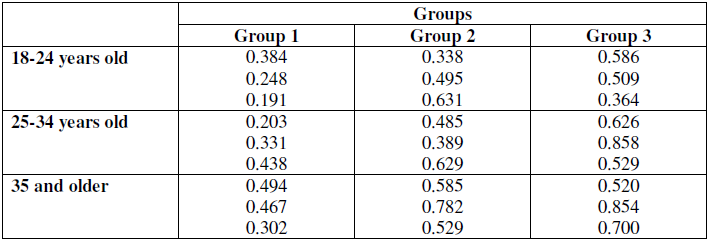
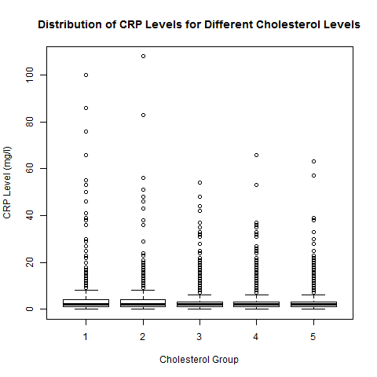

# Responses

  The full R code for each response is given in the [appendix](#appendix). To run the codes effectively the proper data files must be in a subfolder of the working director called "data" and there must also be a subfolder in the working director called "images" to which plots can be saved and opened from.


<br>

## Question 1

  See appendix [A1](#a1) for full R code.

> Use the “sleep.txt” data to answer the following questions.
A description of this data is given bellow.
>
> Species: species of animal
>
> BodyWgt: body weight in kg
>
> BrainWgt: brain weight in g
>
> Sleep: total sleep (hrs/day) (sum of slow wave and paradoxical sleep): slow wave is "nondreaming") sleep and paradoxical is "dreaming" sleep
>
> LifeSpan: maximum life span (years)
>
> The Species column should be used as row names.  
>
>
> a. Construct histograms of each variable.
> b. The strong asymmetry for all variables except Sleep indicates that a log transformation is
appropriate for those variables. Construct a new data frame that contains Sleep, replaces
BodyWgt, BrainWgt, LifeSpan by their log-transformed values, and then construct
histograms of each variable in this new data frame with all of them on the same graphics
page.
> c. Plot LifeSpan versus BrainWgt with LifeSpan on the y-axis and include an informative
title. Repeat using the log-transformed variables instead. Superimpose lines corresponding to
the respective means of the variables for each plot.
> d. Obtain and interpret the correlation between LifeSpan and BrainWgt. Repeat for
log(LifeSpan) and log(BrainWgt).
> e. Obtain the fitted regression line to predict LifeSpan based on BrainWgt. Check assumptions
with appropriate residual plots. Repeat to predict log(LifeSpan) based on log(BrainWgt).
Predict LifeSpan of Homo sapiens based on each of these regression lines. Which would you
expect to have the best overall accuracy? Which prediction is closest to the actual LifeSpan
of Homo sapiens?

```{r, include=F}
## Import data

qdata <- data.frame(read.table("data/sleep.txt", header = T, sep = ""))

rownames(qdata) <- qdata$Species

qdata <- qdata[,2:5]

```

<br>

### Part A

  The figure below shows the histograms for each variable in our raw data-set.

```{r, include=FALSE}

## Part A
png("images/q1_histograms_a.png",
    height = 620, width = 600)

par(mfrow = c(2,2), oma = c(0,0,4,0))

hist(qdata$BodyWgt, 
     main = "Distribution of Body Weight",
     xlab = "Body Weight (kg)",
     ylab = "Frequency",
     cex.lab = 1.3, cex.main = 1.4, font.main = 1)

hist(qdata$BrainWgt,
     main = "Distribution of Brain Weight",
     xlab = "Brain Weight (g)",
     ylab = "Frequency",
     cex.lab = 1.3, cex.main = 1.4, font.main = 1)

hist(qdata$Sleep,
     main = "Distibution of Amount of Sleep",
     xlab = "Sleep (hours/day)",
     ylab = "Frequency",
     cex.lab = 1.3, cex.main = 1.4, font.main = 1)

hist(qdata$LifeSpan,
     main = "Distribution of Lifespan",
     xlab = "Lifespan (years)",
     ylab = "Frequency",
     cex.lab = 1.3, cex.main = 1.4, font.main = 1)

mtext(text = "Histograms of the Observed Distributions of: \n Body Weight, Brain Weight, Sleep, and Lifespan for different Species",
      outer = T,
      padj = -.25,
      cex = 1.2, font = 2)

dev.off()

```


<br>
<br>

### Part B

  A new dataframe was created using the log-transformations of the *Weight*, *Brain Weight*, and *Lifespan* variables and the untransformed *Sleep* variable. The histograms for the variables of this new data frame are shown in figure Q1B.
  
```{r, include=FALSE}

## Part B
lqdata <- qdata

lqdata$BodyWgt <- log(lqdata$BodyWgt)
lqdata$BrainWgt <- log(lqdata$BrainWgt)
lqdata$LifeSpan <- log(lqdata$LifeSpan)

png("images/q1_histograms_b.png",
    height = 620, width = 600)

par(mfrow = c(2,2), oma = c(0,0,4,0))

hist(lqdata$BodyWgt, 
     main = "Distribution of the Natural Log of Body Weight",
     xlab = "Body Weight (ln[kg])",
     ylab = "Frequency",
     cex.lab = 1.3, cex.main = 1.4, font.main = 1)

hist(lqdata$BrainWgt,
     main = "Distribution of the Natural Log of Brain Weight",
     xlab = "Brain Weight (ln[g])",
     ylab = "Frequency",
     cex.lab = 1.3, cex.main = 1.4, font.main = 1)

hist(lqdata$Sleep,
     main = "Distibution of Amount of Sleep",
     xlab = "Sleep (hours/day)",
     ylab = "Frequency",
     cex.lab = 1.3, cex.main = 1.4, font.main = 1)

hist(lqdata$LifeSpan,
     main = "Distribution of the Natural Log of Lifespan",
     xlab = "Lifespan (ln[years])",
     ylab = "Frequency",
     cex.lab = 1.3, cex.main = 1.4, font.main = 1)

mtext(text = "Histograms of the Observed Distributions of: \n ln(Body Weight), ln(Brain Weight), Sleep, and ln(Lifespan) for different Species",
      outer = T,
      padj = -.25,
      cex = 1.2, font = 2)

dev.off()

```


<br>
<br>

### Part C

  Figure Q1C shows the plots of *Lifespan* v.s. *Brain Weight* for both the untransformed data and the log transformed data.

```{r, include = F}

## Part C
png("images/life_vs_brain.png",
    height = 480, width = 620)

par(mfrow = c(1,2), oma = c(3,0,4,0))

plot(qdata$BrainWgt, qdata$LifeSpan,
     main = "Untransformed Data",
     xlab = "Brain Weight (g)",
     ylab = "Lifespan (years)",
     cex.lab = 1.3, cex.main = 1.4, font.main = 1)
abline(v = mean(qdata$BrainWgt), col = "blue", lwd = 1.5)
abline(h = mean(qdata$LifeSpan), col = "red", lwd = 1)

plot(lqdata$BrainWgt, lqdata$LifeSpan,
     main = "Log Tranformed Data",
     xlab = "Brain Weight (ln[g])",
     ylab = "Lifespan (ln[years])",
     cex.lab = 1.3, cex.main = 1.4, font.main = 1)
abline(v = mean(lqdata$BrainWgt), col = "blue", lwd = 1.5)
abline(h = mean(lqdata$LifeSpan), col = "red", lwd = 1)

legend(-13, -.6,
       legend = c("Mean Brain Weight   ", "Mean Lifespan"),
       lty = 1,
       col = c("blue", "red"), xpd = NA, horiz = T)

mtext(text = "Plots of Lifespan v.s. Brain Weight",
      outer = T,
      padj = -0.25,
      cex = 1.2, font = 2)

dev.off()

```




<br>
<br>

### Part D

  An estimate *r* of the true correlation $\rho$ between two variables is calculated using the following formula:
  
  $$ r = \frac{ \sum{(X_i - \bar{X})*(Y_i - \bar{Y})} } { \sqrt{\sum{(X_i - \bar{X})^2}*\sum{(Y_i - \bar{Y})^2}} } $$

  Instead of doing this by hand we used the built in R function "cor()" which takes two vectors as arguments, one for each variable. Table Q1D reports the observed correlation between *Lifespan* and *Brain Weight* for both the untransformed and log-transformed data.
  
***

```{r, echo=F, results="asis"}
## Part D
library(pander)
panderOptions("table.caption.prefix", "")

x <- data.frame("Correlation" = c(cor(qdata$BrainWgt, qdata$LifeSpan), cor(lqdata$BrainWgt, lqdata$LifeSpan)))
rownames(x) <- c("Untransformed", "Log-Transformed")

pandoc.table(x,
             caption = "**Table Q1D:** The observed correlation between lifespan and brain weight for both the untransformed and log-transformed data. Notice that the correlation for the log-transformed data is quite a bit higher than that for the untransformed data.",
             split.table = Inf)

```

***

<br>
<br>

### Part E

  Figure Q1E.1 shows the plot of the fitted regression line for the regression of *Lifespan* onto *Brain Weight* for the untransformed data along with several residual plots. From the residual plots we can see that the residuals are not uniformly scattered. Additionally from the Q-Q plot of the studentized residuals and the histogram of the studentized residuals it appears that they are *not* uniformly distributed. Thus, one of the key assumptions of the linear regression model -- that the errors are uniformly distributed with a mean of 0 and constant variance -- does not appear valid.

```{r, include=F}
## Part E

library(MASS)
library(car)

png("images/q1_ufit.png",
    height = 620, width = 760)

par(mfrow = c(2,3), oma = c(0,0,4,0))

fit <- lm(LifeSpan~BrainWgt, data = qdata)

plot(qdata$BrainWgt, qdata$LifeSpan,
     main = "Fitted Regression Line",
     xlab = "Brain Weight (g)",
     ylab = "Lifespan (years)",
     xlim = c(0, 5750),
     ylim = c(0, 110),
     cex.lab = 1.4, cex.main = 1.5, font.main = 1)
abline(fit$coefficients[1], fit$coefficients[2])

plot(fit$fitted.values, fit$residuals,
     main = "Raw Residual Plot",
     xlab = "Fitted Lifespan Value (years)",
     ylab = "Residual",
     xlim = c(15, 75),
     ylim = c(-35, 75),
     cex.lab = 1.4, cex.main = 1.5, font.main = 1)
abline(h = 0)

plot(fit$fitted.values, studres(fit),
     main = "Studentized Residual Plot",
     xlab = "Fitted Lifespan Value (years)",
     ylab = "Students Residual",
     xlim = c(15, 75),
     ylim = c(-6, 6),
     cex.lab = 1.4, cex.main = 1.5, font.main = 1)
abline(h = 0)

cutoff <- 4/((nrow(qdata)-length(fit$coefficients)-2)) 
plot(fit, which=4, cook.levels=cutoff,
     cex.lab = 1.4, sub = NA)

par(cex.lab = 1.4, cex.main = 1.5, font.main = 1)

qqPlot(fit, simulate = F,
       main = "Q-Q Plot",
       xlab = "Quantiles",
       ylab = "Studentized Residuals",
       grid = F, lwd = 1.5, cex = 2)

hist(studres(fit) , freq=FALSE, 
   main="Distribution of Studentized Residuals",
   xlab = "Studentized Residual",
   ylim = c(0,0.6),
   cex.lab = 1.4, cex.main = 1.5, font.main = 1)

xfit<-seq(min(studres(fit)),max(studres(fit)),length=40) 
yfit<-dnorm(xfit) 
lines(xfit, yfit, col = "red")


mtext(text = "Fitted Regression Line and Diagnostic Plots \n Regression of Lifespan onto Brain Weight: Untransformed Data",
      outer = T,
      padj = -0.25,
      cex = 1.2, font = 2)

dev.off()

```


![**Figure Q1E.1:** The top-left plot shows the fitted regression line and the observed data points for the regression of untransformed *Lifespan* onto *Brain Weight*. The other plots are residual analysis. From the raw residual and studentized residual plots we can clearly see that the resiudals are *not* uniformly scattered. The Cook's distance plot shows that we have some very significant outliers. In the Q-Q plot for the studentized residuals we can see that at the upper and lower tails there appear to be significant departures from normality. The histogram of the distribution of the studentized residuals show that they are skewed to the right.](images/q1_ufit.png)

<br>

  Figure Q1E.2 shows the plot of the fitted regression for the regression of the log transformed *Lifespan* and *Brain Weight* data along with several residual plots. The fit for this regression appears much better than the fit for the untransformed data (see figure Q1E.1). While the raw and studentized residuals are still not perfectly uniformly scattered, their scatter is more uniform than that for the untransformed data and there does not appear to be any obvious pattern. There are still some large outliers, as emphasized by the Cook's distance plot, but the outliers are less extreme than those observed in the regression model for the untransformed data. The histogram of the studentized residuals shows that they are still right skewed, but much less so than for the untransformed data. The Q-Q plot shows at the upper-tail that their is still some departure from normality, but overall the plot looks better than that for the untransformed data.
  
```{r, include=F}

png("images/q1_lfit.png",
    height = 620, width = 760)

par(mfrow = c(2,3), oma = c(0,0,4,0))

lfit <- lm(LifeSpan~BrainWgt, data = lqdata)

plot(lqdata$BrainWgt, lqdata$LifeSpan,
     main = "Fitted Regression Line",
     xlab = "Brain Weight (log[g])",
     ylab = "Lifespan (log[years])",
     xlim = c(-2, 10),
     ylim = c(0, 5),
     cex.lab = 1.4, cex.main = 1.5, font.main = 1)
abline(lfit$coefficients[1], lfit$coefficients[2])

plot(lfit$fitted.values, lfit$residuals,
     main = "Raw Residual Plot",
     xlab = "Fitted Lifespan Value (log[years])",
     ylab = "Residual",
     xlim = c(0, 5),
     ylim = c(-2, 2),
     cex.lab = 1.4, cex.main = 1.5, font.main = 1)
abline(h = 0)

plot(lfit$fitted.values, studres(lfit),
     main = "Studentized Residual Plot",
     xlab = "Fitted Value",
     ylab = "Students Residual",
     xlim = c(0, 5),
     ylim = c(-2, 4),
     cex.lab = 1.4, cex.main = 1.5, font.main = 1)
abline(h = 0)

cutoff <- 4/((nrow(lqdata)-length(lfit$coefficients)-2)) 
plot(lfit, which=4, cook.levels=cutoff,
     cex.lab = 1.4, sub = NA)

par(cex.lab = 1.4, cex.main = 1.5, font.main = 1)

qqPlot(lfit, simulate = F,
       main = "Q-Q Plot",
       xlab = "Quantiles",
       ylab = "Studentized Residuals",
       grid = F, lwd = 1.5, cex = 2)

hist(studres(lfit) , freq=FALSE, 
   main="Distribution of Studentized Residuals",
   xlab = "Studentized Residual",
   ylim = c(0,0.5),
   cex.lab = 1.4, cex.main = 1.5, font.main = 1)

xfit<-seq(min(studres(lfit)),max(studres(lfit)),length=40) 
yfit<-dnorm(xfit) 
lines(xfit, yfit, col = "red")


mtext(text = "Fitted Regression Line and Diagnostic Plots \n Regression of Lifespan onto Brain Weight: Untransformed Data",
      outer = T,
      padj = -0.25,
      cex = 1.2, font = 2)

dev.off()

```


![**Figure Q1E.2:** The top-left plot shows the fitted regression line and the observed data points for the regression of log-transformed *Lifespan* onto *Brain Weight*. The other plots are residual analysis. From the raw residual and studentized residual plots we can clearly see that the resiudals are more uniformly scattered than for the untransformed data, but still not perfectly so. The Cook's distance plot shows that we still have some very significant outliers, but they are less extreme than for the untransformed data. In the Q-Q plot for the studentized residuals we can see that at the upper tail there are still significant departures from normality, but not for the lower tail (as opposed to what we saw for the untransformed data). The histogram of the studentized residuals shows that their distribution is still somewhat skewed to the right, but much less so than for the unstransformed data.](images/q1_ufit.png)

<br>

  From figures Q1E.1 and Q1E.2 I would expect the model built from the log-transformed data to have the best overally accuracy. Although it is far from perfect, the residual diagnostics show that it is much better than the model built from the raw data.

  Figure Q2E.3 shows the plots of the fitted regression lines for both models (though in this case the log-transformed model has been transformed back from to non-log form) with the predicted *mean* life-span (or *expected* lifespan) for humans and the 95% confidence interval for this estimation. Note that we are predicting the *expected* lifespan for humans based on the model, and not the lifespan of a *specific* person. If we were predicting the lifespan for a *specific* person the 95% confidence interval would be larger. Table Q1E reports the expected human lifespan estimates for each model as well as the actual average lifespan for humans. From the table and figure it is clear that the estimates are far off from the actual expected lifespan for humans, but the estimate using the log-transformed model is the closest.

```{r, include=F}
nd <- data.frame(BodyWgt = rep(0,121), BrainWgt = seq(-2, 10, by = .1), Sleep = rep(0,121), LifeSpan = rep(0,121))
x <- seq(-2, 10, by = .1)

png("images/q1_pred.png",
    height = 480, width = 620)

par(mfrow = c(1,2), oma = c(0,0,4,1))

pL <- as.numeric(exp(predict(lfit, newdata = nd)))
pU <- as.numeric(predict(fit, newdata = exp(nd)))

plot(exp(x), pL, type = "l",
     main = "Regression Model for Transformed Data",
     xlab = "Brain Weight (g)",
     ylab = "Lifespan (years)",
     xlim = c(0,1500),
     ylim = c(0, 110),
     cex.lab = 1, cex.main = 1, font.main = 1)

hL <- exp(predict(lfit, lqdata["Homo sapiens",], interval = "c"))

points(qdata["Homo sapiens",2], qdata["Homo sapiens",4])
text(qdata["Homo sapiens",2] - 300, qdata["Homo sapiens",4] + 5,labels = "Homo sapiens", cex = .8)

points(qdata["Homo sapiens",2], hL[1], pch = 20, col = "red")
segments(qdata["Homo sapiens",2], hL[2], qdata["Homo sapiens",2], hL[3])
arrows(qdata["Homo sapiens",2], hL[2], qdata["Homo sapiens",2], hL[3], angle = 90, length = .1)
arrows(qdata["Homo sapiens",2], hL[3], qdata["Homo sapiens",2], hL[2], angle = 90, length = .1)


plot(exp(x), pU, type = "l",
     main = "Regression Model for Raw Data",
     xlab = "Brain Weight (g)",
     ylab = "Lifespan (years)",
     xlim = c(0,1500),
     ylim = c(0, 110),
     cex.lab = 1, cex.main = 1, font.main = 1)

hU <- predict(fit, qdata["Homo sapiens",], interval = "c")

points(qdata["Homo sapiens",2], qdata["Homo sapiens",4])
text(qdata["Homo sapiens",2] - 300, qdata["Homo sapiens",4] + 5,labels = "Homo sapiens", cex = .8)

points(qdata["Homo sapiens",2], hU[1], pch = 20, col = "red")
segments(qdata["Homo sapiens",2], hU[2], qdata["Homo sapiens",2], hU[3])
arrows(qdata["Homo sapiens",2], hU[2], qdata["Homo sapiens",2], hU[3], angle = 90, length = .1)
arrows(qdata["Homo sapiens",2], hU[3], qdata["Homo sapiens",2], hU[2], angle = 90, length = .1)

mtext(text = "95% Confidence Intervals for Predicted Expected Lifespan for Homo sapiens",
      outer = T,
      padj = -0.25,
      cex = 1.3,
      font = 2)

dev.off()

```


<br>

***

```{r, echo=F, results="asis"}

x <- data.frame("LP" = c(hU[1], hL[1], qdata["Homo sapiens",2]))
colnames(x) <- "Lifespan (years)"
rownames(x) <- c("Estimate from Untransformed Model", "Estimate from Log-Transformed Model", "Actual Average")

pandoc.table(x,
            caption = "**Table Q1E:** The estimated expected lifespan for each model and the actual average human lifespan.",
            split.table = Inf)

```

***

  The 

<br>
<br>

## Question 2

  See appendix [A2](#a2) for full R code.

> The amount of water used by a production plant varies from month to month. Observations
on water usage and a few other, possibly related, variables were collected for 17 months
“water.txt”. The explanatory variables are the average monthly temperature, amount of
production, number of operating days in the month, number of people on the monthly plant
payroll and the number of hours the plant was shut down for maintenance. The response
variable is the monthly water usage (in gallons/100) “USAGE”. Determine an appropriate
model for predicting water usage using any or all of the 5 possible explanatory variables.
Keep in mind that the production plant is interested in developing the most parsimonious
model that is still able to efficiently predict water usage.

<br>

```{r, include=F}
## Import Data
q2data <- data.frame(read.table("data/water.txt", header = T, sep = ""))

```


  The first model I will fit is the full mode,l containing all 5 explanatory variables and all 10 first order interaction terms. This gives a total of 16 parameters and the size of our data-set is only 17 so we know in advance this model will be significantly overfit. However, I would like to start with the semi-full model (we don't have enough observations to fit a model with higher interaction terms, there are a total of 26 interaction terms but including them all would mean we would be fitting a model with more parameters than we have observations in our data set). See below:

  
```{r}
fit.full <- lm(USAGE ~ TEMP + PROD + DAYS + PAYR + HOUR +
                 TEMP:PROD + TEMP:DAYS + TEMP:PAYR + TEMP:HOUR + PROD:DAYS + 
                 PROD:PAYR + PROD:HOUR + DAYS:PAYR + DAYS:HOUR + PAYR:HOUR,
               data = q2data)
summary(fit.full)
```


  The model above definitely contains to0 many parameters, the first thing we will do is use an F-test to determine if any of the interaction coefficients are significant. To do this I will fit another model including with no interaction terms and use the R function "anova()" to perform and F-test comparing the full model (with interaction terms) to the reduced model (no interaction terms). The null hypothesis of this test is that the interaction terms contain no useful information for predicting mean water usage, or in mathematical terms, that their slope coefficients are zero. The alternative hypothesis is that at least one of the interaction terms includes useful information for predicting mean water usage, or in mathematical terms that at least one of the slope coefficients is non-zero.
  
***
  
```{r, echo=F, results="asis"}

fit.full.noInt <- lm(USAGE ~ TEMP + PROD + DAYS + PAYR + HOUR, data = q2data)
a <- anova(fit.full.noInt, fit.full)

x <- data.frame(f = a$F[2], numdf <- a$Df[2], dendf <- a$Res.Df[2], p <- a$`Pr(>F)`[2])
colnames(x) <- c("Observed F-Statistic", "Numerator Degrees of Freedom", "Denominator Degrees of Freedom", "P-value")

pandoc.table(x,
             caption = "**Table Q21:** The results of the F-test comparing the model without interaction terms to the model including interaction terms.",
             split.table = Inf)

```
  
***

  Table Q21 reports the results of the F-test comparing the model without interaction terms to the model with interaction terms. The null hypothesis for this test is that the interaction terms include no significant additional information for predicting mean water usage. Since the p-value is large (0.76 >> 0.05) we can safely accept the null hypothesis that the interaction terms do not include any useful additional information for predicting mean water usage.
  
  Table Q22 shows gives the cestimated value, 95% confidence interval, and p-value for each coefficient of the model containing all five explanatory variables. Except for *PRD*, the p-values for all slope coefficients are greater than 0.05 indicating that they are likely to not provide any useful information for predicting mean water usage. However, note that -- in addition to the 95% confidence interval for *PROD* -- the 95% confidence interval for the slope parameter for *PAYR* does not include zero, indicating that this variable may include useful information in predictin mean water usage.
  
***
  
```{r, echo=F, results="asis"}

sf <- summary(fit.full.noInt)

x <- data.frame(E = c(sf$coefficients[1,1], sf$coefficients[2,1], 
                      sf$coefficients[3,1], sf$coefficients[4,1], 
                      sf$coefficients[5,1], sf$coefficients[6,1] ),
                LB = c(sf$coefficients[1,1] - 1.96*sf$coefficients[1,2], 
                       sf$coefficients[2,1] - 1.96*sf$coefficients[2,2], 
                       sf$coefficients[3,1] - 1.96*sf$coefficients[3,2], 
                       sf$coefficients[4,1] - 1.96*sf$coefficients[4,2], 
                       sf$coefficients[5,1] - 1.96*sf$coefficients[5,2], 
                       sf$coefficients[6,1] - 1.96*sf$coefficients[6,2] ),
                UB = c(sf$coefficients[1,1] + 1.96*sf$coefficients[1,2], 
                       sf$coefficients[2,1] + 1.96*sf$coefficients[2,2], 
                       sf$coefficients[3,1] + 1.96*sf$coefficients[3,2], 
                       sf$coefficients[4,1] + 1.96*sf$coefficients[4,2], 
                       sf$coefficients[5,1] + 1.96*sf$coefficients[5,2], 
                       sf$coefficients[6,1] + 1.96*sf$coefficients[6,2] ),
                pv = c(sf$coefficients[1,4], sf$coefficients[2,4],
                       sf$coefficients[3,4], sf$coefficients[4,4],
                       sf$coefficients[5,4], sf$coefficients[6,4]))

colnames(x) <- c("Estimate", "Lower Bound", "Upper Bound", "P-value")
rownames(x) <- c("Intercept", "TEMP", "PROD", "DAYS", "PAYR", "HOUR")

pandoc.table(x,
             caption = "**Table Q22:** The point estimates, 95% confidence intervals, and p-values for the coefficients of the linear regression model for mean water usage including all five explanatory variables.",
             split.table = Inf)

```
  
***

  I will now fit a model containing only *PROD* and *PAYR* as predictor variables for mean water usage. I will use an F-test to compare this reduced model with only two explanatory variables to the more full model with all 5 explanatory variables to determine if the three removed variables (*TEMP*, *DAYS*, and *HOUR*) contain any useful information for predicting mean water usage. The null hypothesis of this test is that the explanatory variables *TEMP*, *DAYS*, and *HOUR* contain no useful information for predicting mean water usage, or in mathematical terms, that their slope coefficients are zero. The alternative hypothesis is that at least one of the explanatory variables *TEMP*, *DAYS*, and *HOUR* includes useful information for predicting mean water usage, or in mathematical terms that at least one of the slope coefficients is non-zero. The results of this test are given in table Q23.
  
***
  
```{r, echo=F, results="asis"}

fit.red2 <- lm(USAGE ~ PROD + PAYR, data = q2data)
a <- anova(fit.red2, fit.full.noInt)

x <- data.frame(f = a$F[2], numdf <- a$Df[2], dendf <- a$Res.Df[2], p <- a$`Pr(>F)`[2])
colnames(x) <- c("Observed F-Statistic", "Numerator Degrees of Freedom", "Denominator Degrees of Freedom", "P-value")

pandoc.table(x,
             caption = "**Table Q23:** The results of the F-test comparing the model with only *PROD* and *PAYR* as predictor variables to the model including all five explanatory variables.",
             split.table = Inf)

```
  
***

  The large p-value (0.56 >> 0.05) reported in table Q23 indicates that we fail to reject our null hypothesis and thus conclude that there is no evidence that the explanatory variables *TEMP*, *DAYS*, and *HOUR* contain useful information for predicting mean water usage.
  
   Table Q24 shows gives the cestimated value, 95% confidence interval, and p-value for each coefficient of the model containing *PROD* and *PAYR* as predictor variables for mean water usage. Note that the p-value of each parameter is less than 0.05 and that none of the 95% confidence intervals contain 0. This indicates that at a 5% significane level, all three parameters appear significant.

***
  
```{r, echo=F, results="asis"}

sf <- summary(fit.red2)

x <- data.frame(E = c(sf$coefficients[1,1], sf$coefficients[2,1], sf$coefficients[3,1] ),
                LB = c(sf$coefficients[1,1] - 1.96*sf$coefficients[1,2], 
                       sf$coefficients[2,1] - 1.96*sf$coefficients[2,2], 
                       sf$coefficients[3,1] - 1.96*sf$coefficients[3,2]),
                UB = c(sf$coefficients[1,1] + 1.96*sf$coefficients[1,2], 
                       sf$coefficients[2,1] + 1.96*sf$coefficients[2,2], 
                       sf$coefficients[3,1] + 1.96*sf$coefficients[3,2]),
                pv = c(sf$coefficients[1,4], sf$coefficients[2,4], sf$coefficients[3,4]))

colnames(x) <- c("Estimate", "Lower Bound", "Upper Bound", "P-value")
rownames(x) <- c("Intercept", "PROD", "PAYR")

pandoc.table(x,
             caption = "**Table Q24:** The point estimates, 95% confidence intervals, and p-values for the coefficients of the linear regression model for mean water usage using *PROD* and *PAYR* as predictor variables.",
             split.table = Inf)

```
  
***

  The last thing I will do is compare the Schwarz criterion (or BIC) the above model containing both *PROD* and *PAYR* and models containing only *PROD* and only *PAYR*. The BIC judges a model on it's fit, but also penelizes models for having more parameters, thus trying to prevent overfit and helping to find the most parsimonious model, The lower the BIC value the better. Table Q25 reports the observed BIC values for each model.

***
  
```{r, echo=F, results="asis"}

b <- BIC(fit.red2,
         lm(USAGE ~ PROD, data = q2data),
         lm(USAGE ~ PAYR, data = q2data))

x <- data.frame(B = c(b[1,2], b[2,2], b[3,2])
                )

colnames(x) <- c("BIC")
rownames(x) <- c("PROD and PAYR", "PROD", "PAYR")

pandoc.table(x,
             caption = "**Table Q25:** The BIC values for the three different models.",
             split.table = Inf)


```
  
***
   
  Since the model containing both *PROD* and *PAYR* as predictor variables for mean water usage has the lowest BIC value we will accept it as the best model for predicting mean water usage. This model is relatively simple since it only includes two predictor variables.


<br>
<br>

## Question 3

  See appendix [A3](#a3) for full R code.
  
> Use the flour dataset “flour.txt” to do these problems:
>
> a. Create and print a SAS dataset or R dataframe named Flour.
> b. Use SAS or R to find the simple linear regression model for predicting NBags from
Weight.
> c. Include the relevant output in your Word file.
> d. Use SAS or R to compute the means and standard deviations for Weight and NBags.
> e. For the simple linear regression model, create the residual and normal plots.
> f. Use SAS or R to find the regression through the origin model for predicting NBags from
Weight.
> g. For the regression through the origin model, create the residual and normal plots.

### Part A

```{r}
## Part A
qdata <- data.frame(read.table("data/flour.txt", header = T, sep = ""))
colnames(qdata) <- c("weight", "nbags")

qdata
```

<br>
<br>

### Parts B and C

  The output below is the summary of the linear regression model fit using the "lm()" function in R. The p-value of 0.629 for the intercept coefficient indicates that it is not significantly non-zero.

```{r}

## Parts B and C
fit <- lm(nbags~weight, data = qdata)

summary(fit)

```


<br>
<br>

### Part D

  Table Q3D reports the means and standard deviations of *Weight* and *Nbags*.

***

```{r, echo=F, results="asis"}

## Part D

x <- data.frame(M = c(mean(qdata$weight), mean(qdata$nbags)), S = c( sqrt(var(qdata$weight)), sqrt(var(qdata$nbags)) ))
colnames(x) <- c("Mean", "Standard Deviation")
rownames(x) <- c("Weight", "Nbags")

pandoc.table(x,
             caption = "**Table Q3D:** The means and standard deviations of *Weight* and *Nbags*.",
             split.table = Inf)

```

***

<br>
<br>

### Part E

  Figure Q3E shows the residual and normal plots for the simpler linear regression model of *Nbags* regressed on *Weight* as well as the fitted regression line and observed data points.

```{r, include = F}

## Part E

png("images/q3_fit.png",
    height = 620, width = 760)

par(mfrow = c(2,3), oma = c(0,0,4,0))

plot(qdata$weight, qdata$nbags,
     main = "Fitted Regression Line",
     xlab = "Weight",
     ylab = "Nbags",
     xlim = c(4500, 30000),
     ylim = c(50, 650),
     cex.lab = 1.4, cex.main = 1.5, font.main = 1)
abline(fit$coefficients[1], fit$coefficients[2])

plot(fit$fitted.values, fit$residuals,
     main = "Raw Residual Plot",
     xlab = "Fitted Weight",
     ylab = "Residual",
     xlim = c(100, 605),
     ylim = c(-35, 55),
     cex.lab = 1.4, cex.main = 1.5, font.main = 1)
abline(h = 0)

plot(fit$fitted.values, studres(fit),
     main = "Studentized Residual Plot",
     xlab = "Fitted Weight",
     ylab = "Students Residual",
     xlim = c(100, 605),
     ylim = c(-4, 4),
     cex.lab = 1.4, cex.main = 1.5, font.main = 1)
abline(h = 0)

cutoff <- 4/((nrow(qdata)-length(fit$coefficients)-2)) 
plot(fit, which=4, cook.levels=cutoff,
     cex.lab = 1.4, sub = NA)

par(cex.lab = 1.4, cex.main = 1.5, font.main = 1)

qqPlot(fit, simulate = F,
       main = "Q-Q Plot",
       xlab = "Quantiles",
       ylab = "Studentized Residuals",
       grid = F, lwd = 1.5, cex = 2)

hist(studres(fit) , freq=FALSE, 
   main="Distribution of Studentized Residuals",
   xlab = "Studentized Residual",
   ylim = c(0,0.8),
   cex.lab = 1.4, cex.main = 1.5, font.main = 1)

xfit<-seq(min(studres(fit)),max(studres(fit)),length=40) 
yfit<-dnorm(xfit) 
lines(xfit, yfit, col = "red")


mtext(text = "Fitted Regression Line and Diagnostic Plots \n Nbags onto Weight",
      outer = T,
      padj = -0.25,
      cex = 1.2, font = 2)

dev.off()

```



<br>
<br>

### Part F

  The output below is the summary of the linear regression model through the origin of *Nbags* regressed on *Weight*. In the previous model, which included a y-intercept of approximately -5.86, the estimated slope coefficient for *Weight* was 0.0218. In the model through the origin the slope coefficient is slightly smaller, approximately 0.0215.

```{r}

## Part F
fito <- lm(nbags~0 + weight, data = qdata)

summary(fito)

```

<br>
<br>

### Part G

  Figure Q3G shows the residual and normal plots for the simpler linear regression model **passing through the origin** of *Nbags* regressed on *Weight* as well as the fitted regression line and observed data points.

```{r, include = F}

## Part G

png("images/q3_fito.png",
    height = 620, width = 760)

par(mfrow = c(2,3), oma = c(0,0,4,0))

plot(qdata$weight, qdata$nbags,
     main = "Fitted Regression Line",
     xlab = "Weight",
     ylab = "Nbags",
     xlim = c(4500, 30000),
     ylim = c(50, 650),
     cex.lab = 1.4, cex.main = 1.5, font.main = 1)
abline(0, fito$coefficients[1])

plot(fito$fitted.values, fito$residuals,
     main = "Raw Residual Plot",
     xlab = "Fitted Weight",
     ylab = "Residual",
     xlim = c(100, 605),
     ylim = c(-35, 55),
     cex.lab = 1.4, cex.main = 1.5, font.main = 1)
abline(h = 0)

plot(fito$fitted.values, studres(fito),
     main = "Studentized Residual Plot",
     xlab = "Fitted Weight",
     ylab = "Students Residual",
     xlim = c(100, 605),
     ylim = c(-4, 4),
     cex.lab = 1.4, cex.main = 1.5, font.main = 1)
abline(h = 0)

cutoff <- 4/((nrow(qdata)-length(fito$coefficients)-2)) 
plot(fito, which=4, cook.levels=cutoff,
     cex.lab = 1.4, sub = NA)

par(cex.lab = 1.4, cex.main = 1.5, font.main = 1)

qqPlot(fito, simulate = F,
       main = "Q-Q Plot",
       xlab = "Quantiles",
       ylab = "Studentized Residuals",
       grid = F, lwd = 1.5, cex = 2)

hist(studres(fito) , freq=FALSE, 
   main="Distribution of Studentized Residuals",
   xlab = "Studentized Residual",
   ylim = c(0,0.8),
   cex.lab = 1.4, cex.main = 1.5, font.main = 1)

xfit<-seq(min(studres(fito)),max(studres(fito)),length=40) 
yfit<-dnorm(xfit) 
lines(xfit, yfit, col = "red")


mtext(text = "Fitted Regression Line and Diagnostic Plots \n Regression through the Origin: Nbags onto Weight",
      outer = T,
      padj = -0.25,
      cex = 1.2, font = 2)

dev.off()

```



<br>
<br>

## Question 4

  See appendix [A4](#a4) for full R code.

> The data are from a hypothetical Verbal Learning Experiment in which participants with Low
Anxiety levels and High Anxiety levels are given a verbal learning task “anxiety.txt”. Some
are given instructions to induce little if any pressure. Some are given instructions to induce
moderation pressure to perform well. Others are given instructions to induce strong
pressure to perform well. Assume that all assumptions for Two-Way ANOVA model are
met.
>
> a. Is there a Main Effect of Anxiety. Do high anxious persons perform better or worse than low
anxious?
> b. Is there a Main Effect of Pressure. Overall, do persons under different amounts of pressure
perform this task differently?
> c. Is there an Interaction of Anxiety and Pressure: Do performance differences between anxiety
levels change at different levels of pressure? Or do the effects of different levels of pressure
differ for people with high anxiety vs. low anxiety?

### Part A

  If we assume that low anxiety is coded as *1* in the data set and high anxiety is coded as *2* we can see that anxious persons perform worse. This is because the mean score for high anxiety people (coded as *2*) is lower than the mean score for low anxiety people (coded as *1*). Table Q4A reports the mean test scores for high anxiety and low anxiety people.

***

```{r, echo = F, results="asis"}

## Part A
qdata <- data.frame(read.table("data/anxiety.txt", header = T, sep = ""))
qdata$anxiety <- factor(qdata$anxiety)
qdata$pressure <- factor(qdata$pressure)

x <- data.frame(M = c(mean(qdata$verblearn[qdata$anxiety==1]), mean(qdata$verblearn[qdata$anxiety==2])))
colnames(x) <- "Mean Test Score"
rownames(x) <- c("Low Anxiety", "High Anxiety")

pandoc.table(x,
             caption = "**Table Q4A:** Mean test scores for low anxiety and high anxiety individuals",
             split.table = Inf)

```

***

  We can do a one-way ANOVA test in R using the "aov()" function. The output for this function when looking at the effect of *Anxiety* on the learning scores is shown below. The low p-value (less than 0.01) indicates that there is indeed a non-zero factor effect of *Anxiety* on learning scores. Since the mean scores are higher for low anxiety people and the ANOVA test confirms that there is a difference between high and low anxiety individuals we conclude that low anxiety individuals perform better than high anxiety individuals.

```{r}
fit <- aov(verblearn ~ anxiety, data = qdata)
summary(fit)
```


<br>
<br>

### Part B

  Table Q4B reports the mean learning scores for individuals under low pressure, medium pressure, and high pressure. We are assuming that low pressure is coded as *1* in the data set and high pressure as *3*.

***

```{r, echo = F, results="asis"}

## Part B
x <- data.frame(M = c(mean(qdata$verblearn[qdata$pressure==1]), mean(qdata$verblearn[qdata$pressure==2]), mean(qdata$verblearn[qdata$pressure==3])))
colnames(x) <- "Mean Test Score"
rownames(x) <- c("Low Pressure", "Medium Pressure", "High Pressure")

pandoc.table(x,
             caption = "**Table Q4B:** Mean test scores for individuals under low, medium, and high pressure.",
             split.table = Inf)

```

***

<br>

  Table Q4B shows that the mean scores were higher for individuals under hight pressure. We will use the "aov()" function in R to see if there is actually a significant difference between any of the levels of pressure. Since the p-value is greater than 0.05 we cannot conclude that pressure has a significant effect on performance.
  
```{r}
fit <- aov(verblearn ~ pressure, data = qdata)
summary(fit)
```

<br>
<br>

### Part C

  Table Q4C reports the mean learning scores for low and high anxiety individuals under low pressure, medium pressure, and high pressure.

***

```{r, echo = F, results="asis"}

## Part C
x <- data.frame(L = c(mean(qdata$verblearn[qdata$pressure==1 & qdata$anxiety==1]), 
                      mean(qdata$verblearn[qdata$pressure==1 & qdata$anxiety==2]),
                      mean(qdata$verblearn[qdata$pressure==1])),
                M = c(mean(qdata$verblearn[qdata$pressure==2 & qdata$anxiety==1]), 
                      mean(qdata$verblearn[qdata$pressure==2 & qdata$anxiety==2]),
                      mean(qdata$verblearn[qdata$pressure==2])),
                H = c(mean(qdata$verblearn[qdata$pressure==3 & qdata$anxiety==1]), 
                      mean(qdata$verblearn[qdata$pressure==3 & qdata$anxiety==2]),
                      mean(qdata$verblearn[qdata$pressure==3])),
                A = c(mean(qdata$verblearn[qdata$anxiety==1]), 
                      mean(qdata$verblearn[qdata$anxiety==2]), 
                      mean(qdata$verblearn)))

colnames(x) <- c("Low Pressure", "Medium Pressure", "High Pressure", "Total")
rownames(x) <- c("Low Anxiety", "High Anxiety", "Total")

pandoc.table(x,
             caption = "**Table Q4B:** Mean test scores for high and low anxiety individuals under low, medium, and high pressure.",
             split.table = Inf)

```

***

<br>

  We can also use the R function "aov()" to perform a two-way ANOVA test. Since the p-value of interaction between *Anxiety* and *Pressure* is less than 0.05 we can conclude at a 5% signifcance level that there is an interaction between anxiety and pressure on scores. This means that the effects of different levels of pressure on performance differ between high anxiety and low anxiety individuals, and the effect of anxiety on performance varies at different levels of pressure. 

```{r}
## Part C
fit <- aov(verblearn ~ anxiety*pressure, data = qdata)
summary(fit)
```

  Now that we know there is an interaction between *Anxiety* and *Pressure* we want to see which levels actually differ. To this end we will perform Tukey's Honestly Significant Difference (HSD) test. The output below shows that in addition to there being a differenc between high and low anxiety people (which we alread showed in part A), there are some differences between groups of different *combinations* of anxiety and pressure levels. 
  
  The p-value of ~0.021 for "1:3-1:1" (*Anxiety*:*Pressure*) indicates that there is a significant difference for low anxiety people when under high pressure and low pressure. The "diff" column in the output indicates the estimated difference between the two groups. So low anxiety individuals are estimated to score about 13.4 points better when under high pressure than when under low pressure. However, the 95% confidence interval (lower bound given in column "lwr", upper bound given in column "upr") for the difference is large. The p-value of ~0.00031 for "1:3-2:1" indicates that there is a significant difference between low anxiety people under high pressure and high anxiety people under low pressure. Low anxiety people under high pressure are estimated to score 19 points better (95% CI: 6.9 - 13.1) than high anxiety people under low pressure. The p-value of ~0.0087 for "1:3-2:2" indicates that there is a significant difference in performance between low anxiety people under high pressure and high anxiety people under medium pressure. Low anxiety people under high pressure are estimated to score 14.7 points better (95% CI: 2.6 - 26.8) than high anxiety people under medium pressure. Finally, the p-value of ~0.00024 for "2:3-1:3" indicates that there is a significant difference between low anxiety people under high pressure and high anxiety people under high pressure. High anxiety people under high pressure are estimated to do 19.3 points (95% CI: 7.2 - 31.4) *worse* than low anxiety people under high pressure.

```{r}
TukeyHSD(fit)
```
  

Figure Q4C gives a nice visualization of the interaction effects between *Anxiety* and *Pressure*. The combination of low anxiety and high pressure performs best on the test (this can also be seen from the output of the Tukey's HSD test). The effect of pressure on performance is much greater for low anxiety people than high anxiety people.

```{r, include=F}
png("images/q4_int.png",
    width = 480, height = 480)

par(oma = c(1,1,1,1))

interaction.plot(qdata$pressure, qdata$anxiety, qdata$verblearn,
                 trace.label = "Anxiety",
                 type = "b", col = c("darkmagenta", "forestgreen"),
                 leg.bty = "o", leg.bg = "beige", lwd = 2, pch = c(20, 24),
                 xlab = "Pressure", 
                 ylab = "Learning Score",
                 main = "Interaction Plot")

dev.off()

```



<br>
<br>

## Question 5

  See appendix [A5](#a5) for full R code.
  
> Researchers were interested in determining the relationship between a person’s cholesterol
level and their age and gender. For each of 30 subjects, data was collected on their
cholesterol level (in mg), age group (Under 30, 30-50, Over 50) and gender
“CholesterolLevel.txt”. Fit an appropriate model to the data set. Justify your choice carefully.
Determine whether there is a significant age or gender difference in the mean cholesterol
levels. Also determine whether or not the two factors interact with one another.

  First we loaded the data set and converted the string values for *Age Group* and *Gender* into factors such that:
  
* *Age Group* Levels
    1. Under 30
    2. 30-50
    3. Over 50
* *Gender* Levels
    1. Female
    2. Male
    
```{r, include=F}

q5data <- data.frame(read.delim("data/CholesterolLevel2.txt", header = T, sep = "\t"))
q5data$Age.Group <- factor(q5data$Age.Group, levels = c("Under 30", "30-50", "Over 50"))
q5data$Gender <- factor(q5data$Gender)

```

  
  Since we converted the variables *Age Group* and *Gender* to factors with different levels (three for *Age Group* and two for *Gender*), the linear regression model fitting function "lm()" in R will automatically treat the lowest factor level as the baseline. So the baseline for *Age Group* is "30-50" and the baseline fore *Gender* is female. Fitting a linear regression model (including interaction terms), we find that *Gender* has a significant effect (p-value = 0.05) as well as the interaction between *Gender* and the *Age Group* level of "Over 50" (p-value < 0.05). Except for this interaction, *Age Group* does not have a significant effect on *Cholesterol* level.

<br>

```{r}
fit1 <- lm(Cholesterol ~ Gender + Age.Group + Gender:Age.Group, data = q5data)
summary(fit1)
```

<br>
  
  Since the only level of *Age Group* that seemed to be significant in the above model was the group over 50 (when interacting with *Gender*), we collapsed the *Age Group* levels "Under 30" and "30-50" into one level and fit a model to this data. In this simplified model we find that the same factors and interactions are significant, but now the coefficient for the intercept is also significant (p-value < 0.05) which it was not in the previous model (p-value ~0.08).

```{r}
q5data.2 <- q5data
q5data.2$Age.Group <- as.character(q5data.2$Age.Group)
q5data.2$Age.Group[q5data$Age.Group == "30-50" | q5data$Age.Group == "Under 30"] <- "Under 50"
q5data.2$Age.Group <- factor(q5data.2$Age.Group, levels = c("Under 50", "Over 50"))

fit2 <- lm(Cholesterol ~ Gender + Age.Group + Gender:Age.Group, data = q5data.2)
summary(fit2)

```

<br>

  Figures Q51 and Q52 show the fitted linear regression model, residual plots, and normality plots for the two models. Figure Q51 shows the plots for model including all levels of *Age Group*, while figure Q52 shows the plots for the model with the "Under 30" and "30-50" levels collapsed.

```{r, include=F}

png("images/q5_fit1.png",
    height = 620, width = 760)

par(mfrow = c(2,3), oma = c(0,0,4,0))

plot(as.numeric(q5data$Age.Group[q5data$Gender == "Female"]), q5data$Cholesterol[q5data$Gender == "Female"],
     main = "Fitted Regression Line",
     xlab = "Age Group",
     ylab = "Cholesterol Level (mg)",
     xlim = c(1, 3),
     ylim = c(25, 1275),
     pch = 20, col = "forestgreen",
     axes = F,
     cex.lab = 1.4, cex.main = 1.5, font.main = 1)
points(as.numeric(q5data$Age.Group[q5data$Gender == "Male"]), q5data$Cholesterol[q5data$Gender == "Male"],
       pch = 20, col = "red")
box()
axis(1, labels = c("Under 30", "30 - 50", "Over 50"), at = c(1,2,3), cex = .9)
axis(2, at = (seq(50, 1250, 200)), cex = .9)

nd.m <- data.frame(Age.Group = c("Under 30", "30-50", "Over 50"), Gender = rep("Male", 3), Cholesterol = rep(0,3))
nd.m$Age.Group <- factor(nd.m$Age.Group, levels = c("Under 30", "30-50", "Over 50"))
nd.m$Gender <- factor(nd.m$Gender, levels = c("Female", "Male"))

nd.f <- data.frame(Age.Group = c("Under 30", "30-50", "Over 50"), Gender = rep("Female", 3), Cholesterol = rep(0,3))
nd.f$Age.Group <- factor(nd.f$Age.Group, levels = c("Under 30", "30-50", "Over 50"))
nd.f$Gender <- factor(nd.f$Gender, levels = c("Female", "Male"))

pm <- predict(fit1, newdata = nd.m)
pf <- predict(fit1, newdata = nd.f)

lines(as.numeric(nd.m$Age.Group), pm, col = "red")
lines(as.numeric(nd.f$Age.Group), pf, col = "forestgreen")

legend("topright",
       legend = c("Female", "Male"),
       pch = 20,
       col = c("forestgreen", "red"))

#-------------------------------------------#

plot(fit1$fitted.values, fit1$residuals,
     main = "Raw Residual Plot",
     xlab = "Fitted Cholesterol Level (mg)",
     ylab = "Residual",
     xlim = c(200, 610),
     ylim = c(-375, 650),
     cex.lab = 1.4, cex.main = 1.5, font.main = 1)
abline(h = 0)

#-------------------------------------------#

plot(fit1$fitted.values, studres(fit1),
     main = "Studentized Residual Plot",
     xlab = "Fitted Cholesterol (mg)",
     ylab = "Students Residual",
     xlim = c(200, 610),
     ylim = c(-4, 4),
     cex.lab = 1.4, cex.main = 1.5, font.main = 1)
abline(h = 0)

#-------------------------------------------#

cutoff <- 4/((nrow(q5data)-length(fit1$coefficients)-2)) 
plot(fit1, which=4, cook.levels=cutoff,
     cex.lab = 1.4, sub = NA)

par(cex.lab = 1.4, cex.main = 1.5, font.main = 1)

#-------------------------------------------#

qqPlot(fit1, simulate = F,
       main = "Q-Q Plot",
       xlab = "Quantiles",
       ylab = "Studentized Residuals",
       grid = F, lwd = 1.5, cex = 1)

#-------------------------------------------#

hist(studres(fit1) , freq=FALSE, 
   main="Distribution of Studentized Residuals",
   xlab = "Studentized Residual",
   ylim = c(0,0.5),
   cex.lab = 1.4, cex.main = 1.5, font.main = 1)

xfit<-seq(min(studres(fit1)),max(studres(fit1)),length=40) 
yfit<-dnorm(xfit) 
lines(xfit, yfit, col = "red")


mtext(text = "Fitted Regression Line and Diagnostic Plots \n Regression of Cholesterol Level onto Age Group and Gender",
      outer = T,
      padj = -0.25,
      cex = 1.2, font = 2)

dev.off()


```


<br>

```{r, include=F}

png("images/q5_fit2.png",
    height = 620, width = 760)

par(mfrow = c(2,3), oma = c(0,0,5.5,0))

plot(as.numeric(q5data.2$Age.Group[q5data.2$Gender == "Female"]), q5data.2$Cholesterol[q5data.2$Gender == "Female"],
     main = "Fitted Regression Line",
     xlab = "Age Group",
     ylab = "Cholesterol Level (mg)",
     xlim = c(0.8,2.2),
     ylim = c(25, 1275),
     pch = 20, col = "forestgreen",
     axes = F,
     cex.lab = 1.4, cex.main = 1.5, font.main = 1)
points(as.numeric(q5data.2$Age.Group[q5data.2$Gender == "Male"]), q5data.2$Cholesterol[q5data.2$Gender == "Male"],
       pch = 20, col = "red")
box()
axis(1, labels = c("Under 50", "Over 50"), at = c(1,2), cex = .9)
axis(2, at = (seq(50, 1250, 200)), cex = .9)

nd.m <- data.frame(Age.Group = c("Under 50", "Over 50"), Gender = rep("Male", 2), Cholesterol = rep(0,2))
nd.m$Age.Group <- factor(nd.m$Age.Group, levels = c("Under 50", "Over 50"))
nd.m$Gender <- factor(nd.m$Gender, levels = c("Female", "Male"))

nd.f <- data.frame(Age.Group = c("Under 50", "Over 50"), Gender = rep("Female", 2), Cholesterol = rep(0,2))
nd.f$Age.Group <- factor(nd.f$Age.Group, levels = c("Under 50", "Over 50"))
nd.f$Gender <- factor(nd.f$Gender, levels = c("Female", "Male"))

pm <- predict(fit2, newdata = nd.m)
pf <- predict(fit2, newdata = nd.f)

lines(as.numeric(nd.m$Age.Group), pm, col = "red")
lines(as.numeric(nd.f$Age.Group), pf, col = "forestgreen")

legend("topright",
       legend = c("Female", "Male"),
       pch = 20,
       col = c("forestgreen", "red"))

#-------------------------------------------#

plot(fit2$fitted.values, fit2$residuals,
     main = "Raw Residual Plot",
     xlab = "Fitted Cholesterol Level (mg)",
     ylab = "Residual",
     xlim = c(200, 500),
     ylim = c(-375, 650),
     cex.lab = 1.4, cex.main = 1.5, font.main = 1)
abline(h = 0)

#-------------------------------------------#

plot(fit2$fitted.values, studres(fit2),
     main = "Studentized Residual Plot",
     xlab = "Fitted Cholesterol (mg)",
     ylab = "Students Residual",
     xlim = c(200, 500),
     ylim = c(-4, 4.5),
     cex.lab = 1.4, cex.main = 1.5, font.main = 1)
abline(h = 0)

#-------------------------------------------#

cutoff <- 4/((nrow(q5data.2)-length(fit2$coefficients)-2)) 
plot(fit2, which=4, cook.levels=cutoff,
     cex.lab = 1.4, sub = NA)

par(cex.lab = 1.4, cex.main = 1.5, font.main = 1)

#-------------------------------------------#

qqPlot(fit2, simulate = F,
       main = "Q-Q Plot",
       xlab = "Quantiles",
       ylab = "Studentized Residuals",
       grid = F, lwd = 1.5, cex = 1)

#-------------------------------------------#

hist(studres(fit2) , freq=FALSE, 
   main="Distribution of Studentized Residuals",
   xlab = "Studentized Residual",
   ylim = c(0,0.6),
   cex.lab = 1.4, cex.main = 1.5, font.main = 1)

xfit<-seq(min(studres(fit2)-1),max(studres(fit2)),length=40) 
yfit<-dnorm(xfit) 
lines(xfit, yfit, col = "red")


mtext(text = "Fitted Regression Line and Diagnostic Plots \n Regression of Cholesterol Level onto Age Group and Gender: \n Age Groups \"Under 30\" and \"30-50\" Collapsed",
      outer = T,
      padj = 0,
      cex = 1.2, font = 2)

dev.off()


```

![**Figure Q52:** Fitted linear regression model, residual plots, and normality plots for the linear regression of cholesterol level onto *Age Group* and *Gender* with the "Under 30" and "30-50" levels of *Age Group* collapsed together. The residual plots look quite similar to those for the regression model with uncollapsed *Age Group* levels. The normality plots are also quite similar though there is greater deviation from the normal at the upper tail of the Q-Q plot which can also be seen in the histogram of the residuals which are slightly more right skewed.](images/q5_fit2.png)

<br>


  Before we proceed further, we will take a look at the distribution of observed cholesterol levels. Figure Q53 shows histograms of the raw untransformed obeserved *Cholesterol* values as well as the log-transformed *Cholesterol* values. We can clearly see that the distribution of the untransformed data is right-skewed, while the distribution of the log-transformed data appears more normally distributed.

```{r include=F}

png("images/q5_histograms_a.png",
    height = 480, width = 600)

par(mfrow = c(1,2), oma = c(0,0,4,0))

hist(q5data$Cholesterol, 
     main = "Distribution of Cholesterol Levels",
     xlab = "Cholesterol Level (mg)",
     ylab = "Frequency",
     cex.lab = 1.3, cex.main = 1.4, font.main = 1)

hist(log(q5data$Cholesterol),
     main = "Distribution of ln[Cholesterol] Levels",
     xlab = "Cholesterol Level (ln[mg])",
     ylab = "Frequency",
     cex.lab = 1.3, cex.main = 1.4, font.main = 1)

mtext(text = "Histograms of Untransformed and Log-Transformed Cholesterol Data",
      outer = T,
      padj = -.25,
      cex = 1.2, font = 2)

dev.off()

```
 
 
 
<br>

  Running Shapiro-Wilk tests for normality (using the "shapiro.test()" function in R) concluded our suspicions from the histograms shown in figure Q51. Table Q51 reports the p-values for the Shapiro-Wilk tests for the untransformed and log-transformed *Cholesterol* data. The small p-value (< 0.05) for the untransformed data indicates that we should reject the null hypothesis that the untransformed *Cholesterol* data are normally distributed and conclude that the untransformed data are not normally distributed. On the other hand the large p-value for the log-transformed data (>0.05) indicates that we should accept the null hypothesis that the data are normally distributed, thus we can safely assume the log-transformed *Cholesterol* data are approximately normally distributed.
  
***
  
```{r, echo=F, results="asis"}

x <- data.frame(P = c(shapiro.test(q5data$Cholesterol)$p.value, 
                      shapiro.test(log(q5data$Cholesterol))$p.value))
colnames(x) <- "P-Value"
rownames(x) <- c("Untransformed Cholesterol Data", "Log-Transformed Cholesterol Data")

pandoc.table(x,
             caption = "**Table Q51:** Shapiro-Wilk normality test results for untransformed and log-transformed cholesterol data. The p-value of less than 0.05 for the untransformed data means we should reject the assumption that the unstransformed data are normally distributed. Conversely, the p-value of more than 0.05 for the log-transformed data indicates that we can accept the assumption that the log-transformed cholesterol data are normally distributed",
             split.table = Inf)

```

***

<br>

  We will now try and regress the log-transformed *Cholesterol* data onto *Age Group* and *Gender* and see if we can get any better fit. Below is the output for the model fitting with all levels of *Age Group*. As before we see that *Age Group* is only significant at one level and then only when interacting with *Gender*. *Gender* is still significant and the coefficient for the intercept is also no significant.

```{r}
fit1l <- lm(log(Cholesterol) ~ Gender + Age.Group + Gender:Age.Group, data = q5data)
summary(fit1l)
```

<br>  
  
  Now lets look at the linear regression of the log-transformed *Cholesterol* data onto *Gender* and *Age Group* with the two youngest levels of *Age Group* collapsed together. The same parameters are significant at a significance level of 5% as the collapsed model for the untransformed data, but the p-values are slightly different.
  
```{r}
fit2l <- lm(log(Cholesterol) ~ Gender + Age.Group + Gender:Age.Group, data = q5data.2)
summary(fit2l)
```

<br>

  Now lets take a look at the residual and normality plots for the log-transformed regressions. Figure Q54 shows the fitted regression model, residual plots, and normality plots for the linear regression of the log-transformed *Cholesterol* data onto *Gender* and *Age Group* using all levels of *Age Group*. Figure Q55 shows the same plots but for the regression model with the two youngest age groups collapsed together.

```{r, include=F}

png("images/q5_fitl1.png",
    height = 620, width = 760)

par(mfrow = c(2,3), oma = c(0,0,4,0))

plot(as.numeric(q5data$Age.Group[q5data$Gender == "Female"]), q5data$Cholesterol[q5data$Gender == "Female"],
     main = "Fitted Regression Line",
     xlab = "Age Group",
     ylab = "Cholesterol Level (mg)",
     xlim = c(1, 3),
     ylim = c(25, 1275),
     pch = 20, col = "forestgreen",
     axes = F,
     cex.lab = 1.4, cex.main = 1.5, font.main = 1)
points(as.numeric(q5data$Age.Group[q5data$Gender == "Male"]), q5data$Cholesterol[q5data$Gender == "Male"],
       pch = 20, col = "red")
box()
axis(1, labels = c("Under 30", "30 - 50", "Over 50"), at = c(1,2,3), cex = .9)
axis(2, at = (seq(50, 1250, 200)), cex = .9)

nd.m <- data.frame(Age.Group = c("Under 30", "30-50", "Over 50"), Gender = rep("Male", 3), Cholesterol = rep(0,3))
nd.m$Age.Group <- factor(nd.m$Age.Group, levels = c("Under 30", "30-50", "Over 50"))
nd.m$Gender <- factor(nd.m$Gender, levels = c("Female", "Male"))

nd.f <- data.frame(Age.Group = c("Under 30", "30-50", "Over 50"), Gender = rep("Female", 3), Cholesterol = rep(0,3))
nd.f$Age.Group <- factor(nd.f$Age.Group, levels = c("Under 30", "30-50", "Over 50"))
nd.f$Gender <- factor(nd.f$Gender, levels = c("Female", "Male"))

pm <- exp(predict(fit1l, newdata = nd.m))
pf <- exp(predict(fit1l, newdata = nd.f))

lines(as.numeric(nd.m$Age.Group), pm, col = "red")
lines(as.numeric(nd.f$Age.Group), pf, col = "forestgreen")

legend("topright",
       legend = c("Female", "Male"),
       pch = 20,
       col = c("forestgreen", "red"))

#-------------------------------------------#

plot(fit1l$fitted.values, fit1l$residuals,
     main = "Raw Residual Plot",
     xlab = "Fitted ln[Cholesterol] Level (ln[mg])",
     ylab = "Residual",
     xlim = c(5, 6),
     ylim = c(-2, 2),
     cex.lab = 1.4, cex.main = 1.5, font.main = 1)
abline(h = 0)

#-------------------------------------------#

plot(fit1l$fitted.values, studres(fit1l),
     main = "Studentized Residual Plot",
     xlab = "Fitted ln[Cholesterol] Level (ln[mg])",
     ylab = "Students Residual",
     xlim = c(5, 6),
     ylim = c(-3, 3),
     cex.lab = 1.4, cex.main = 1.5, font.main = 1)
abline(h = 0)

#-------------------------------------------#

cutoff <- 4/((nrow(q5data)-length(fit1l$coefficients)-2)) 
plot(fit1l, which=4, cook.levels=cutoff,
     cex.lab = 1.4, sub = NA)

par(cex.lab = 1.4, cex.main = 1.5, font.main = 1)

#-------------------------------------------#

qqPlot(fit1l, simulate = F,
       main = "Q-Q Plot",
       xlab = "Quantiles",
       ylab = "Studentized Residuals",
       grid = F, lwd = 1.5, cex = 1)

#-------------------------------------------#

hist(studres(fit1l) , freq=FALSE, 
   main="Distribution of Studentized Residuals",
   xlab = "Studentized Residual",
   ylim = c(0,0.5),
   cex.lab = 1.4, cex.main = 1.5, font.main = 1)

xfit<-seq(min(studres(fit1l)-1),max(studres(fit1l)+1),length=40) 
yfit<-dnorm(xfit) 
lines(xfit, yfit, col = "red")


mtext(text = "Fitted Regression Line and Diagnostic Plots \n Regression of Log Transformed Cholesterol Level onto Age Group and Gender",
      outer = T,
      padj = -0.25,
      cex = 1.2, font = 2)

dev.off()


```

![**Figure Q54:** Fitted linear regression model, residual plots, and normality plots for the linear regression of log-transformed cholesterol level onto *Age Group* and *Gender* using all levels of *Age Group*. The scatter on the residual plots seems to be a little more random than that observed for the untransformed data but there is still a slight pattern, the residuals for smaller fitted values seem to be larger overall. However the normality plots are much better than those observed for the regression of the untransformed data. All the residuals lie close to the normal line in the Q-Q plot and the histogram of the residuals show that they are appear to be very close to normally distributed.](images/q5_fitl1.png)  
 
<br>

```{r, include=F}

png("images/q5_fitl2.png",
    height = 620, width = 760)

par(mfrow = c(2,3), oma = c(0,0,6,0))

plot(as.numeric(q5data.2$Age.Group[q5data.2$Gender == "Female"]), q5data.2$Cholesterol[q5data.2$Gender == "Female"],
     main = "Fitted Regression Line",
     xlab = "Age Group",
     ylab = "Cholesterol Level (mg)",
     xlim = c(0.9, 2.1),
     ylim = c(25, 1275),
     pch = 20, col = "forestgreen",
     axes = F,
     cex.lab = 1.4, cex.main = 1.5, font.main = 1)
points(as.numeric(q5data.2$Age.Group[q5data.2$Gender == "Male"]), q5data.2$Cholesterol[q5data.2$Gender == "Male"],
       pch = 20, col = "red")
box()
axis(1, labels = c("Under 50", "Over 50"), at = c(1,2), cex = .9)
axis(2, at = (seq(50, 1250, 200)), cex = .9)

nd.m <- data.frame(Age.Group = c("Under 50", "Over 50"), Gender = rep("Male", 2), Cholesterol = rep(0,2))
nd.m$Age.Group <- factor(nd.m$Age.Group, levels = c("Under 50", "Over 50"))
nd.m$Gender <- factor(nd.m$Gender, levels = c("Female", "Male"))

nd.f <- data.frame(Age.Group = c("Under 50", "Over 50"), Gender = rep("Female", 2), Cholesterol = rep(0,2))
nd.f$Age.Group <- factor(nd.f$Age.Group, levels = c("Under 50", "Over 50"))
nd.f$Gender <- factor(nd.f$Gender, levels = c("Female", "Male"))

pm <- exp(predict(fit2l, newdata = nd.m))
pf <- exp(predict(fit2l, newdata = nd.f))

lines(as.numeric(nd.m$Age.Group), pm, col = "red")
lines(as.numeric(nd.f$Age.Group), pf, col = "forestgreen")

legend("topright",
       legend = c("Female", "Male"),
       pch = 20,
       col = c("forestgreen", "red"))

#-------------------------------------------#

plot(fit2l$fitted.values, fit2l$residuals,
     main = "Raw Residual Plot",
     xlab = "Fitted ln[Cholesterol] Level (ln[mg])",
     ylab = "Residual",
     xlim = c(5, 6),
     ylim = c(-2, 2),
     cex.lab = 1.4, cex.main = 1.5, font.main = 1)
abline(h = 0)

#-------------------------------------------#

plot(fit2l$fitted.values, studres(fit2l),
     main = "Studentized Residual Plot",
     xlab = "Fitted ln[Cholesterol] Level (ln[mg])",
     ylab = "Students Residual",
     xlim = c(5, 6),
     ylim = c(-3, 3),
     cex.lab = 1.4, cex.main = 1.5, font.main = 1)
abline(h = 0)

#-------------------------------------------#

cutoff <- 4/((nrow(q5data.2)-length(fit2l$coefficients)-2)) 
plot(fit2l, which=4, cook.levels=cutoff,
     cex.lab = 1.4, sub = NA)

par(cex.lab = 1.4, cex.main = 1.5, font.main = 1)

#-------------------------------------------#

qqPlot(fit2l, simulate = F,
       main = "Q-Q Plot",
       xlab = "Quantiles",
       ylab = "Studentized Residuals",
       grid = F, lwd = 1.5, cex = 1)

#-------------------------------------------#

hist(studres(fit2l) , freq=FALSE, 
   main="Distribution of Studentized Residuals",
   xlab = "Studentized Residual",
   ylim = c(0,0.5),
   cex.lab = 1.4, cex.main = 1.5, font.main = 1)

xfit<-seq(min(studres(fit2l)-1),max(studres(fit2l)+1),length=40) 
yfit<-dnorm(xfit) 
lines(xfit, yfit, col = "red")


mtext(text = "Fitted Regression Line and Diagnostic Plots \n Regression of Log Transformed Cholesterol Level onto Age Group and Gender: \n Age Groups \"Under 30\" and \"30-50\" Collapsed",
      outer = T,
      padj = 0,
      cex = 1.2, font = 2)

dev.off()


```
 
![**Figure Q55:** Fitted linear regression model, residual plots, and normality plots for the linear regression of log-transformed cholesterol level onto *Age Group* and *Gender* with the two youngest age groups collapsed. The scatter on the residual plots seems a bit more uniform that that observed on the residual plots for the model using all levels of *Age Group*, but the spread variance does seem larger overall. As with the model including all levels of *Age Group* the normality plots show that the residuals appear to be normally distributed.](images/q5_fitl2.png)  
  
<br>

  In both figures Q54 and Q55 the normality plots show that the residuals appear to be normally distributed with all the residuals lying close to the normal line in the Q-Q plot and the histogram of the residuals showing an approximatly normal distribution. The residual plots in figure Q55 show more uniform scatter than those in Q54 indicating that there is less pattern (and thus less heteroskedacity) in the error of the model with the two youngest levels of *Age Group* collapsed. Both models appear to be improvements over the models using the untransformed *Cholesterol* data.

  Before choosing between the two models let's look at the R summary output for both models. Below, the summary for the log-transformed model with all levels of *Age Group* is given first and the log-transformed model with the youngest levels of *Age Group* collapsed is given second.

```{r}
summary(fit1l)

summary(fit2l)
```

<br>

  I would recommend using the model with the two youngest levels of *Age Group* collapsed primarily because it is the simpler model of the two and when looking at the residual and normality plots both models perform about equally (see figures Q54 and Q55). Additionally, even though it is the simpler model, it has a slightly larger adjusted R-squared value, slightly smaller residual standard error, and the p-value of the F-statistic is smaller.
  
  In conclusion, there does seem to be significant association between gender and cholesterol level, males appear to have higher overall cholesterol levels than females. Additionally, although there does not seem to be an overall effect of age on cholesterol, there is an interactive effect between gender and age. Males over the age of fifty appear to have lower cholesterol levels than females over the age of 50.


<br>
<br>

## Question 6

  See appendix [A6](#a6) for full R code.

> A hospital surgical unit was interested in predicting survival time in patients undergoing a
particular type of liver operation. From a random sample of 54 patients, information on the
patient’s survival time, blood clotting score, prognostic index, enzyme function test score and
liver function test score were extracted “Surgical.txt”.
>
>a. Fit a multiple regression model using the natural logarithm of survival time as the response
variable and the other four variables as explanatory variables.
>b. Conduct an F-test for the overall fit of the regression model in (a). Comment on the results.
>c. Test each of the individual regression coefficients. Do the results indicate that any of the
explanatory variables can be removed from the model?
>d. Perform variable selection by finding the subset model that minimizes the BIC criteria. State
the ‘best’ model.
>e. Using the model from part (d) make appropriate diagnostic plots to determine whether the
model assumptions are valid. Comment on the plots.

```{r, include=F}
## Import Data
q6data <- data.frame(read.table("data/Surgical.txt", header = T, quote = "\'", sep = ""))
```

<br>

### Part A

  Below we use the "lm()" function in R to regress the natural log of survival time onto all four explanatory variables. We are not including interaction terms since they were not asked for.

```{r}
fit1 <- lm(log(survival) ~ blood.clotting + prognostic + enzyme + liver.function, data = q6data) 
```

<br>
<br>

### Part B

  We use the "summary" function in R to get a summary of the model we fit in part A. The line at the bottom of the summary output that starts with "F-statistic:" gives the result of the F-test the null model (horizontal line through global mean of ln[survival]) vs. our model with all four explanatory variables. The F-test test the null hypothesis that all parameters in the full model that are not in the reduced (null) model are equal to zero against the alternative hypothesis that at least one of them is not. The test statistic for F-test has an F distribution with numerator degrees of freedom equal to the number of parameters in the full model minus the number of parameters in the null model, and denominator degrees of freedom equal to the number of parameters in the full model minus the sample size. In our case the reduced model (null model) has 1 parameter (global mean), the full model has five (4 slope parameters and 1 intercept), and out sample size is 54. Thus, our F-statitistic under the null hypothesis has an F-distribution with numerator degrees of freedom equal to 4 and denominator degrees of freedom equal to 49. Looking at the last line of the the summary gives us the result of the F-test for our model. The observed F-statistic is 431 and the p-value for this statistic is close to zero, indicating that we should reject the null hypothesis and conclude that at least one of the slope parameters in our model is significantly non-zero.
  
```{r}
summary(fit1)
```

<br>

### Part C

  To test each of the individual coefficients, I will remove them one at a time from the model and use the "anova()" function in R to compare the reduced model (one explanatory variable), to the full model fitted in part A.

#### Blood Clotting

```{r}
redb <- lm(log(survival) ~ prognostic + enzyme + liver.function, data = q6data) 
anova(redb, fit1)
```

  The "anova()" output above shows that our F-statistic is 158.65 on 1 and 49 degrees of freedom. The probability of observing a statistic this large or larger if the slope parameter for *blood clotting* were actually zero is practically zero. Thus we can conclude that regression coefficient for *blood clotting* is significant.


<br>

#### Prognostic

```{r}
redp <- lm(log(survival) ~ blood.clotting + enzyme + liver.function, data = q6data) 
anova(redp, fit1)
```

  The "anova()" output above shows that our F-statistic is 448.9 on 1 and 49 degrees of freedom. The probability of observing a statistic this large or larger if the slope parameter for *prognostic* were actually zero is practically zero. Thus we can conclude that regression coefficient for *prognostic* is significant.

<br>

#### Enzyme

```{r}
rede <- lm(log(survival) ~ blood.clotting + prognostic + liver.function, data = q6data) 
anova(rede, fit1)
```

  The "anova()" output above shows that our F-statistic is 571.55 on 1 and 49 degrees of freedom. The probability of observing a statistic this large or larger if the slope parameter for *enzyme* were actually zero is practically zero. Thus we can conclude that regression coefficient for *enzyme* is significant.
  
<br>

#### Liver Function

```{r}
redl <- lm(log(survival) ~ blood.clotting + enzyme + prognostic, data = q6data) 
anova(redl, fit1)
```

  The "anova()" output above shows that our F-statistic is 0.039 on 1 and 49 degrees of freedom. The probability of observing a statistic this large or larger if the slope parameter for *liver function* were actually zero is 0.8842. Since this p-value is greater than 0.05 we cannot reject the null hypothesis and thus we conclude that the coefficient for *liver function* is *not* significantly non-zero.


<br>

  In summary, since the F-statistic for the model without *liver function* compared to the full model is so small, we can conclude that the coefficient for *liver function* is insignificant and we canl remove it from the model.
  
<br>
<br>
  
### Part D

  Ignoring *liver function* but now including interaction terms we have 18 possible models with different combinations of explanatory variables:

a. *Blood Clotting* + *Enzyme* + *Prognostic* + All 4 Interaction Terms
b. *Blood Clotting* + *Enzyme* + *Prognostic* + 3 Interaction Terms (between each explanatory variable)
c. *Blood Clotting* + *Enzyme* + *Prognostic* + *Blood Clotting*:*Enzyme* + *Blood Clotting*:*Prognostic*
d. *Blood Clotting* + *Enzyme* + *Prognostic* + *Blood Clotting*:*Enzyme* + *Enzyme*:*Prognostic*
e. *Blood Clotting* + *Enzyme* + *Prognostic* + *Blood Clotting*:*Prognostic* + *Enzyme:Prognostic*
f. *Blood Clotting* + *Enzyme* + *Prognostic* + *Blood Clotting*:*Enzyme*
g. *Blood Clotting* + *Enzyme* + *Prognostic* + *Blood Clotting*:*Prognostic*
h. *Blood Clotting* + *Enzyme* + *Prognostic* + *Enzyme*:*Prognostic*
i. *Blood Clotting* + *Enzyme* + *Prognostic*
j. *Blood Clotting* + *Enzyme* + *Blood Clotting*:*Enzyme*
k. *Blood Clotting* + *Enzyme* 
l. *Blood Clotting* + *Prognostic* + *Blood Clotting*:*Prognostic*
m. *Blood Clotting* + *Prognostic*
n. *Enzyme* + *Prognostic* + *Enzyme*:*Prognostic*
o. *Enzyme* + *Prognostic*
p. *Blood Clotting*
q. *Enzyme*
r. *Prognostic*

  We will use the "BIC()" function from the R package "stats4" to calculate the Bayesian information criterion (Schwarz criterion) for each model. See below:

```{r}
a = lm(log(survival) ~ blood.clotting + enzyme + prognostic + 
         blood.clotting:enzyme + blood.clotting:prognostic + 
         enzyme:prognostic + blood.clotting:enzyme:prognostic, 
       data = q6data)
b = lm(log(survival) ~ blood.clotting + enzyme + prognostic + 
         blood.clotting:enzyme + blood.clotting:prognostic + 
         enzyme:prognostic, data = q6data)
c = lm(log(survival) ~ blood.clotting + enzyme + prognostic + 
         blood.clotting:enzyme + blood.clotting:prognostic, 
       data = q6data)
d = lm(log(survival) ~ blood.clotting + enzyme + prognostic + 
         blood.clotting:enzyme + enzyme:prognostic, 
       data = q6data)
e = lm(log(survival) ~ blood.clotting + enzyme + prognostic + 
         blood.clotting:prognostic + enzyme:prognostic, 
       data = q6data)
f = lm(log(survival) ~ blood.clotting + enzyme + prognostic + 
         blood.clotting:enzyme, data = q6data)
g = lm(log(survival) ~ blood.clotting + enzyme + prognostic + 
         blood.clotting:prognostic, data = q6data)
h = lm(log(survival) ~ blood.clotting + enzyme + prognostic + 
         enzyme:prognostic, data = q6data)
i = lm(log(survival) ~ blood.clotting + enzyme + prognostic, 
       data = q6data)
j = lm(log(survival) ~ blood.clotting + enzyme + 
         blood.clotting:enzyme, data = q6data)
k = lm(log(survival) ~ blood.clotting + enzyme, data = q6data)
l = lm(log(survival) ~ blood.clotting + prognostic + 
         blood.clotting:prognostic, data = q6data)
m = lm(log(survival) ~ blood.clotting + prognostic, data = q6data)
n = lm(log(survival) ~ enzyme + prognostic +  enzyme:prognostic, 
       data = q6data)
o = lm(log(survival) ~ enzyme + prognostic, data = q6data)
p = lm(log(survival) ~ blood.clotting, data = q6data)
q = lm(log(survival) ~ enzyme, data = q6data)
r = lm(log(survival) ~ prognostic, data = q6data)

BIC(a,b,c,d,e,f,g,h,i,j,k,l,m,n,o,p,q,r)
    
```

<br>

  The lower the BIC the better. From the output above we can clearly see that the the model containing the *blood clotting*, *enzyme*, and *prognostic* variables has the lowest BIC (-71.38). Thus, according to the BIC, the model containing the *blood clotting*, *enzyme*, and *prognostic* explanatory variables (and no interaction terms) is the "best" model.
  
<br>
<br>

### Part E

  Figure Q6E shows the residual and normality plots for the model regressing the log of survival time onto blood clotting score, prognostic index, and enzyme function test score. While an obvious pattern is not visible from the Studentized residual plot, when we look at the Cook's Distance plot we see that there some significant outliers. Additionally from looking at the Q-Q plot and the histogram of the the Studentized residuals it appears that the residuals are slightly right-skewed. Table Q6A reports the p-values for the Shapiro-Wilk test for normality on the raw residuals and Studentized residuals. The p-values of less than 0.05 indicate that our assumption of normally distributed error term is not valid.

```{r, include = F}
fit1 <- redl

png("images/q6_plots.png",
    height = 620, width = 760)

par(mfrow = c(2,2), oma = c(0,0,4,0))

#-------------------------------------------#

plot(fit1$fitted.values, studres(fit1),
     main = "Studentized Residual Plot",
     xlab = "Fitted Cholesterol (mg)",
     ylab = "Students Residual",
     xlim = c(3, 7),
     ylim = c(-4, 4),
     cex.lab = 1.4, cex.main = 1.5, font.main = 1)
abline(h = 0)

#-------------------------------------------#

cutoff <- 4/((nrow(q6data)-length(fit1$coefficients)-2)) 
plot(fit1, which=4, cook.levels=cutoff,
     cex.lab = 1.4, sub = NA)

par(cex.lab = 1.4, cex.main = 1.5, font.main = 1)

#-------------------------------------------#

qqPlot(fit1, simulate = F,
       main = "Q-Q Plot",
       xlab = "Quantiles",
       ylab = "Studentized Residuals",
       grid = F, lwd = 1.5, cex = 1)

#-------------------------------------------#

hist(studres(fit1) , freq=FALSE, 
   main="Distribution of Studentized Residuals",
   xlab = "Studentized Residual",
   ylim = c(0,0.5),
   cex.lab = 1.4, cex.main = 1.5, font.main = 1)

xfit<-seq(min(studres(fit1) - 1),max(studres(fit1) + 1),length=40) 
yfit<-dnorm(xfit) 
lines(xfit, yfit, col = "red")


mtext(text = "Diagnostic Plots \n Regression of Survival Time Level onto Blood Clotting, Prognostic, and Enzyme Function Scores",
      outer = T,
      padj = -0.25,
      cex = 1.2, font = 2)

dev.off()
```


<br>

***
```{r, echo = F, results="asis"}
x <- data.frame(P = c(shapiro.test(fit1$residuals)$p.value, shapiro.test(studres(fit1))$p.value))
colnames(x) <- "P-Value"
rownames(x) <- c("Raw Residuals", "Studentized Residuals")

pandoc.table(x,
             caption = "**Table Q6E:** Results from Shapiro-Wilk normality test on raw and studentized residuals of our regression model. The p-values of less than 0.05 indicate that the residuals are not normally distributed",
             split.table = Inf)

```

***

<br>
<br>

## Question 7

  See appendix [A7](#a7) for full R code.

> A researcher wanted to determine the impact that smoking has on resting heart rate. She
randomly selected seven individuals from each of three categories: nonsmokers, light
smokers (<10 cigarettes/day) and heavy smokers (>10 cigarettes/day) “heartrate.txt” and
obtained the following resting heart rate data (in beats/minute):
>
>
> Nonsmoker: 56 53 53 65 70 58 51
>
> Light smoker: 78 62 70 73 67 75 65
>
> Heavy smoker: 77 86 65 83 79 80 77
>
>
> a. Make a side-by-side boxplot showing the distribution of resting heart rate for the three
different groups.
> b. State the appropriate null and alternative hypotheses to test whether the mean heart rate
differs between the three groups.
> c. Perform ANOVA on the data. What can you conclude?
> d. If the results of the ANOVA indicate that the means are significantly different, perform a
multiple comparisons test to determine which groups differ in terms of mean resting heart
rate.

```{r, include=F}
q7data <- data.frame(read.table("data/heartrate.txt", header = T, sep = ""))
```


<br>

### Part A

  Figure Q71 shows the side-by-side boxplots for the distribution of resting heart rate for heavysmokers, lightsmokers, and nonsmokers.

```{r, include=F}

## Part A
png("images/q7a_bp.png",
    width = 480, height = 520)

boxplot(heartrate~smoke, data=q7data, main="Distibutions of Resting Heartrates", 
  	xlab="Smoking Stats", ylab="Heart Rate (bpm)")

dev.off()

```



<br>
<br>

### Part B

  To test whether mean heart rate differs between the three groups we will test the following null hypothesis agains the following alternative hypothesis (using factor effects model):

* Null Hypothesis: the effect of each level of smoking on mean resting heartrate is zero.

    $$ \text{H}_o: \tau_{ns} = \tau_{ls} = \tau_{hs} = 0 \\ \text{where: } \space \space \space \space \space \space \space \space \space \space \space \space \space \space \space \space \space \space \space \space \space \space \space \space  \space \space \space \space \space  \\ ns = \text{Nonsmoker} \\ ls = \text{Lightsmoker} \\ hs = \text{Heavysmoker}  $$

* Alternative Hypothesis: the effect of at least one level of smoking on mean heartrate is not zero.

  $$ \text{H}_a: \text{ at least one } \tau_i \neq 0  $$

<br>
<br>

### Part C
  
  We will use the R function "aov()" to perform a one-way ANOVA on the data.
  
```{r}
a <- aov(heartrate ~ smoke, data = q7data)
summary(a)
```

<br>

  The printed summary above shows that our F-statistic is 17.09 on 2 and 18 degrees of freedom. The probability (p-value) of observing an F-statistic this large or larger under the null hypothesis is ~0.00007, much less than 0.05. Thus we reject the null hypothesis that the factor effect of every level on mean heartrate is 0. We conclude that the factor effect of at least one level of smoking must have a significant impact on mean heartrate.
  
<br>
<br>

### Part D

  In order to determine which smoking groups differ in mean resting heart rate we will perform Tukey's Honestly Significant Difference (HSD) test using the R function "TukeyHSD()".

```{r}
TukeyHSD(a)
```

<br>

  The p-values in the printed summary of the Tukey's HSD test shown above, indicate that, at a significance level of 5%, the mean resting heart rates of nonsmokers and heavysmokers differ (p-value ~0.00005) as well as the mean resting heart rate of nonsmokers and light smokers (p-value ~0.0074). The p-value of ~0.074 for the comparison between heavysmokers and lightsmokers indicates that there is not a significant difference in mean resting heart rate between these to groups.
  
<br>
<br>

## Question 8

  See appendix [A8](#a8) for full R code.

> (only for graduate students) In a psychology experiment, researchers asked participants to
respond to various stimuli and measured their reaction time. Participants were randomly
assigned to one of three treatment groups. Subjects in group 1 were required to respond as
quickly as possible to any stimulus that was presented. Subjects in group 2 were required to
respond to a particular stimulus while disregarding other types of stimuli. Finally, subjects in
group 3 were required to respond differently depending on the stimuli presented. The
researcher felt that age may be a factor in determining the reaction time, so she organized the
subjects by age and obtained the following data:



<br>

 
> a. Fit a two-way ANOVA model with interactions.
>b. Is there a significant interaction effect between group and age?
>c. Draw an interaction plot to support the result of (b).
>d. Refit the model without the interaction term.
>e. What are the null and alternative hypotheses for the two main effects?
>f. How many degrees of freedom does the sum of square error have?
>g. Is there a significant difference in the mean reaction time between the three stimulus groups?
>h. Is there a significant difference in the mean reaction time between the three age groups?
>i. Make a residual plot. Do the assumptions of ANOVA appear to be valid?

```{r, include = F}

## Create Data Frame
q8data <- data.frame("Reaction Time" = c(0.384, 0.248, 0.191, 0.338, 0.495, 0.631, 0.586, 0.509, 0.364,
                                         0.203, 0.331, 0.438, 0.485, 0.389, 0.629, 0.626, 0.858, 0.529,
                                         0.494, 0.467, 0.302, 0.585, 0.782, 0.529, 0.520, 0.854, 0.700),
                     "Age" = c(rep("18-24 years old", 9), 
                               rep("25-34 years old", 9),
                               rep("35 and older", 9)),
                     "Group" = rep(c(rep("Group 1", 3), rep("Group 2", 3), rep("Group 3", 3)), 3)
                     )

q8data$Age <- factor(q8data$Age, levels = c("18-24 years old", "25-34 years old", "35 and older" ))
q8data$Group <- factor(q8data$Group, levels = c("Group 1", "Group 2", "Group 3"))

```
  
  
  

<br>

### Part A

  We will use the R function "aov()" to fit a two-way ANOVA model with interactions. See below:
  
```{r}
fit.i <- aov(Reaction.Time ~ Age + Group + Age:Group, data = q8data)
```

<br>
<br>

### Part B

  The ANOVA model summary below gives us the F-statistics and corresponding p-values for the effects of *Age*, *Group* and the ineraction between the two on response time. The large p-value (0.834 >> 0.05) indicates that is not a significant interaction effect between *Age* and *Group* on mean response time.

```{r}
summary(fit.i)
```

<br>
<br>

### Part C

  The interaction plot of the fitted ANOVA model shown below shows that there are are not any obvious interactions between *Group* and *Age*. It appears that younger individuals may tend to have lower reaction times and people in group 1 tend to have lower reaction times than those in group 2 or 3.

```{r, echo = F}

## Part C
interaction.plot(q8data$Age, q8data$Group, q8data$Reaction.Time,
                 trace.label = "Group",
                 type = "b", col = c("darkmagenta", "forestgreen", "red"),
                 leg.bty = "o", leg.bg = "beige", lwd = 2, pch = c(20, 24, 23),
                 xlab = "Group", 
                 ylab = "Reaction Time",
                 main = "Interaction Plot")

```


<br>
<br>

### Part D

  We will use the R function "aov()" to refit a two-way ANOVA model without interactions. See below:
  
```{r}
fit.ni <- aov(Reaction.Time ~ Age + Group, data = q8data)
```

<br>
<br>

### Part E

  The null and alternative hypotheses (using factor effects model) for the main effect of the factor *Age* on mean *Reaction Time* are:

* Null Hypothesis: the effect of each level *Age* on mean *Reaction Time* is 0.

  $$ \text{H}_o: \alpha_{la} = \alpha_{ma} = \alpha_{ha} = 0 \\ \text{where: } \space \space \space \space \space \space \space \space \space \space \space \space \space \space \space \space \space \space \space \space \space \space \space \space  \space \space \space \space \space  \\ la \rightarrow \text{Age Group 18-24} \\ ma \rightarrow \text{Age Group 25-34} \\ ha \rightarrow \text{Age Group 35 and over}  $$

* Alternative Hypothesis: the effect of at least one level of *Age* on mean response time is not 0.

  $$ \text{H}_a: \text{ at least one } \alpha_i \neq 0  $$

<br>

  Similarly, the null and alternative hypotheses for the main effect of the facter *Group* on mean *Reaction Time* are:

* Null Hypothesis: the effect of each level *Age* on mean *Reaction Time* is 0.

  $$ \text{H}_o: \beta_{G1} = \beta_{G3} = \beta_{G3} = 0 \\ \text{where: } \space \space \space \space \space \space \space \space \space \space \space \space \space \space \space \space \space \space \space \space \space \space \space \space  \space \space \space \space \space  \\  G1 \rightarrow \text{Group 1} \\ G2 \rightarrow \text{Group 3} \\ G3 \rightarrow \text{Group 3}  $$

* Alternative Hypothesis: the effect of at least one level of *Age* on mean response time is not 0.

  $$ \text{H}_a: \text{ at least one } \beta_i \neq 0  $$  

<br>
<br>

### Part F

  If we were including the interaction term the degrees of freedom for the error sum of squares would be:

  $$ df_e = a*b*(n-1) \\ \text{where: } \space \space \space \space \space \\ a = \text{number of levels of Age} = 3 \\ b = \text{number of levels of Group} = 3 \\ n = \text{total observations for each treatment combination} = 3 $$ 
  
  So if we were including interaction term the degrees of freedom for the error sum of squares would be 3*3*2 = 18. However, since we are exlcuding the interaction term the degrees of freedom of the interaction term, which equal $(a-1)(b-1)$ also go into the error sum of squares degrees of freedom. Thus the error sum of squares degrees of freedom is:
  
  $$ df_e = a*b*(n-1) + (a-1)*(b-1) = 18 + 4 = 22 $$

### Parts G and H

  We will use Tukey's HSD test (alpha level 0.05) to determine if there is a significant difference in mean reaction time between different age groups (levels of factor *Age*) and different stimulus groups (levels of factor *Group*). See below:

```{r}
TukeyHSD(fit.ni)
```


  The results of the Tukey's HSD test shown above indicate that at an alpha level of 0.05 there is a significant difference in mean reaction time between stimulus group 1 and stimulus group 2 (p-value ~0.0066) and between stimulus group 1 and stimulus group 3 (p-value ~0.0003), but there is not a significant difference in mean reaction time between stimulus group 3 and 2 (p-value ~0.41 > 0.05). For the age groups, the Tukey's HSD test shows there is only a significant difference between individuals 35 and older and indivuals between teh age of 18 to 24 (p-value ~0.026).

<br>
<br>

### Part I

  Figure Q8I below shows the residual and normality plots. The residual plots do not show any pattern to indicate heteroskedacity or nonlinearity. The Q-Q plot and the histogram of the studentized residuals don't show any large deviations from normality. The Cook's Distance plot does not indicate any large outliers. Overall our ANOVA assumptions of normality, independence, and homoskedacity all appear valid.


```{r, include=F}

## Part I
png("images/q8_resplots.png",
    height = 620, width = 760)

par(mfrow = c(2,2), oma = c(0,0,4,0))

#-------------------------------------------#

plot(fit.ni$fitted.values, studres(fit.ni),
     main = "Studentized Residual Plot",
     xlab = "Fitted Cholesterol (mg)",
     ylab = "Students Residual",
     xlim = c(0.25, 0.75),
     ylim = c(-3, 3),
     cex.lab = 1.4, cex.main = 1.5, font.main = 1)
abline(h = 0)

#-------------------------------------------#

cutoff <- 4/((nrow(q8data)-length(fit.ni$coefficients)-2)) 
plot(fit.ni, which=4, cook.levels=cutoff,
     cex.lab = 1.4, sub = NA)

par(cex.lab = 1.4, cex.main = 1.5, font.main = 1)

#-------------------------------------------#

qqPlot(fit.ni, simulate = F,
       main = "Q-Q Plot",
       xlab = "Quantiles",
       ylab = "Studentized Residuals",
       grid = F, lwd = 1.5, cex = 1)

#-------------------------------------------#

hist(studres(fit.ni) , freq=FALSE, 
   main="Distribution of Studentized Residuals",
   xlab = "Studentized Residual",
   ylim = c(0,0.5),
   cex.lab = 1.4, cex.main = 1.5, font.main = 1)

xfit<-seq(min(studres(fit.ni) - 1),max(studres(fit.ni) + 1),length=40) 
yfit<-dnorm(xfit) 
lines(xfit, yfit, col = "red")


mtext(text = "Diagnostic Plots for Two-Way ANOVA Model \n  Effect of Age and Stimulus Type on Reaction Time",
      outer = T,
      padj = -0.25,
      cex = 1.2, font = 2)

dev.off()


```

![**Figure Q8I:** Residual and normality plots for our fitted two-way ANOVA model. The studentized residual plot shows scatter that is pretty pattern free. The Cook's Distance plot shows doesn't show any exceedingly large outliers. Most of the residuals lie close to the normal line in the Q-Q plot, there is some deviation at the lower tail of the Q-Q plot. The histogram of the residuals shows that they are pretty close to normally distributed, though perhaps a little left-skewed (agrees with Q-Q plot). ](images/q8_resplots.png)

<br>
<br>

## Question 9

  See appendix [A9](#a9) for full R code.

> (only for graduate students) The following questions pertain to the dataset for biomarkers
of inflammation and cardiovascular disease stored as “inflamm.txt” on the class web page.
For all questions involving statistical inference, provide estimates, confidence intervals, and
P values in text suitable for a scientific journal.

> Create a new variable representing the following strata for the age (for both male and
female):
>
>65 – 69 year old
>
>70 – 74 year old
>
>75 – 79 year old
>
>80 – 84 year old
>
>85 – 89 year old
>
>90 – 100 year old
>
>Part 1: We are interested in “examining how mean C reactive protein levels vary
by age and sex.”
>
>a. Provide suitable descriptive statistics regarding the distribution of C reactive protein
levels by age and sex.
>b. Perform an analysis to determine whether the mean C reactive protein levels differ across
sex groups.
>c. Perform an analysis to determine whether there is a linear trend in mean C reactive
protein levels by age.
>d. Perform an analysis to determine whether the mean C reactive protein levels differ across
sex groups after adjustment for age.
>e. Perform an analysis to determine whether there is a linear trend in mean C reactive
protein levels by age after adjustment for sex.
>f. Perform an analysis to determine whether there is a linear trend in mean C reactive
protein levels by age in women.
>g. Perform an analysis to determine whether there is a linear trend in mean C reactive
protein levels by age in men.
>h. Perform an analysis to test whether the results obtained in part g are statistically
significantly different from those in part f. Interpret all parameters in the model used to
answer this question, and relate those estimates to the parameter estimates obtained in
parts f and g.
>i. How would you summarize the association between C reactive protein levels and age and
sex? Provide a summary of your findings suitable for inclusion in a manuscript.

> Part 2: We are interested in “examining how mean C reactive protein levels vary
across groups defined by cholesterol level.”
>
> Create a new variable representing the following strata for the cholesterol levels
>
> less than 160 mg/dl
>
> 160 – 180 mg/dl
>
> 180 – 200 mg/dl
>
> 200 – 220 mg/dl
>
> 220 – 240 mg/dl
>
> 240 – 260 mg/dl
>
> greater than 260 mg/dl
>
>a. Provide suitable descriptive statistics regarding the distribution of C reactive protein
levels across groups defined by cholesterol levels.
>b. Perform an analysis to determine whether there is a linear trend in mean C reactive
protein levels by cholesterol level.
>c. Perform an analysis to determine whether any trend in mean C reactive protein levels by
cholesterol is well described by a straight line. That is, perform a test to see whether there
is sufficient evidence in the data to suggest a nonlinear trend in mean C reactive protein
levels by cholesterol. (A typical approach is to consider the possibility of a curvilinear
trend by fitting both cholesterol and a new variable equal to the square of cholesterol.)

<br>

  First we will import the data set. Since we are only interested in the variables pertaining to C reactive protein (CRP) levels, age, gender, and cholesterol levels we will remove all other variables from our data-set.

```{r}
## Import Data
q9.data <- data.frame(read.table("data/inflamm.txt", header = T, sep = ""))

q9.data <- q9.data[, c("crp", "age", "male", "cholest")]
```

<br>

  For all statistical tests we will use an alpha level of 0.05 (significance level of 5%).

### Part 1

  First we will count how many total observations are in the data set and how many observations have missing values for age, gender, or CRP levels.
```{r}
nrow(q9.data)
nrow(q9.data[is.na(q9.data$crp),])
nrow(q9.data[is.na(q9.data$age),])
nrow(q9.data[is.na(q9.data$male),])
```

  From above we can see that we have a large data set, 5000 observations, and we have only 67 observations that contain missing values for any of our variables of interest. We can safely remove these missing values without losing too much information.

```{r}
q9.data <- q9.data[!is.na(q9.data$crp),]
```
  
  
  Now we will create a new variable for discretized age groups:

* "Late Sixties": 65 – 69 year old
* "Early Seventies": 70 – 74 year old
* "Late Seventies": 75 – 79 year old
* "Early Eighties": 80 – 84 year old
* "Late Eighties": 85 – 89 year old
* "Nineties": 90 – 100 year old 

  We will treat these variables as factors with the lower level factors corresponding to lower age group (level 1 -> Late Sixties = 65-69)

```{r}
q9.data[,"Age.Group"] <- 0

for(i in 1:nrow(q9.data)){
  if(q9.data$age[i] >= 65 & q9.data$age[i] < 70){
    q9.data$Age.Group[i] <- "Late Sixties"
  }
  
  else if(q9.data$age[i] >= 70 & q9.data$age[i] < 75){
    q9.data$Age.Group[i] <- "Early Seventies"
  }
  
  else if(q9.data$age[i] >= 75 & q9.data$age[i] < 80){
    q9.data$Age.Group[i] <- "Late Seventies"
  }
  
  else if(q9.data$age[i] >= 80 & q9.data$age[i] < 85){
    q9.data$Age.Group[i] <- "Early Eighties"
  }
  
  else if(q9.data$age[i] >= 85 & q9.data$age[i] < 90){
    q9.data$Age.Group[i] <- "Late Eighties"
  }
  
  else if(q9.data$age[i] >= 90 & q9.data$age[i] <= 100){
    q9.data$Age.Group[i] <- "Nineties"
  }
}

q9.data$Age.Group <- factor(q9.data$Age.Group, levels = c("Late Sixties",
                                                          "Early Seventies",
                                                          "Late Seventies",
                                                          "Early Eighties",
                                                          "Late Eighties",
                                                          "Nineties")
                            )

```

  We also rename the variable *male* to *gender* and change the values of the variable to factors ("female" = level 1, "male" = level 2).
```{r}

colnames(q9.data) <- c("crp", "age", "gender", "cholest", "Age.Group")

for(i in 1:nrow(q9.data)){
  if(q9.data$gender[i] == 0){
    q9.data$gender[i] <- "female"
  }
  else if(q9.data$gender[i] == 1){
    q9.data$gender[i] <- "male"
  }
}

q9.data$gender <- factor(q9.data$gender, levels = c("female", "male"))

```

<br>

#### A

  The boxplots in figure Q9.1A show that the distributions of CRP levels are heavily right skewed for gender and age group combinations. The skewness decreases as age increases, especially for females, but it is still present.

```{r, include=F}
## Part A
png("images/q91a_boxplots.png",
    width = 1300, height = 1200)

par(oma = c(1,3,5,2), mar = c(6, 6, 5, 4))
layout(matrix(c(1,1,1,2,3,3,3,3), 2, 4, byrow = TRUE))

boxplot(crp~Age.Group, data = q9.data,
        main = "Distribution of CRP Levels for Different Age Groups",
        xlab="Age Group", 
        ylab="CRP Level (mg/l)",
        cex.main = 2, cex.lab = 2, cex.axis = 2, cex = 1.5, font.main = 1)

boxplot(crp~gender, data = q9.data,
        main = "Distribution of CRP Levels \n Females and Males",
        xlab="Gender", 
        ylab="CRP Level (mg/l)",
        cex.main = 2, cex.lab = 2, cex.axis = 2, cex = 1.5, font.main = 1)

boxplot(crp~Age.Group + gender, data=q9.data, 
        main="Distribution of CRP Levels for Males and Females of Different Age Groups",
        xlab="Group", 
        ylab="CRP Level (mg/l)",
        cex.main = 2, cex.lab = 2, cex.axis = 1.5, cex = 1.5, font.main = 1)

mtext(text = "Boxplots Showing Distribution of CRP Levels",
      outer = T,
      padj = -.25,
      cex = 2.5,
      font = 2)

dev.off()

```


  Table Q9.1A reports some descriptive statistics for the distribution of CRP levels for different age and gender groups. The distributions for all groups are heavy-tailed and strongly skewed to the right.
  
***
  
```{r, echo=F, results="asis"}
library(moments)

x <- data.frame(fm = c(as.numeric(summary(q9.data$crp[q9.data$gender=="female"])), 
                       var(q9.data$crp[q9.data$gender=="female"]),
                       sqrt(var(q9.data$crp[q9.data$gender=="female"]))/mean(q9.data$crp[q9.data$gender=="female"]),
                       skewness(q9.data$crp[q9.data$gender=="female"]),
                       kurtosis(q9.data$crp[q9.data$gender=="female"])),
                ml = c(as.numeric(summary(q9.data$crp[q9.data$gender=="male"])), 
                       var(q9.data$crp[q9.data$gender=="male"]),
                       sqrt(var(q9.data$crp[q9.data$gender=="male"]))/mean(q9.data$crp[q9.data$gender=="male"]),
                       skewness(q9.data$crp[q9.data$gender=="male"]),
                       kurtosis(q9.data$crp[q9.data$gender=="male"])),
                l6 = c(as.numeric(summary(q9.data$crp[q9.data$Age.Group=="Late Sixties"])), 
                       var(q9.data$crp[q9.data$Age.Group=="Late Sixties"]),
                       sqrt(var(q9.data$crp[q9.data$Age.Group=="Late Sixties"]))/mean(q9.data$crp[q9.data$Age.Group=="Late Sixties"]),
                       skewness(q9.data$crp[q9.data$Age.Group=="Late Sixties"]),
                       kurtosis(q9.data$crp[q9.data$Age.Group=="Late Sixties"])),
                e7 = c(as.numeric(summary(q9.data$crp[q9.data$Age.Group=="Early Seventies"])), 
                       var(q9.data$crp[q9.data$Age.Group=="Early Seventies"]),
                       sqrt(var(q9.data$crp[q9.data$Age.Group=="Early Seventies"]))/mean(q9.data$crp[q9.data$Age.Group=="Early Seventies"]),
                       skewness(q9.data$crp[q9.data$Age.Group=="Early Seventies"]),
                       kurtosis(q9.data$crp[q9.data$Age.Group=="Early Seventies"])),
                l7 = c(as.numeric(summary(q9.data$crp[q9.data$Age.Group=="Late Seventies"])), 
                       var(q9.data$crp[q9.data$Age.Group=="Late Seventies"]),
                       sqrt(var(q9.data$crp[q9.data$Age.Group=="Late Seventies"]))/mean(q9.data$crp[q9.data$Age.Group=="Late Seventies"]),
                       skewness(q9.data$crp[q9.data$Age.Group=="Late Seventies"]),
                       kurtosis(q9.data$crp[q9.data$Age.Group=="Late Seventies"])),
                e8 = c(as.numeric(summary(q9.data$crp[q9.data$Age.Group=="Early Eighties"])), 
                       var(q9.data$crp[q9.data$Age.Group=="Early Eighties"]),
                       sqrt(var(q9.data$crp[q9.data$Age.Group=="Early Eighties"]))/mean(q9.data$crp[q9.data$Age.Group=="Early Eighties"]),
                       skewness(q9.data$crp[q9.data$Age.Group=="Early Eighties"]),
                       kurtosis(q9.data$crp[q9.data$Age.Group=="Early Eighties"])),
                l8 = c(as.numeric(summary(q9.data$crp[q9.data$Age.Group=="Late Eighties"])), 
                       var(q9.data$crp[q9.data$Age.Group=="Late Eighties"]),
                       sqrt(var(q9.data$crp[q9.data$Age.Group=="Late Eighties"]))/mean(q9.data$crp[q9.data$Age.Group=="Late Eighties"]),
                       skewness(q9.data$crp[q9.data$Age.Group=="Late Eighties"]),
                       kurtosis(q9.data$crp[q9.data$Age.Group=="Late Eighties"])),
                nn = c(as.numeric(summary(q9.data$crp[q9.data$Age.Group=="Nineties"])), 
                       var(q9.data$crp[q9.data$Age.Group=="Nineties"]),
                       sqrt(var(q9.data$crp[q9.data$Age.Group=="Nineties"]))/mean(q9.data$crp[q9.data$Age.Group=="Nineties"]),
                       skewness(q9.data$crp[q9.data$Age.Group=="Nineties"]),
                       kurtosis(q9.data$crp[q9.data$Age.Group=="Nineties"]))
                )

x <- t(x)
colnames(x) <- c("Min", "1st Quartile", "Median", "Mean", "3rd Quartile", "Max", "Variance", "CV", "Skewness", "Kurtosis")
rownames(x) <- c("Female", "Male", "Late Sixties", "Early Seventies", "Late Seventies", "Early Eighties", "Late Eighties", "Nineties")

pandoc.table(x,
             caption = "**Table Q9.1A:** Descriptive statistics for the distribution of CRP levels at different age and gender groups. From looking at the discrepency between the means and medians, and the large differences between the 3rd quartiles and mximum values we can see that the distributions are all right skewed. This is confirmed by the positive skewness coefficient for all distributions. The large kurtosis values indicate that the distributions are all heavy tailed.",
             split.table = Inf)

```

***

<br>
<br>

#### B

  I will use one-way ANOVA to determine if there is a difference in CRP levels between males and females. See below:

```{r}
x <- aov(crp~gender, data = q9.data)
summary(x)
```

  The summary output for the one-way ANOVA above shows that our F-statistic for is 0.069. The p-value of this statistic 0.793, thus there is no evidence of differenc in mean CRP levels between males and females.
  
<br>
<br>

#### C

  To determine if there is a linear trend between mean CRP levels and age I will fit two regression models. One regressing CRP levels onto *age* (ungrouped ages) and one regressing CRP levels onto *Age Group* (grouped ages). 

```{r}
fit.a1 <- lm(crp ~ age, data = q9.data)
fit.a2 <- lm(crp ~ Age.Group, data = q9.data)
summary(fit.a1)
summary(fit.a2)
```

  The summary output for the model regressing CRP levels onto *age* shows that the coefficient for *age* is not significant, with a p-value close to one (~0.98445). This indicates that there is no linear trend between CRP levels and *age*. The summary output for the model regressing CRP onto *Age Group* also shows that there is no linear trend, the p-values for all coefficients are greater than 0.05.

<br>
<br>

#### D

  To determine whether mean CRP levels differ across gender after adjusting for age I will run a two-way ANOVA model including the interaction between *gender* and *Age.Group*. See below:
  
```{r}
x <- aov(crp ~ gender + Age.Group + gender:Age.Group, data = q9.data)
summary(x)
```

  The p-value of 0.0131 (less than 0.05) indicates that there is indeed a significant interaction effect between age and gender. The interaction plot below shows that at older age groups their appears to be a strong effect of gender on CRP levels.

```{r, echo = F}

interaction.plot(q9.data$Age.Group, q9.data$gender, q9.data$crp,
                 trace.label = "Gender",
                 type = "b", col = c("darkmagenta", "forestgreen"),
                 leg.bty = "o", leg.bg = "beige", lwd = 2, pch = c(20, 24),
                 xlab = "Age Group", 
                 ylab = "CRP Level",
                 main = "Interaction Plot", cex.axis = .5)

```

<br>
<br>

#### E

  To determine if there is a linear trend between mean CRP levels and age after adjusting for gender I will fit a linear model regression mean CRP levels onto age and gender and include an interaction term between age and gender. I will use the ungrouped ages first. See below:
  
```{r}
fit.int <- lm(crp ~ age + gender + age:gender, data= q9.data)
summary(fit.int)
```

  The regression model summary above shows that after adjusting for gender, there is a significant linear relationship between age and and mean CRP level. The model above is of the form:
  
  $$\text{E[CRP]} = \widehat{\beta}_0 + \widehat{\beta}_1(age) + \widehat{\beta}_2(male) + \widehat{\beta}_3(male*age)        \\ \text{where:} \quad \quad \quad \quad \quad \quad \quad \quad \quad \quad \quad \quad \quad \quad \quad \quad \quad \quad \quad                        \\ \widehat{\beta}_0 \approx 7.38   \quad \quad \quad \quad \quad \quad \quad \quad \quad \quad \quad                                                \\ \widehat{\beta}_1 \approx -0.0517  \quad \quad \quad \quad \quad \quad \quad \quad \quad \space \space                             \\ \widehat{\beta}_2 \approx -8.74 \quad \quad \quad \quad \quad \quad \quad \quad \quad \quad \space \space                      \\ \widehat{\beta}_3 \approx 0.119 \quad \quad \quad \quad \quad \quad \quad \quad \quad \quad \space \space \space                                                \\ age = \text{age in years}   \quad \quad \quad \quad  \quad \quad \quad \space \space \space                 \\  male = 0 \space \text{ for females and } \space 1 \text{ for males }$$
  
  The interaction term between gender and age means that there are, in effect, two different models for females and males.

* The model for females is:

  $$ \text{E[CRP]} = \widehat{\beta}_0 + \widehat{\beta}_1(age) $$

* The model for males is:

  $$\text{E[CRP]} = \widehat{\beta}_0' + \widehat{\beta}_1'(age) \\ \text{where:}  \quad \quad \quad \quad \quad \quad \quad \quad  \quad \quad \quad \quad  \quad \quad \quad \quad  \\ \widehat{\beta}_0' = \widehat{\beta}_0 + \widehat{\beta}_2 \approx 7.38 - 8.74 = -1.36 \quad \quad  \\  \widehat{\beta}_1' = \widehat{\beta}_1 + \widehat{\beta}_3 \approx -0.0517 + 0.119 = 0.0673$$ 
 
  The 95% confidence intervals for the regression coefficients for the female model are easy to calculate, but the confidence intervals for the regression coefficients for the male model are a bit more complicated because we need to take into account the covariance between the parameters. The standard errors for $\widehat{\beta}_0'$ and $\widehat{\beta}_1'$ are:

  $$ \widehat{\text{SE}}[\widehat{\beta}_0'] = \sqrt{ \widehat{\text{V}}[\widehat{\beta}_0] +  \widehat{\text{V}}[\widehat{\beta}_2] +  2*\widehat{\text{Cov}}[\widehat{\beta}_0, \widehat{\beta}_2] } \\                                                                   \widehat{\text{SE}}[\widehat{\beta}_1'] = \sqrt{ \widehat{\text{V}}[\widehat{\beta}_1] +  \widehat{\text{V}}[\widehat{\beta}_3] +  2*\widehat{\text{Cov}}[\widehat{\beta}_1, \widehat{\beta}_3] } $$
 
  We can find the covariances from the R summary object of our model. Table Q9.1E gives the 95% confidence intervals for the intercept and slope parameters for the male and female models. 
   
```{r, include = F}

sf <- summary(fit.int)
v <- sf$cov.unscaled
c <- sf$coefficients

icp <- c[1,1]+c[3,1]
SE.icp <- sqrt( v[1,1] + v[3,3] + 2*v[3,1] )
LB.icp <- icp - 1.96*SE.icp
UB.icp <- icp + 1.96*SE.icp

slp <- c[2,1] + c[4,1]
SE.slp <- sqrt( v[2,2] + v[4,4] + 2*v[2,4] )
LB.slp <- slp - 1.96*SE.slp
UB.slp <- slp + 1.96*SE.slp

males <- data.frame(Intercept = c(icp, LB.icp, UB.icp),
                    Slope = c(slp, LB.slp, UB.slp))

icp <- c[1,1]
SE.icp <- sqrt(v[1,1])
LB.icp <- icp - 1.96*SE.icp
UB.icp <- icp + 1.96*SE.icp

slp <- c[2,1]
SE.slp <- sqrt( v[2,2] )
LB.slp <- slp - 1.96*SE.slp
UB.slp <- slp + 1.96*SE.slp

females <- data.frame(Interceptf = c(icp, LB.icp, UB.icp),
                    Slopem = c(slp, LB.slp, UB.slp))


```  
  

***

```{r, echo=F, results="asis"}

x <- t(cbind(females, males))

colnames(x) <- c("Estimate", "Lower Bound", "Upper Bound")
rownames(x) <- c("Females: Intercept", "Females: Slope", "Males: Intercept", "Males: Slope")

pandoc.table(x,
             caption = "**Table Q9.1E:** 95% confidence intervals for the effective slope and intercept coefficients for the linear regression of mean CRP levels onto age and gender. The inclusion of the ineraction term between age and gender effectively gives rise to two different sets of intercept and slope coefficients, one for males and one for females.",
             split.table = Inf)

```

***

<br>

  Using the above age adjusted model, we expect that for a 1 year increase in age mean CRP levels will *decrease* by ~0.052 mg/l (95% CI: 0.0450, 0.0584) for females. On the other hand, we expect for males that for a 1 year increase in age, mean CRP levels will *increase* by ~0.0675 mg/l (95% CI: 0.0599, 0.0752).
  
<br>
<br>

#### F

  To examine if there is a linear relationship between mean CRP levels and age in women I will fit a linear model regressing *crp* onto *age* only considering females. See below:
  
```{r}
fit.w <- lm(crp ~ age, data = q9.data[q9.data$gender=="female",])
summary(fit.w)
```


  The above output summary of our model indicates that is indeed a linear relationship between mean CRP levels and age in women (p-value ~0.00564 < 0.05). The 95% confidence intervals for the intercept and slope coeficients are given in table Q9.1F.

***
  
```{r, echo=F, results="asis"}

sf <- summary(fit.w)

x <- data.frame(E = c(sf$coefficients[1,1], sf$coefficients[2,1]),
                LB = c(sf$coefficients[1,1] - 1.96*sf$coefficients[1,2], sf$coefficients[2,1] - 1.96*sf$coefficients[2,2] ),
                UB = c(sf$coefficients[1,1] + 1.96*sf$coefficients[1,2], sf$coefficients[2,1] + 1.96*sf$coefficients[2,2] ),
                pv = c(sf$coefficients[1,4], sf$coefficients[2,4]))

colnames(x) <- c("Estimate", "Lower Bound", "Upper Bound", "P.value")
rownames(x) <- c("Intercept", "Slope")

pandoc.table(x,
             caption = "**Table Q9.1F:** The point estimates, 95% confidence intervals, and p-values for the parameters of the regression model of the relationship between mean CRP levels and age in women.",
             split.table = Inf)

```

***

  From the above table we can see that for a 1 year increase in age we expect the mean CRP level for females to decrease by 0.052 mg/l (95% CI: 0.0151, 0.0883).
  
<br>
<br>

#### G

  To examine if there is a linear relationship between mean CRP levels and age in men I will fit a linear model regressing *crp* onto *age* only considering only males. See below:
  
```{r}
fit.m <- lm(crp ~ age, data=q9.data[q9.data$gender=="male",])
summary(fit.m)
```

  The model output summary shown above indicates that there is indeed a linear relationship between mean CRP levels and age in men (p-value ~ 0.0128 < 0.05). However the p-value of 0.4959 for the intercept coefficient indicates the the intercept is *not* significantly non-zero. We will re-fit the model so that it passes through the origin. See below:
  
```{r}
fit.m <- lm(crp ~ 0 + age, data=q9.data[q9.data$gender=="male",])
summary(fit.m)
```

  After re-fitting our model so that it passes through the origin the p-value for the slope coefficient is practically zero, indicating that the linear relationship between mean CRP levels and age is highly statistically significant for men. Table Q9.1F gives the 95% confidence interval for the slope coefficient.
  
***
  
```{r, echo=F, results="asis"}

sfm <- summary(fit.m)

x <- data.frame(E = c(sfm$coefficients[1,1]),
                LB = c(sfm$coefficients[1,1] - 1.96*sfm$coefficients[1,2]),
                UB = c(sfm$coefficients[1,1] + 1.96*sfm$coefficients[1,2] ),
                pv = c(sfm$coefficients[1,4]))

colnames(x) <- c("Estimate", "Lower Bound", "Upper Bound", "P.value")
rownames(x) <- c("Slope")

pandoc.table(x,
             caption = "**Table Q9.1F:** The point estimate, 95% confidence interval, and p-value for the slope coefficient of the regression model of the relationship between mean CRP levels and age in men.",
             split.table = Inf)

```

***

  From the above table we can see that for a 1 year increase in age we expect the mean CRP level for males to increase by ~0.0491 mg/l (95% CI: 0.0451, 0.0532).
  
<br>
<br>

#### H

  To determine if the linear relationship between mean CRP levels and age in women is different from that in men I will perform a t-test to see if the slope parameters are significanly different. This test is in essence redundant, since from tables Q9.1F and Q9.1G we already know the confidence intervals do not overlap and thus the slope parameters *must* be siginifcantly different, but I will perform it anyways because the question asks for the comparison.

  The null hypothesis for this test is that the two slope parameters are not significantly different, the alternative hypothesis is that they are different:

  $$ \text{H}_o: \text{D}_o = \widehat{\beta}_{1m} - \widehat{\beta}_{1f} = 0 \space \space \space \space \space \space \text{vs}. \space \space \space \space \space \space \text{H}_a: \text{D}_a = \widehat{\beta}_{1m} - \widehat{\beta}_{1f} \neq 0 $$
  

  The test statistic is given below. Under the null hypothesis the test-statistic has a t-distribution with degrees of freedom equal to $ (n_m - 1) + (n_f - 2) $ where $ n_m $ is the number of males used to fit the model for men and $ n_f $ is the number of females used to fit the model for women. The reason why we use $ (n_m - 1) $ rather than $ (n_m -2) $ is because tha model for men does *not* include an intercept parameter. Thus the number of parameters in the model for men is 1 while the number of parameters in the model for women is 2.
  
  $$ \text{T} = \frac{(\widehat{\beta}_{1m} - \widehat{\beta}_{1f}) - \text{D}_o } { \sqrt{\widehat{\text{V}}[\widehat{\beta}_{1m}] - \widehat{\text{V}}[\widehat{\beta}_{1f}]} } \sim t_{n_m + n_f - 3} $$
 
***
  
```{r, echo = F, results="asis"}

## Part H
nm <- nrow(q9.data[q9.data$gender=="male",])
nf <- nrow(q9.data[q9.data$gender=="female",])
df <- nm + nf - 3

dif <- sfm$coefficients[1,1] - sf$coefficients[2,1]
se <- (sfm$coefficients[1,2] + sf$coefficients[2,2])^2

t <- dif/se

x <- data.frame(d = dif,
                ts = t,
                df = df,
                pv = pt(t, df = df, lower.tail = F))

colnames(x) <- c("Observed Difference", "Test Statistic", "Degrees of Freedom", "P-Value")

pandoc.table(x,
             caption = "**Table Q9.1H:** The results of the t-test for the difference between the slope parameters of the mens and womens regression model of the relationship between mean CRP levels and age.")


```
  
***

  Table Q9.1H reports the results of the t-test of the difference between the slope parameters. The test-statitistic is very large and the p-value is virtually zero. We can safely reject the null hypothesis that the slope parameters are the same and conclude that the linear relationship between mean CRP levels and age is different for men and women.
  
<br>
<br>

#### I

  In summary, mean CRP levels are linearly related with age, but the relationship is different between men and women. The linear correlation (the slope of the relationship) is positive for men and negative for women. Meaning that, as men age mean CRP levels increase while as women age mean CRP levels decrease. Table Q9.1I reports the estimates, confidence intervals, and p-values for the estimates of the slope of the linear relationship beteen mean CRP levels and age in women and men.

***
  
```{r, echo = F, results="asis"}


x <- data.frame(E = c(sf$coefficients[2,1], sfm$coefficients[1,1]),
                LB = c(sf$coefficients[2,1] - 1.96*sf$coefficients[2,2], sfm$coefficients[1,1] - 1.96*sfm$coefficients[1,2] ),
                UB = c(sf$coefficients[2,1] + 1.96*sf$coefficients[2,2], sfm$coefficients[1,1] + 1.96*sfm$coefficients[1,2] ),
                pv = c(sf$coefficients[2,4], sfm$coefficients[1,4]))

colnames(x) <- c("Estimate", "Lower Bound", "Upper Bound", "P.value")
rownames(x) <- c("Women", "Men")

pandoc.table(x,
             caption = "**Table Q9.1I:** Point estimates, 95% confidence intervals, and p-values for the slope of the linear relationship between mean CRP levels and age in women and men.",
             split.table = Inf)

```

***

  We expect that for every year increase in age the mean CRP levels for women should drop by ~0.052 mg/l (95% CI: 0.0151, 0.0883) and for men they should rise by ~0.049 mg/l (95% CI: 0.0451, 0.0532).


<br>
<br>

### Part 2

  First we will count how many missing values there are for *cholest*

```{r}
nrow(q9.data)
nrow(q9.data[is.na(q9.data$crp),])
nrow(q9.data[is.na(q9.data$cholest),])
```

  There are only three missing values for *cholest* and our data set is large so we can safely remove these three missin values without losing too much information.
  
```{r}
q9.data <- q9.data[!is.na(q9.data$cholest),]
```

  Next we will create a new variable *chol.group* with cholesterol levels grouped into 7 different levels.
  
1. < 160 mg/dl
2. 160 – 180 mg/dl
3. 180 – 200 mg/dl
4. 200 – 220 mg/dl
5. 220 – 240 mg/dl
6. 240 – 260 mg/dl
7. > 260 mg/dl

```{r}
q9.data[, "chol.group"] <- 0

for(i in 1:nrow(q9.data)){
  if(q9.data$cholest[i] < 160){
    q9.data$chol.group[i] <- 1
  }
  
  else if(q9.data$cholest[i] >= 160 & q9.data$cholest[i] < 180){
    q9.data$chol.group[i] <- 2
  }
  
  else if(q9.data$cholest[i] >= 180 & q9.data$cholest[i] < 200){
    q9.data$chol.group[i] <- 3
  }
  
  else if(q9.data$cholest[i] >= 200 & q9.data$cholest[i] < 220){
    q9.data$chol.group[i] <- 4
  }
  
  else if(q9.data$cholest[i] >= 220 & q9.data$age[i] < 240){
    q9.data$chol.group[i] <- 5
  }
  
  else if(q9.data$cholest[i] >= 240 & q9.data$cholest[i] <= 260){
    q9.data$chol.group[i] <- 6
  }
  else if(q9.data$cholest[i] > 260){
    q9.data$chol.group[i] <- 7
  }
}
```
  
  
<br>

#### A

  The boxplot in figure Q9.2A shows that the distribution of CRP levels is right skewed for all cholesterol groups. The boxplots for cholesterol groups 6 and 7 are absent because there were no observation of cholesterol levels that high.

```{r, include = F}

png("images/q92a_boxplot.png",
    width = 480, height = 480)


boxplot(crp~ chol.group, data = q9.data,
        main = "Distribution of CRP Levels for Different Cholesterol Levels",
        xlab="Cholesterol Group", 
        ylab="CRP Level (mg/l)")

dev.off()


```



<br>

  Table Q9.2A reports some of the descriptive statistices for the distribution of CRP levels at differen cholesterol levels and over all groups. Regardless of the cholesterol groups the distribution of CRP levels was right-skewed with heavy-tails (although higher cholesterol groups seemed to be slightly less right skewed).
  
***

```{r, echo=F, results="asis"}

x <- data.frame(c1 = c(as.numeric(summary(q9.data$crp[q9.data$chol.group==1])), 
                       var(q9.data$crp[q9.data$chol.group==1]),
                       sqrt(var(q9.data$crp[q9.data$chol.group==1]))/mean(q9.data$crp[q9.data$chol.group==1]),
                       skewness(q9.data$crp[q9.data$chol.group==1]),
                       kurtosis(q9.data$crp[q9.data$chol.group==1])),
                c2 = c(as.numeric(summary(q9.data$crp[q9.data$chol.group==2])), 
                       var(q9.data$crp[q9.data$chol.group==2]),
                       sqrt(var(q9.data$crp[q9.data$chol.group==2]))/mean(q9.data$crp[q9.data$chol.group==2]),
                       skewness(q9.data$crp[q9.data$chol.group==2]),
                       kurtosis(q9.data$crp[q9.data$chol.group==2])),
                c3 = c(as.numeric(summary(q9.data$crp[q9.data$chol.group==3])), 
                       var(q9.data$crp[q9.data$chol.group==3]),
                       sqrt(var(q9.data$crp[q9.data$chol.group==3]))/mean(q9.data$crp[q9.data$chol.group==3]),
                       skewness(q9.data$crp[q9.data$chol.group==3]),
                       kurtosis(q9.data$crp[q9.data$chol.group==3])),
                c4 = c(as.numeric(summary(q9.data$crp[q9.data$chol.group==4])), 
                       var(q9.data$crp[q9.data$chol.group==4]),
                       sqrt(var(q9.data$crp[q9.data$chol.group==4]))/mean(q9.data$crp[q9.data$chol.group==4]),
                       skewness(q9.data$crp[q9.data$chol.group==4]),
                       kurtosis(q9.data$crp[q9.data$chol.group==4])),
                c5 = c(as.numeric(summary(q9.data$crp[q9.data$chol.group==5])), 
                       var(q9.data$crp[q9.data$chol.group==5]),
                       sqrt(var(q9.data$crp[q9.data$chol.group==5]))/mean(q9.data$crp[q9.data$chol.group==5]),
                       skewness(q9.data$crp[q9.data$chol.group==5]),
                       kurtosis(q9.data$crp[q9.data$chol.group==5])),
                ac = c(as.numeric(summary(q9.data$crp)), 
                       var(q9.data$crp),
                       sqrt(var(q9.data$crp))/mean(q9.data$crp),
                       skewness(q9.data$crp),
                       kurtosis(q9.data$crp))
                )

x <- t(x)
colnames(x) <- c("Min", "1st Quartile", "Median", "Mean", "3rd Quartile", "Max", "Variance", "CV", "Skewness", "Kurtosis")
rownames(x) <- c("Cholesterol Group 1", "Cholesterol Group 2", "Cholesterol Group 3", 
                 "Cholesterol Group 4", "Cholesterol Group 5", "All")

pandoc.table(x,
             caption = "**Table Q9.2A:** Descriptive statistics for the distribution of CRP levels at different cholesterol level groups. From looking at the discrepency between the means and medians, and the large differences between the 3rd quartiles and mximum values we can see that the distributions are all right skewed. This is confirmed by the positive skewness coefficient for all distributions. The large kurtosis values indicate that the distributions are all heavy tailed.",
             split.table = Inf)

```

***

<br>
<br>

#### B
  
  To determine if there is a linear trend between mean CRP levels and cholesterol level we will try and fit and linear model regressing *crp* onto *chol.group*. See below:

```{r}
fit.cg <- lm(crp ~ chol.group, data = q9.data)
summary(fit.cg)
```
 
  In the model summary output above, the very small p-value ($3.14*10^{-10} <<< 0.05 $) indicates that there is a statistically significant relationship between cholesterol level and mean CRP levels. Recall that this model regresses CRP levels onto cholesterol level groups with each level covering a range of 20 mg/dl. So the estimate if -0.419 for the slope coefficient indicates that for a 20 mg/dl increase in cholesterol level (a change up one group) we would expect an *decrease* in the mean CRP level of approximately 0.419 mg/l. Table Q9.2B reports the confidence interval for the slope of the linear relationship between mean CRP level and cholesterol level group.
  
***
  
```{r, echo=F, results="asis"}

sf <- summary(fit.cg)

x <- data.frame(E = c(sf$coefficients[1,1], sf$coefficients[2,1]),
                LB = c(sf$coefficients[1,1] - 1.96*sf$coefficients[1,2], sf$coefficients[2,1] - 1.96*sf$coefficients[2,2] ),
                UB = c(sf$coefficients[1,1] + 1.96*sf$coefficients[1,2], sf$coefficients[2,1] + 1.96*sf$coefficients[2,2] ),
                pv = c(sf$coefficients[1,4], sf$coefficients[2,4]))

colnames(x) <- c("Estimate", "Lower Bound", "Upper Bound", "P.value")
rownames(x) <- c("Intercept", "Slope")

pandoc.table(x,
             caption = "**Table Q9.2B:** The point estimates, 95% confidence intervals, and p-values for the parameters of the linear regression model of the relationship between mean CRP levels and cholesterol.",
             split.table = Inf)


```

***

  Table Q9.2B reports the 95% confidence intervals and p-values for both the intercept and slope parameters of our model but we are only interested in the slop parameter since it describes the linear relationship between mean CRP levels and cholesterol. The fact that the p-value is very small -- much less than 0.05 -- and that the confidence interval for the slope does not include 0 indicates that we can safely concluded that there is indeed a signficant linear relationship between mean CRP levels and cholesterol levels. Keep in mind though that this model was fit using cholesterol levels discretized into groups, with each cholesterol level group having a range of 20 mg/dl. So the estimate of the intercept indicates how much we expect the the mean CRP levels to change when changing from one cholesterol group level (change of 20 mg/dl cholesterol) to another. For an increase in cholesterol level *by one level* we expect mean CRP levels to decrease by ~0.42 (95% CI: 0.289, 0.549).

<br>
<br>

#### C

  To determine if the relationship between mean CRP levels and cholesterol is better approximated by a linear or nonlinear relationship I will fit add terms taking cholesterol level to various powers and compare the Schwarz criterion (BIC) of the models to see if any of the higher order models give better fit. I will do this using both the ungrouped cholesterol variable *cholest* and the grouped cholesterol level variable *chol.group*. See below:
  
```{r}

Grouped.Lin <- lm(crp ~ chol.group, data = q9.data)
Ungrouped.Lin <- lm(crp ~ cholest, data = q9.data)
Grouped.Quad.NoInt <- lm(crp ~ chol.group + chol.group^2, data = q9.data)
Ungrouped.Quad.NoInt <- lm(crp ~ cholest + cholest^2, data = q9.data)
Grouped.Quad.Int <- lm(crp ~ chol.group + chol.group^2 + chol.group:(chol.group^2), data = q9.data)
Ungrouped.Quad.Int <- lm(crp ~ cholest + cholest^2 + cholest:(cholest^2), data = q9.data)
Grouped.Cub.FullInt <- lm(crp ~ chol.group + chol.group^2 + chol.group:(chol.group^2) + chol.group^3 + 
                            chol.group:(chol.group^3) + (chol.group^2):(chol.group^3) + chol.group:(chol.group^2):(chol.group^3), data = q9.data)
Ungrouped.Cub.FullInt <- lm(crp ~ cholest + cholest^2 + cholest:(cholest^2) + cholest^3 + 
                              cholest:(cholest^3) + (cholest^2):(cholest^3) + cholest:(cholest^2):(cholest^3), data = q9.data)
Grouped.Cub.2wInt <- lm(crp ~ chol.group + chol.group^2 + chol.group:(chol.group^2) + chol.group^3 + 
                            chol.group:(chol.group^3) + (chol.group^2):(chol.group^3), data = q9.data)
Ungrouped.Cub.2wInt <- lm(crp ~ cholest + cholest^2 + cholest:(cholest^2) + cholest^3 + 
                              cholest:(cholest^3) + (cholest^2):(cholest^3), data = q9.data)
Grouped.Cub.NoInt <- lm(crp ~ chol.group + chol.group^2 + chol.group^3, data = q9.data)
Ungrouped.Cub.NoInt <- lm(crp ~ cholest + cholest^2 + cholest^3, data = q9.data)


BIC(Grouped.Lin, Ungrouped.Lin, 
    Grouped.Quad.NoInt, 
    Ungrouped.Quad.NoInt, 
    Grouped.Quad.Int,
    Ungrouped.Quad.Int,
    Grouped.Cub.FullInt,
    Ungrouped.Cub.FullInt,
    Grouped.Cub.2wInt,
    Ungrouped.Cub.2wInt,
    Grouped.Cub.NoInt,
    Ungrouped.Cub.NoInt)


```


  The lower the BIC the better. None of the models containing higher order cholesterol terms have a lower BIC indicating that the do not provide any better fit. There is no evidence that a higher order relationship between cholesterol level and mean CRP levels is needed.

<br>
<br>


## Question 10

  See appendix [A10](#a10) for full R code.
  
> (only for graduate students)The data contained in the file “Skull.txt” contains variables
which represent physical measurements of skulls from a small region in Egypt.
The variables description are as follows:
>
> >MB: Maximal Breadth of Skull
>
> >BH: Basibregmatic Height of Skull
>
> >BL: Basialveolar Length of Skull
>
> >NH: Nasal Height of Skull
>
> >Year: Approximate Year of Skull Formation (negative = B.C., positive = A.D.)
>
>These variables represent physical measurements of skulls from a small region in Egypt. The
basic question here is to determine whether or not these measurements have changed over time.

> Consider the following four simple linear regression models:
>
>> Model 1: Use Years to predict MB.
>
>> Model 2: Use Years to predict BH.
>
>> Model 3: Use Years to predict BL.
>
>>Model 4: Use Years to predict NH.
>
> For each model answer the following questions:
>
>> Are the model assumptions reasonable?
>
>> Test for significance of the final regression equation at the 5% level of significance.
>
>> Interpret the slope of the fitted model.
>
>> For each simple linear regression model, assume this relationship continues to the present
time and construct a 95% prediction interval for the MB, BH, BL, and NH measurement
of an individual from this region for the year 2015.

<br>
<br>

# Appendix


<br>

## A1
```{r}
## Import data

qdata <- data.frame(read.table("data/sleep.txt", header = T, sep = ""))

rownames(qdata) <- qdata$Species

qdata <- qdata[,2:5]

#######################################################################

## Part A
png("images/q1_histograms_a.png",
    height = 620, width = 600)

par(mfrow = c(2,2), oma = c(0,0,4,0))

hist(qdata$BodyWgt, 
     main = "Distribution of Body Weight",
     xlab = "Body Weight (kg)",
     ylab = "Frequency",
     cex.lab = 1.3, cex.main = 1.4, font.main = 1)

hist(qdata$BrainWgt,
     main = "Distribution of Brain Weight",
     xlab = "Brain Weight (g)",
     ylab = "Frequency",
     cex.lab = 1.3, cex.main = 1.4, font.main = 1)

hist(qdata$Sleep,
     main = "Distibution of Amount of Sleep",
     xlab = "Sleep (hours/day)",
     ylab = "Frequency",
     cex.lab = 1.3, cex.main = 1.4, font.main = 1)

hist(qdata$LifeSpan,
     main = "Distribution of Lifespan",
     xlab = "Lifespan (years)",
     ylab = "Frequency",
     cex.lab = 1.3, cex.main = 1.4, font.main = 1)

mtext(text = "Histograms of the Observed Distributions of: \n Body Weight, Brain Weight, Sleep, and Lifespan for different Species",
      outer = T,
      padj = -.25,
      cex = 1.2, font = 2)

dev.off()

#######################################################################

## Part B
lqdata <- qdata

lqdata$BodyWgt <- log(lqdata$BodyWgt)
lqdata$BrainWgt <- log(lqdata$BrainWgt)
lqdata$LifeSpan <- log(lqdata$LifeSpan)

png("images/q1_histograms_b.png",
    height = 620, width = 600)

par(mfrow = c(2,2), oma = c(0,0,4,0))

hist(lqdata$BodyWgt, 
     main = "Distribution of the Natural Log of Body Weight",
     xlab = "Body Weight (ln[kg])",
     ylab = "Frequency",
     cex.lab = 1.3, cex.main = 1.4, font.main = 1)

hist(lqdata$BrainWgt,
     main = "Distribution of the Natural Log of Brain Weight",
     xlab = "Brain Weight (ln[g])",
     ylab = "Frequency",
     cex.lab = 1.3, cex.main = 1.4, font.main = 1)

hist(lqdata$Sleep,
     main = "Distibution of Amount of Sleep",
     xlab = "Sleep (hours/day)",
     ylab = "Frequency",
     cex.lab = 1.3, cex.main = 1.4, font.main = 1)

hist(lqdata$LifeSpan,
     main = "Distribution of the Natural Log of Lifespan",
     xlab = "Lifespan (ln[years])",
     ylab = "Frequency",
     cex.lab = 1.3, cex.main = 1.4, font.main = 1)

mtext(text = "Histograms of the Observed Distributions of: \n ln(Body Weight), ln(Brain Weight), Sleep, and ln(Lifespan) for different Species",
      outer = T,
      padj = -.25,
      cex = 1.2, font = 2)

dev.off()

#######################################################################

## Part C
png("images/life_vs_brain.png",
    height = 480, width = 620)

par(mfrow = c(1,2), oma = c(3,0,4,0))

plot(qdata$BrainWgt, qdata$LifeSpan,
     main = "Untransformed Data",
     xlab = "Brain Weight (g)",
     ylab = "Lifespan (years)",
     cex.lab = 1.3, cex.main = 1.4, font.main = 1)
abline(v = mean(qdata$BrainWgt), col = "blue", lwd = 1.5)
abline(h = mean(qdata$LifeSpan), col = "red", lwd = 1)

plot(lqdata$BrainWgt, lqdata$LifeSpan,
     main = "Log Tranformed Data",
     xlab = "Brain Weight (ln[g])",
     ylab = "Lifespan (ln[years])",
     cex.lab = 1.3, cex.main = 1.4, font.main = 1)
abline(v = mean(lqdata$BrainWgt), col = "blue", lwd = 1.5)
abline(h = mean(lqdata$LifeSpan), col = "red", lwd = 1)

legend(-13, -.6,
       legend = c("Mean Brain Weight   ", "Mean Lifespan"),
       lty = 1,
       col = c("blue", "red"), xpd = NA, horiz = T)

mtext(text = "Plots of Lifespan v.s. Brain Weight",
      outer = T,
      padj = -0.25,
      cex = 1.2, font = 2)

dev.off()

#######################################################################

## Part D
library(pander)
panderOptions("table.caption.prefix", "")

x <- data.frame("Correlation" = c(cor(qdata$BrainWgt, qdata$LifeSpan), cor(lqdata$BrainWgt, lqdata$LifeSpan)))
rownames(x) <- c("Untransformed", "Log-Transformed")

pandoc.table(x,
             caption = "**Table Q1D:** The observed correlation between lifespan and brain weight for both the untransformed and log-transformed data. Notice that the correlation for the log-transformed data is quite a bit higher than that for the untransformed data.",
             split.table = Inf)

#######################################################################

## Part E
library(MASS)
library(car)

png("images/q1_ufit.png",
    height = 620, width = 760)

par(mfrow = c(2,3), oma = c(0,0,4,0))

fit <- lm(LifeSpan~BrainWgt, data = qdata)

plot(qdata$BrainWgt, qdata$LifeSpan,
     main = "Fitted Regression Line",
     xlab = "Brain Weight (g)",
     ylab = "Lifespan (years)",
     xlim = c(0, 5750),
     ylim = c(0, 110),
     cex.lab = 1.4, cex.main = 1.5, font.main = 1)
abline(fit$coefficients[1], fit$coefficients[2])

plot(fit$fitted.values, fit$residuals,
     main = "Raw Residual Plot",
     xlab = "Fitted Lifespan Value (years)",
     ylab = "Residual",
     xlim = c(15, 75),
     ylim = c(-35, 75),
     cex.lab = 1.4, cex.main = 1.5, font.main = 1)
abline(h = 0)

plot(fit$fitted.values, studres(fit),
     main = "Studentized Residual Plot",
     xlab = "Fitted Lifespan Value (years)",
     ylab = "Students Residual",
     xlim = c(15, 75),
     ylim = c(-6, 6),
     cex.lab = 1.4, cex.main = 1.5, font.main = 1)
abline(h = 0)

cutoff <- 4/((nrow(qdata)-length(fit$coefficients)-2)) 
plot(fit, which=4, cook.levels=cutoff,
     cex.lab = 1.4, sub = NA)

par(cex.lab = 1.4, cex.main = 1.5, font.main = 1)

qqPlot(fit, simulate = F,
       main = "Q-Q Plot",
       xlab = "Quantiles",
       ylab = "Studentized Residuals",
       grid = F, lwd = 1.5, cex = 2)

hist(studres(fit) , freq=FALSE, 
   main="Distribution of Studentized Residuals",
   xlab = "Studentized Residual",
   ylim = c(0,0.6),
   cex.lab = 1.4, cex.main = 1.5, font.main = 1)

xfit<-seq(min(studres(fit)),max(studres(fit)),length=40) 
yfit<-dnorm(xfit) 
lines(xfit, yfit, col = "red")


mtext(text = "Fitted Regression Line and Diagnostic Plots \n Regression of Lifespan onto Brain Weight: Untransformed Data",
      outer = T,
      padj = -0.25,
      cex = 1.2, font = 2)

dev.off()


png("images/q1_lfit.png",
    height = 620, width = 760)

par(mfrow = c(2,3), oma = c(0,0,4,0))

lfit <- lm(LifeSpan~BrainWgt, data = lqdata)

plot(lqdata$BrainWgt, lqdata$LifeSpan,
     main = "Fitted Regression Line",
     xlab = "Brain Weight (log[g])",
     ylab = "Lifespan (log[years])",
     xlim = c(-2, 10),
     ylim = c(0, 5),
     cex.lab = 1.4, cex.main = 1.5, font.main = 1)
abline(lfit$coefficients[1], lfit$coefficients[2])

plot(lfit$fitted.values, lfit$residuals,
     main = "Raw Residual Plot",
     xlab = "Fitted Lifespan Value (log[years])",
     ylab = "Residual",
     xlim = c(0, 5),
     ylim = c(-2, 2),
     cex.lab = 1.4, cex.main = 1.5, font.main = 1)
abline(h = 0)

plot(lfit$fitted.values, studres(lfit),
     main = "Studentized Residual Plot",
     xlab = "Fitted Value",
     ylab = "Students Residual",
     xlim = c(0, 5),
     ylim = c(-2, 4),
     cex.lab = 1.4, cex.main = 1.5, font.main = 1)
abline(h = 0)

cutoff <- 4/((nrow(lqdata)-length(lfit$coefficients)-2)) 
plot(lfit, which=4, cook.levels=cutoff,
     cex.lab = 1.4, sub = NA)

par(cex.lab = 1.4, cex.main = 1.5, font.main = 1)

qqPlot(lfit, simulate = F,
       main = "Q-Q Plot",
       xlab = "Quantiles",
       ylab = "Studentized Residuals",
       grid = F, lwd = 1.5, cex = 2)

hist(studres(lfit) , freq=FALSE, 
   main="Distribution of Studentized Residuals",
   xlab = "Studentized Residual",
   ylim = c(0,0.5),
   cex.lab = 1.4, cex.main = 1.5, font.main = 1)

xfit<-seq(min(studres(lfit)),max(studres(lfit)),length=40) 
yfit<-dnorm(xfit) 
lines(xfit, yfit, col = "red")


mtext(text = "Fitted Regression Line and Diagnostic Plots \n Regression of Lifespan onto Brain Weight: Untransformed Data",
      outer = T,
      padj = -0.25,
      cex = 1.2, font = 2)

dev.off()


nd <- data.frame(BodyWgt = rep(0,121), BrainWgt = seq(-2, 10, by = .1), Sleep = rep(0,121), LifeSpan = rep(0,121))
x <- seq(-2, 10, by = .1)

png("images/q1_pred.png",
    height = 480, width = 620)

par(mfrow = c(1,2), oma = c(0,0,4,1))

pL <- as.numeric(exp(predict(lfit, newdata = nd)))
pU <- as.numeric(predict(fit, newdata = exp(nd)))

plot(exp(x), pL, type = "l",
     main = "Regression Model for Transformed Data",
     xlab = "Brain Weight (g)",
     ylab = "Lifespan (years)",
     xlim = c(0,1500),
     ylim = c(0, 110),
     cex.lab = 1, cex.main = 1, font.main = 1)

hL <- exp(predict(lfit, lqdata["Homo sapiens",], interval = "c"))

points(qdata["Homo sapiens",2], qdata["Homo sapiens",4])
text(qdata["Homo sapiens",2] - 300, qdata["Homo sapiens",4] + 5,labels = "Homo sapiens", cex = .8)

points(qdata["Homo sapiens",2], hL[1], pch = 20, col = "red")
segments(qdata["Homo sapiens",2], hL[2], qdata["Homo sapiens",2], hL[3])
arrows(qdata["Homo sapiens",2], hL[2], qdata["Homo sapiens",2], hL[3], angle = 90, length = .1)
arrows(qdata["Homo sapiens",2], hL[3], qdata["Homo sapiens",2], hL[2], angle = 90, length = .1)


plot(exp(x), pU, type = "l",
     main = "Regression Model for Raw Data",
     xlab = "Brain Weight (g)",
     ylab = "Lifespan (years)",
     xlim = c(0,1500),
     ylim = c(0, 110),
     cex.lab = 1, cex.main = 1, font.main = 1)

hU <- predict(fit, qdata["Homo sapiens",], interval = "c")

points(qdata["Homo sapiens",2], qdata["Homo sapiens",4])
text(qdata["Homo sapiens",2] - 300, qdata["Homo sapiens",4] + 5,labels = "Homo sapiens", cex = .8)

points(qdata["Homo sapiens",2], hU[1], pch = 20, col = "red")
segments(qdata["Homo sapiens",2], hU[2], qdata["Homo sapiens",2], hU[3])
arrows(qdata["Homo sapiens",2], hU[2], qdata["Homo sapiens",2], hU[3], angle = 90, length = .1)
arrows(qdata["Homo sapiens",2], hU[3], qdata["Homo sapiens",2], hU[2], angle = 90, length = .1)

mtext(text = "95% Confidence Intervals for Predicted Expected Lifespan for Homo sapiens",
      outer = T,
      padj = -0.25,
      cex = 1.3,
      font = 2)

dev.off()


x <- data.frame("LP" = c(hU[1], hL[1], qdata["Homo sapiens",2]))
colnames(x) <- "Lifespan (years)"
rownames(x) <- c("Estimate from Untransformed Model", "Estimate from Log-Transformed Model", "Actual Average")

pandoc.table(x,
            caption = "**Table Q1E:** The estimated expected lifespan for each model and the actual average human lifespan.",
            split.table = Inf)

```


<br>
<br>

## A2


```{r}
q2data <- data.frame(read.table("data/water.txt", header = T, sep = ""))

##################################################

fit.full <- lm(USAGE ~ TEMP + PROD + DAYS + PAYR + HOUR +
                 TEMP:PROD + TEMP:DAYS + TEMP:PAYR + TEMP:HOUR + PROD:DAYS + 
                 PROD:PAYR + PROD:HOUR + DAYS:PAYR + DAYS:HOUR + PAYR:HOUR,
               data = q2data)

##################################################

fit.full.noInt <- lm(USAGE ~ TEMP + PROD + DAYS + PAYR + HOUR, data = q2data)
a <- anova(fit.full.noInt, fit.full)

x <- data.frame(f = a$F[2], numdf <- a$Df[2], dendf <- a$Res.Df[2], p <- a$`Pr(>F)`[2])
colnames(x) <- c("Observed F-Statistic", "Numerator Degrees of Freedom", "Denominator Degrees of Freedom", "P-value")

pandoc.table(x,
             caption = "**Table Q21:** The results of the F-test comparing the model without interaction terms to the model including interaction terms.",
             split.table = Inf)

##################################################

sf <- summary(fit.full.noInt)

x <- data.frame(E = c(sf$coefficients[1,1], sf$coefficients[2,1], 
                      sf$coefficients[3,1], sf$coefficients[4,1], 
                      sf$coefficients[5,1], sf$coefficients[6,1] ),
                LB = c(sf$coefficients[1,1] - 1.96*sf$coefficients[1,2], 
                       sf$coefficients[2,1] - 1.96*sf$coefficients[2,2], 
                       sf$coefficients[3,1] - 1.96*sf$coefficients[3,2], 
                       sf$coefficients[4,1] - 1.96*sf$coefficients[4,2], 
                       sf$coefficients[5,1] - 1.96*sf$coefficients[5,2], 
                       sf$coefficients[6,1] - 1.96*sf$coefficients[6,2] ),
                UB = c(sf$coefficients[1,1] + 1.96*sf$coefficients[1,2], 
                       sf$coefficients[2,1] + 1.96*sf$coefficients[2,2], 
                       sf$coefficients[3,1] + 1.96*sf$coefficients[3,2], 
                       sf$coefficients[4,1] + 1.96*sf$coefficients[4,2], 
                       sf$coefficients[5,1] + 1.96*sf$coefficients[5,2], 
                       sf$coefficients[6,1] + 1.96*sf$coefficients[6,2] ),
                pv = c(sf$coefficients[1,4], sf$coefficients[2,4],
                       sf$coefficients[3,4], sf$coefficients[4,4],
                       sf$coefficients[5,4], sf$coefficients[6,4]))

colnames(x) <- c("Estimate", "Lower Bound", "Upper Bound", "P-value")
rownames(x) <- c("Intercept", "TEMP", "PROD", "DAYS", "PAYR", "HOUR")

pandoc.table(x,
             caption = "**Table Q22:** The point estimates, 95% confidence intervals, and p-values for the coefficients of the linear regression model for mean water usage including all five explanatory variables.",
             split.table = Inf)

##################################################

fit.red2 <- lm(USAGE ~ PROD + PAYR, data = q2data)
a <- anova(fit.red2, fit.full.noInt)

x <- data.frame(f = a$F[2], numdf <- a$Df[2], dendf <- a$Res.Df[2], p <- a$`Pr(>F)`[2])
colnames(x) <- c("Observed F-Statistic", "Numerator Degrees of Freedom", "Denominator Degrees of Freedom", "P-value")

pandoc.table(x,
             caption = "**Table Q23:** The results of the F-test comparing the model with only *PROD* and *PAYR* as predictor variables to the model including all five explanatory variables.",
             split.table = Inf)

##################################################

sf <- summary(fit.red2)

x <- data.frame(E = c(sf$coefficients[1,1], sf$coefficients[2,1], sf$coefficients[3,1] ),
                LB = c(sf$coefficients[1,1] - 1.96*sf$coefficients[1,2], 
                       sf$coefficients[2,1] - 1.96*sf$coefficients[2,2], 
                       sf$coefficients[3,1] - 1.96*sf$coefficients[3,2]),
                UB = c(sf$coefficients[1,1] + 1.96*sf$coefficients[1,2], 
                       sf$coefficients[2,1] + 1.96*sf$coefficients[2,2], 
                       sf$coefficients[3,1] + 1.96*sf$coefficients[3,2]),
                pv = c(sf$coefficients[1,4], sf$coefficients[2,4], sf$coefficients[3,4]))

colnames(x) <- c("Estimate", "Lower Bound", "Upper Bound", "P-value")
rownames(x) <- c("Intercept", "PROD", "PAYR")

pandoc.table(x,
             caption = "**Table Q24:** The point estimates, 95% confidence intervals, and p-values for the coefficients of the linear regression model for mean water usage using *PROD* and *PAYR* as predictor variables.",
             split.table = Inf)

##################################################

b <- BIC(fit.red2,
         lm(USAGE ~ PROD, data = q2data),
         lm(USAGE ~ PAYR, data = q2data))

x <- data.frame(B = c(b[1,2], b[2,2], b[3,2])
                )

colnames(x) <- c("BIC")
rownames(x) <- c("PROD and PAYR", "PROD", "PAYR")

pandoc.table(x,
             caption = "**Table Q25:** The BIC values for the three different models.",
             split.table = Inf)


```

<br>
<br>

## A3

```{r}
## Part A
qdata <- data.frame(read.table("data/flour.txt", header = T, sep = ""))
colnames(qdata) <- c("weight", "nbags")

qdata

#######################################################################

## Parts B and C
fit <- lm(nbags~weight, data = qdata)

summary(fit)

#######################################################################

## Part D

x <- data.frame(M = c(mean(qdata$weight), mean(qdata$nbags)), S = c( sqrt(var(qdata$weight)), sqrt(var(qdata$nbags)) ))
colnames(x) <- c("Mean", "Standard Deviation")
rownames(x) <- c("Weight", "Nbags")

pandoc.table(x,
             caption = "**Table Q3D:** The means and standard deviations of *Weight* and *Nbags*.",
             split.table = Inf)

#######################################################################

## Part E

png("images/q3_fit.png",
    height = 620, width = 760)

par(mfrow = c(2,3), oma = c(0,0,4,0))

plot(qdata$weight, qdata$nbags,
     main = "Fitted Regression Line",
     xlab = "Weight",
     ylab = "Nbags",
     xlim = c(4500, 30000),
     ylim = c(50, 650),
     cex.lab = 1.4, cex.main = 1.5, font.main = 1)
abline(fit$coefficients[1], fit$coefficients[2])

plot(fit$fitted.values, fit$residuals,
     main = "Raw Residual Plot",
     xlab = "Fitted Weight",
     ylab = "Residual",
     xlim = c(100, 605),
     ylim = c(-35, 55),
     cex.lab = 1.4, cex.main = 1.5, font.main = 1)
abline(h = 0)

plot(fit$fitted.values, studres(fit),
     main = "Studentized Residual Plot",
     xlab = "Fitted Weight",
     ylab = "Students Residual",
     xlim = c(100, 605),
     ylim = c(-4, 4),
     cex.lab = 1.4, cex.main = 1.5, font.main = 1)
abline(h = 0)

cutoff <- 4/((nrow(qdata)-length(fit$coefficients)-2)) 
plot(fit, which=4, cook.levels=cutoff,
     cex.lab = 1.4, sub = NA)

par(cex.lab = 1.4, cex.main = 1.5, font.main = 1)

qqPlot(fit, simulate = F,
       main = "Q-Q Plot",
       xlab = "Quantiles",
       ylab = "Studentized Residuals",
       grid = F, lwd = 1.5, cex = 2)

hist(studres(fit) , freq=FALSE, 
   main="Distribution of Studentized Residuals",
   xlab = "Studentized Residual",
   ylim = c(0,0.8),
   cex.lab = 1.4, cex.main = 1.5, font.main = 1)

xfit<-seq(min(studres(fit)),max(studres(fit)),length=40) 
yfit<-dnorm(xfit) 
lines(xfit, yfit, col = "red")


mtext(text = "Fitted Regression Line and Diagnostic Plots \n Nbags onto Weight",
      outer = T,
      padj = -0.25,
      cex = 1.2, font = 2)

dev.off()

#######################################################################

## Part F
fito <- lm(nbags~0 + weight, data = qdata)

summary(fito)

#######################################################################

## Part G

png("images/q3_fito.png",
    height = 620, width = 760)

par(mfrow = c(2,3), oma = c(0,0,4,0))

plot(qdata$weight, qdata$nbags,
     main = "Fitted Regression Line",
     xlab = "Weight",
     ylab = "Nbags",
     xlim = c(4500, 30000),
     ylim = c(50, 650),
     cex.lab = 1.4, cex.main = 1.5, font.main = 1)
abline(0, fito$coefficients[1])

plot(fito$fitted.values, fito$residuals,
     main = "Raw Residual Plot",
     xlab = "Fitted Weight",
     ylab = "Residual",
     xlim = c(100, 605),
     ylim = c(-35, 55),
     cex.lab = 1.4, cex.main = 1.5, font.main = 1)
abline(h = 0)

plot(fito$fitted.values, studres(fito),
     main = "Studentized Residual Plot",
     xlab = "Fitted Weight",
     ylab = "Students Residual",
     xlim = c(100, 605),
     ylim = c(-4, 4),
     cex.lab = 1.4, cex.main = 1.5, font.main = 1)
abline(h = 0)

cutoff <- 4/((nrow(qdata)-length(fito$coefficients)-2)) 
plot(fito, which=4, cook.levels=cutoff,
     cex.lab = 1.4, sub = NA)

par(cex.lab = 1.4, cex.main = 1.5, font.main = 1)

qqPlot(fito, simulate = F,
       main = "Q-Q Plot",
       xlab = "Quantiles",
       ylab = "Studentized Residuals",
       grid = F, lwd = 1.5, cex = 2)

hist(studres(fito) , freq=FALSE, 
   main="Distribution of Studentized Residuals",
   xlab = "Studentized Residual",
   ylim = c(0,0.8),
   cex.lab = 1.4, cex.main = 1.5, font.main = 1)

xfit<-seq(min(studres(fito)),max(studres(fito)),length=40) 
yfit<-dnorm(xfit) 
lines(xfit, yfit, col = "red")


mtext(text = "Fitted Regression Line and Diagnostic Plots \n Regression through the Origin: Nbags onto Weight",
      outer = T,
      padj = -0.25,
      cex = 1.2, font = 2)

dev.off()

```

<br>
<br>

## A4

```{r}
## Part A
qdata <- data.frame(read.table("data/anxiety.txt", header = T, sep = ""))
qdata$anxiety <- factor(qdata$anxiety)
qdata$pressure <- factor(qdata$pressure)

x <- data.frame(M = c(mean(qdata$verblearn[qdata$anxiety==1]), mean(qdata$verblearn[qdata$anxiety==2])))
colnames(x) <- "Mean Test Score"
rownames(x) <- c("Low Anxiety", "High Anxiety")

pandoc.table(x,
             caption = "**Table Q4A:** Mean test scores for low anxiety and high anxiety individuals",
             split.table = Inf)


fit <- aov(verblearn ~ anxiety, data = qdata)
summary(fit)

################################################################

## Part B
x <- data.frame(M = c(mean(qdata$verblearn[qdata$pressure==1]), mean(qdata$verblearn[qdata$pressure==2]), mean(qdata$verblearn[qdata$pressure==3])))
colnames(x) <- "Mean Test Score"
rownames(x) <- c("Low Pressure", "Medium Pressure", "High Pressure")

pandoc.table(x,
             caption = "**Table Q4B:** Mean test scores for individuals under low, medium, and high pressure.",
             split.table = Inf)


fit <- aov(verblearn ~ pressure, data = qdata)
summary(fit)

################################################################

## Part C
x <- data.frame(L = c(mean(qdata$verblearn[qdata$pressure==1 & qdata$anxiety==1]), 
                      mean(qdata$verblearn[qdata$pressure==1 & qdata$anxiety==2]),
                      mean(qdata$verblearn[qdata$pressure==1])),
                M = c(mean(qdata$verblearn[qdata$pressure==2 & qdata$anxiety==1]), 
                      mean(qdata$verblearn[qdata$pressure==2 & qdata$anxiety==2]),
                      mean(qdata$verblearn[qdata$pressure==2])),
                H = c(mean(qdata$verblearn[qdata$pressure==3 & qdata$anxiety==1]), 
                      mean(qdata$verblearn[qdata$pressure==3 & qdata$anxiety==2]),
                      mean(qdata$verblearn[qdata$pressure==3])),
                A = c(mean(qdata$verblearn[qdata$anxiety==1]), 
                      mean(qdata$verblearn[qdata$anxiety==2]), 
                      mean(qdata$verblearn)))

colnames(x) <- c("Low Pressure", "Medium Pressure", "High Pressure", "Total")
rownames(x) <- c("Low Anxiety", "High Anxiety", "Total")

pandoc.table(x,
             caption = "**Table Q4B:** Mean test scores for high and low anxiety individuals under low, medium, and high pressure.",
             split.table = Inf)


fit <- aov(verblearn ~ anxiety*pressure, data = qdata)
summary(fit)


TukeyHSD(fit)


png("images/q4_int.png",
    width = 480, height = 480)

par(oma = c(1,1,1,1))

interaction.plot(qdata$pressure, qdata$anxiety, qdata$verblearn,
                 trace.label = "Anxiety",
                 type = "b", col = c("darkmagenta", "forestgreen"),
                 leg.bty = "o", leg.bg = "beige", lwd = 2, pch = c(20, 24),
                 xlab = "Pressure", 
                 ylab = "Learning Score",
                 main = "Interaction Plot")

dev.off()

```

<br>
<br>

## A5

```{r}

q5data <- data.frame(read.delim("data/CholesterolLevel2.txt", header = T, sep = "\t"))
q5data$Age.Group <- factor(q5data$Age.Group, levels = c("Under 30", "30-50", "Over 50"))
q5data$Gender <- factor(q5data$Gender)

################################################################

fit1 <- lm(Cholesterol ~ Gender + Age.Group + Gender:Age.Group, data = q5data)
summary(fit1)

################################################################

q5data.2 <- q5data
q5data.2$Age.Group <- as.character(q5data.2$Age.Group)
q5data.2$Age.Group[q5data$Age.Group == "30-50" | q5data$Age.Group == "Under 30"] <- "Under 50"
q5data.2$Age.Group <- factor(q5data.2$Age.Group, levels = c("Under 50", "Over 50"))

fit2 <- lm(Cholesterol ~ Gender + Age.Group + Gender:Age.Group, data = q5data.2)
summary(fit2)

################################################################

png("images/q5_fit1.png",
    height = 620, width = 760)

par(mfrow = c(2,3), oma = c(0,0,4,0))

plot(as.numeric(q5data$Age.Group[q5data$Gender == "Female"]), q5data$Cholesterol[q5data$Gender == "Female"],
     main = "Fitted Regression Line",
     xlab = "Age Group",
     ylab = "Cholesterol Level (mg)",
     xlim = c(1, 3),
     ylim = c(25, 1275),
     pch = 20, col = "forestgreen",
     axes = F,
     cex.lab = 1.4, cex.main = 1.5, font.main = 1)
points(as.numeric(q5data$Age.Group[q5data$Gender == "Male"]), q5data$Cholesterol[q5data$Gender == "Male"],
       pch = 20, col = "red")
box()
axis(1, labels = c("Under 30", "30 - 50", "Over 50"), at = c(1,2,3), cex = .9)
axis(2, at = (seq(50, 1250, 200)), cex = .9)

nd.m <- data.frame(Age.Group = c("Under 30", "30-50", "Over 50"), Gender = rep("Male", 3), Cholesterol = rep(0,3))
nd.m$Age.Group <- factor(nd.m$Age.Group, levels = c("Under 30", "30-50", "Over 50"))
nd.m$Gender <- factor(nd.m$Gender, levels = c("Female", "Male"))

nd.f <- data.frame(Age.Group = c("Under 30", "30-50", "Over 50"), Gender = rep("Female", 3), Cholesterol = rep(0,3))
nd.f$Age.Group <- factor(nd.f$Age.Group, levels = c("Under 30", "30-50", "Over 50"))
nd.f$Gender <- factor(nd.f$Gender, levels = c("Female", "Male"))

pm <- predict(fit1, newdata = nd.m)
pf <- predict(fit1, newdata = nd.f)

lines(as.numeric(nd.m$Age.Group), pm, col = "red")
lines(as.numeric(nd.f$Age.Group), pf, col = "forestgreen")

legend("topright",
       legend = c("Female", "Male"),
       pch = 20,
       col = c("forestgreen", "red"))

#-------------------------------------------#

plot(fit1$fitted.values, fit1$residuals,
     main = "Raw Residual Plot",
     xlab = "Fitted Cholesterol Level (mg)",
     ylab = "Residual",
     xlim = c(200, 610),
     ylim = c(-375, 650),
     cex.lab = 1.4, cex.main = 1.5, font.main = 1)
abline(h = 0)

#-------------------------------------------#

plot(fit1$fitted.values, studres(fit1),
     main = "Studentized Residual Plot",
     xlab = "Fitted Cholesterol (mg)",
     ylab = "Students Residual",
     xlim = c(200, 610),
     ylim = c(-4, 4),
     cex.lab = 1.4, cex.main = 1.5, font.main = 1)
abline(h = 0)

#-------------------------------------------#

cutoff <- 4/((nrow(q5data)-length(fit1$coefficients)-2)) 
plot(fit1, which=4, cook.levels=cutoff,
     cex.lab = 1.4, sub = NA)

par(cex.lab = 1.4, cex.main = 1.5, font.main = 1)

#-------------------------------------------#

qqPlot(fit1, simulate = F,
       main = "Q-Q Plot",
       xlab = "Quantiles",
       ylab = "Studentized Residuals",
       grid = F, lwd = 1.5, cex = 1)

#-------------------------------------------#

hist(studres(fit1) , freq=FALSE, 
   main="Distribution of Studentized Residuals",
   xlab = "Studentized Residual",
   ylim = c(0,0.5),
   cex.lab = 1.4, cex.main = 1.5, font.main = 1)

xfit<-seq(min(studres(fit1)),max(studres(fit1)),length=40) 
yfit<-dnorm(xfit) 
lines(xfit, yfit, col = "red")


mtext(text = "Fitted Regression Line and Diagnostic Plots \n Regression of Cholesterol Level onto Age Group and Gender",
      outer = T,
      padj = -0.25,
      cex = 1.2, font = 2)

dev.off()

################################################################

png("images/q5_fit2.png",
    height = 620, width = 760)

par(mfrow = c(2,3), oma = c(0,0,5.5,0))

plot(as.numeric(q5data.2$Age.Group[q5data.2$Gender == "Female"]), q5data.2$Cholesterol[q5data.2$Gender == "Female"],
     main = "Fitted Regression Line",
     xlab = "Age Group",
     ylab = "Cholesterol Level (mg)",
     xlim = c(0.8,2.2),
     ylim = c(25, 1275),
     pch = 20, col = "forestgreen",
     axes = F,
     cex.lab = 1.4, cex.main = 1.5, font.main = 1)
points(as.numeric(q5data.2$Age.Group[q5data.2$Gender == "Male"]), q5data.2$Cholesterol[q5data.2$Gender == "Male"],
       pch = 20, col = "red")
box()
axis(1, labels = c("Under 50", "Over 50"), at = c(1,2), cex = .9)
axis(2, at = (seq(50, 1250, 200)), cex = .9)

nd.m <- data.frame(Age.Group = c("Under 50", "Over 50"), Gender = rep("Male", 2), Cholesterol = rep(0,2))
nd.m$Age.Group <- factor(nd.m$Age.Group, levels = c("Under 50", "Over 50"))
nd.m$Gender <- factor(nd.m$Gender, levels = c("Female", "Male"))

nd.f <- data.frame(Age.Group = c("Under 50", "Over 50"), Gender = rep("Female", 2), Cholesterol = rep(0,2))
nd.f$Age.Group <- factor(nd.f$Age.Group, levels = c("Under 50", "Over 50"))
nd.f$Gender <- factor(nd.f$Gender, levels = c("Female", "Male"))

pm <- predict(fit2, newdata = nd.m)
pf <- predict(fit2, newdata = nd.f)

lines(as.numeric(nd.m$Age.Group), pm, col = "red")
lines(as.numeric(nd.f$Age.Group), pf, col = "forestgreen")

legend("topright",
       legend = c("Female", "Male"),
       pch = 20,
       col = c("forestgreen", "red"))

#-------------------------------------------#

plot(fit2$fitted.values, fit2$residuals,
     main = "Raw Residual Plot",
     xlab = "Fitted Cholesterol Level (mg)",
     ylab = "Residual",
     xlim = c(200, 500),
     ylim = c(-375, 650),
     cex.lab = 1.4, cex.main = 1.5, font.main = 1)
abline(h = 0)

#-------------------------------------------#

plot(fit2$fitted.values, studres(fit2),
     main = "Studentized Residual Plot",
     xlab = "Fitted Cholesterol (mg)",
     ylab = "Students Residual",
     xlim = c(200, 500),
     ylim = c(-4, 4.5),
     cex.lab = 1.4, cex.main = 1.5, font.main = 1)
abline(h = 0)

#-------------------------------------------#

cutoff <- 4/((nrow(q5data.2)-length(fit2$coefficients)-2)) 
plot(fit2, which=4, cook.levels=cutoff,
     cex.lab = 1.4, sub = NA)

par(cex.lab = 1.4, cex.main = 1.5, font.main = 1)

#-------------------------------------------#

qqPlot(fit2, simulate = F,
       main = "Q-Q Plot",
       xlab = "Quantiles",
       ylab = "Studentized Residuals",
       grid = F, lwd = 1.5, cex = 1)

#-------------------------------------------#

hist(studres(fit2) , freq=FALSE, 
   main="Distribution of Studentized Residuals",
   xlab = "Studentized Residual",
   ylim = c(0,0.6),
   cex.lab = 1.4, cex.main = 1.5, font.main = 1)

xfit<-seq(min(studres(fit2)-1),max(studres(fit2)),length=40) 
yfit<-dnorm(xfit) 
lines(xfit, yfit, col = "red")


mtext(text = "Fitted Regression Line and Diagnostic Plots \n Regression of Cholesterol Level onto Age Group and Gender: \n Age Groups \"Under 30\" and \"30-50\" Collapsed",
      outer = T,
      padj = 0,
      cex = 1.2, font = 2)

dev.off()

################################################################

png("images/q5_histograms_a.png",
    height = 480, width = 600)

par(mfrow = c(1,2), oma = c(0,0,4,0))

hist(q5data$Cholesterol, 
     main = "Distribution of Cholesterol Levels",
     xlab = "Cholesterol Level (mg)",
     ylab = "Frequency",
     cex.lab = 1.3, cex.main = 1.4, font.main = 1)

hist(log(q5data$Cholesterol),
     main = "Distribution of ln[Cholesterol] Levels",
     xlab = "Cholesterol Level (ln[mg])",
     ylab = "Frequency",
     cex.lab = 1.3, cex.main = 1.4, font.main = 1)

mtext(text = "Histograms of Untransformed and Log-Transformed Cholesterol Data",
      outer = T,
      padj = -.25,
      cex = 1.2, font = 2)

dev.off()

################################################################

x <- data.frame(P = c(shapiro.test(q5data$Cholesterol)$p.value, 
                      shapiro.test(log(q5data$Cholesterol))$p.value))
colnames(x) <- "P-Value"
rownames(x) <- c("Untransformed Cholesterol Data", "Log-Transformed Cholesterol Data")

pandoc.table(x,
             caption = "**Table Q51:** Shapiro-Wilk normality test results for untransformed and log-transformed cholesterol data. The p-value of less than 0.05 for the untransformed data means we should reject the assumption that the unstransformed data are normally distributed. Conversely, the p-value of more than 0.05 for the log-transformed data indicates that we can accept the assumption that the log-transformed cholesterol data are normally distributed",
             split.table = Inf)

################################################################

fit1l <- lm(log(Cholesterol) ~ Gender + Age.Group + Gender:Age.Group, data = q5data)
summary(fit1l)

################################################################

fit2l <- lm(log(Cholesterol) ~ Gender + Age.Group + Gender:Age.Group, data = q5data.2)
summary(fit2l)

################################################################

png("images/q5_fitl1.png",
    height = 620, width = 760)

par(mfrow = c(2,3), oma = c(0,0,4,0))

plot(as.numeric(q5data$Age.Group[q5data$Gender == "Female"]), q5data$Cholesterol[q5data$Gender == "Female"],
     main = "Fitted Regression Line",
     xlab = "Age Group",
     ylab = "Cholesterol Level (mg)",
     xlim = c(1, 3),
     ylim = c(25, 1275),
     pch = 20, col = "forestgreen",
     axes = F,
     cex.lab = 1.4, cex.main = 1.5, font.main = 1)
points(as.numeric(q5data$Age.Group[q5data$Gender == "Male"]), q5data$Cholesterol[q5data$Gender == "Male"],
       pch = 20, col = "red")
box()
axis(1, labels = c("Under 30", "30 - 50", "Over 50"), at = c(1,2,3), cex = .9)
axis(2, at = (seq(50, 1250, 200)), cex = .9)

nd.m <- data.frame(Age.Group = c("Under 30", "30-50", "Over 50"), Gender = rep("Male", 3), Cholesterol = rep(0,3))
nd.m$Age.Group <- factor(nd.m$Age.Group, levels = c("Under 30", "30-50", "Over 50"))
nd.m$Gender <- factor(nd.m$Gender, levels = c("Female", "Male"))

nd.f <- data.frame(Age.Group = c("Under 30", "30-50", "Over 50"), Gender = rep("Female", 3), Cholesterol = rep(0,3))
nd.f$Age.Group <- factor(nd.f$Age.Group, levels = c("Under 30", "30-50", "Over 50"))
nd.f$Gender <- factor(nd.f$Gender, levels = c("Female", "Male"))

pm <- exp(predict(fit1l, newdata = nd.m))
pf <- exp(predict(fit1l, newdata = nd.f))

lines(as.numeric(nd.m$Age.Group), pm, col = "red")
lines(as.numeric(nd.f$Age.Group), pf, col = "forestgreen")

legend("topright",
       legend = c("Female", "Male"),
       pch = 20,
       col = c("forestgreen", "red"))

#-------------------------------------------#

plot(fit1l$fitted.values, fit1l$residuals,
     main = "Raw Residual Plot",
     xlab = "Fitted ln[Cholesterol] Level (ln[mg])",
     ylab = "Residual",
     xlim = c(5, 6),
     ylim = c(-2, 2),
     cex.lab = 1.4, cex.main = 1.5, font.main = 1)
abline(h = 0)

#-------------------------------------------#

plot(fit1l$fitted.values, studres(fit1l),
     main = "Studentized Residual Plot",
     xlab = "Fitted ln[Cholesterol] Level (ln[mg])",
     ylab = "Students Residual",
     xlim = c(5, 6),
     ylim = c(-3, 3),
     cex.lab = 1.4, cex.main = 1.5, font.main = 1)
abline(h = 0)

#-------------------------------------------#

cutoff <- 4/((nrow(q5data)-length(fit1l$coefficients)-2)) 
plot(fit1l, which=4, cook.levels=cutoff,
     cex.lab = 1.4, sub = NA)

par(cex.lab = 1.4, cex.main = 1.5, font.main = 1)

#-------------------------------------------#

qqPlot(fit1l, simulate = F,
       main = "Q-Q Plot",
       xlab = "Quantiles",
       ylab = "Studentized Residuals",
       grid = F, lwd = 1.5, cex = 1)

#-------------------------------------------#

hist(studres(fit1l) , freq=FALSE, 
   main="Distribution of Studentized Residuals",
   xlab = "Studentized Residual",
   ylim = c(0,0.5),
   cex.lab = 1.4, cex.main = 1.5, font.main = 1)

xfit<-seq(min(studres(fit1l)-1),max(studres(fit1l)+1),length=40) 
yfit<-dnorm(xfit) 
lines(xfit, yfit, col = "red")


mtext(text = "Fitted Regression Line and Diagnostic Plots \n Regression of Log Transformed Cholesterol Level onto Age Group and Gender",
      outer = T,
      padj = -0.25,
      cex = 1.2, font = 2)

dev.off()

################################################################

png("images/q5_fitl2.png",
    height = 620, width = 760)

par(mfrow = c(2,3), oma = c(0,0,6,0))

plot(as.numeric(q5data.2$Age.Group[q5data.2$Gender == "Female"]), q5data.2$Cholesterol[q5data.2$Gender == "Female"],
     main = "Fitted Regression Line",
     xlab = "Age Group",
     ylab = "Cholesterol Level (mg)",
     xlim = c(0.9, 2.1),
     ylim = c(25, 1275),
     pch = 20, col = "forestgreen",
     axes = F,
     cex.lab = 1.4, cex.main = 1.5, font.main = 1)
points(as.numeric(q5data.2$Age.Group[q5data.2$Gender == "Male"]), q5data.2$Cholesterol[q5data.2$Gender == "Male"],
       pch = 20, col = "red")
box()
axis(1, labels = c("Under 50", "Over 50"), at = c(1,2), cex = .9)
axis(2, at = (seq(50, 1250, 200)), cex = .9)

nd.m <- data.frame(Age.Group = c("Under 50", "Over 50"), Gender = rep("Male", 2), Cholesterol = rep(0,2))
nd.m$Age.Group <- factor(nd.m$Age.Group, levels = c("Under 50", "Over 50"))
nd.m$Gender <- factor(nd.m$Gender, levels = c("Female", "Male"))

nd.f <- data.frame(Age.Group = c("Under 50", "Over 50"), Gender = rep("Female", 2), Cholesterol = rep(0,2))
nd.f$Age.Group <- factor(nd.f$Age.Group, levels = c("Under 50", "Over 50"))
nd.f$Gender <- factor(nd.f$Gender, levels = c("Female", "Male"))

pm <- exp(predict(fit2l, newdata = nd.m))
pf <- exp(predict(fit2l, newdata = nd.f))

lines(as.numeric(nd.m$Age.Group), pm, col = "red")
lines(as.numeric(nd.f$Age.Group), pf, col = "forestgreen")

legend("topright",
       legend = c("Female", "Male"),
       pch = 20,
       col = c("forestgreen", "red"))

#-------------------------------------------#

plot(fit2l$fitted.values, fit2l$residuals,
     main = "Raw Residual Plot",
     xlab = "Fitted ln[Cholesterol] Level (ln[mg])",
     ylab = "Residual",
     xlim = c(5, 6),
     ylim = c(-2, 2),
     cex.lab = 1.4, cex.main = 1.5, font.main = 1)
abline(h = 0)

#-------------------------------------------#

plot(fit2l$fitted.values, studres(fit2l),
     main = "Studentized Residual Plot",
     xlab = "Fitted ln[Cholesterol] Level (ln[mg])",
     ylab = "Students Residual",
     xlim = c(5, 6),
     ylim = c(-3, 3),
     cex.lab = 1.4, cex.main = 1.5, font.main = 1)
abline(h = 0)

#-------------------------------------------#

cutoff <- 4/((nrow(q5data.2)-length(fit2l$coefficients)-2)) 
plot(fit2l, which=4, cook.levels=cutoff,
     cex.lab = 1.4, sub = NA)

par(cex.lab = 1.4, cex.main = 1.5, font.main = 1)

#-------------------------------------------#

qqPlot(fit2l, simulate = F,
       main = "Q-Q Plot",
       xlab = "Quantiles",
       ylab = "Studentized Residuals",
       grid = F, lwd = 1.5, cex = 1)

#-------------------------------------------#

hist(studres(fit2l) , freq=FALSE, 
   main="Distribution of Studentized Residuals",
   xlab = "Studentized Residual",
   ylim = c(0,0.5),
   cex.lab = 1.4, cex.main = 1.5, font.main = 1)

xfit<-seq(min(studres(fit2l)-1),max(studres(fit2l)+1),length=40) 
yfit<-dnorm(xfit) 
lines(xfit, yfit, col = "red")


mtext(text = "Fitted Regression Line and Diagnostic Plots \n Regression of Log Transformed Cholesterol Level onto Age Group and Gender: \n Age Groups \"Under 30\" and \"30-50\" Collapsed",
      outer = T,
      padj = 0,
      cex = 1.2, font = 2)

dev.off()

################################################################

summary(fit1l)

summary(fit2l)

```

<br>
<br>

## A6

```{r}
## Import Data
q6data <- data.frame(read.table("data/Surgical.txt", header = T, quote = "\'", sep = ""))

########################################################

## Part A
fit1 <- lm(log(survival) ~ blood.clotting + prognostic + enzyme + liver.function, data = q6data) 

########################################################

## Part B
summary(fit1)

########################################################

## Part C
redb <- lm(log(survival) ~ prognostic + enzyme + liver.function, data = q6data) 
anova(redb, fit1)

########################################################

redp <- lm(log(survival) ~ blood.clotting + enzyme + liver.function, data = q6data) 
anova(redp, fit1)

########################################################

rede <- lm(log(survival) ~ blood.clotting + prognostic + liver.function, data = q6data) 
anova(rede, fit1)

########################################################

redl <- lm(log(survival) ~ blood.clotting + enzyme + prognostic, data = q6data) 
anova(redl, fit1)

########################################################

## Part D
a = lm(log(survival) ~ blood.clotting + enzyme + prognostic + 
         blood.clotting:enzyme + blood.clotting:prognostic + 
         enzyme:prognostic + blood.clotting:enzyme:prognostic, 
       data = q6data)
b = lm(log(survival) ~ blood.clotting + enzyme + prognostic + 
         blood.clotting:enzyme + blood.clotting:prognostic + 
         enzyme:prognostic, data = q6data)
c = lm(log(survival) ~ blood.clotting + enzyme + prognostic + 
         blood.clotting:enzyme + blood.clotting:prognostic, 
       data = q6data)
d = lm(log(survival) ~ blood.clotting + enzyme + prognostic + 
         blood.clotting:enzyme + enzyme:prognostic, 
       data = q6data)
e = lm(log(survival) ~ blood.clotting + enzyme + prognostic + 
         blood.clotting:prognostic + enzyme:prognostic, 
       data = q6data)
f = lm(log(survival) ~ blood.clotting + enzyme + prognostic + 
         blood.clotting:enzyme, data = q6data)
g = lm(log(survival) ~ blood.clotting + enzyme + prognostic + 
         blood.clotting:prognostic, data = q6data)
h = lm(log(survival) ~ blood.clotting + enzyme + prognostic + 
         enzyme:prognostic, data = q6data)
i = lm(log(survival) ~ blood.clotting + enzyme + prognostic, 
       data = q6data)
j = lm(log(survival) ~ blood.clotting + enzyme + 
         blood.clotting:enzyme, data = q6data)
k = lm(log(survival) ~ blood.clotting + enzyme, data = q6data)
l = lm(log(survival) ~ blood.clotting + prognostic + 
         blood.clotting:prognostic, data = q6data)
m = lm(log(survival) ~ blood.clotting + prognostic, data = q6data)
n = lm(log(survival) ~ enzyme + prognostic +  enzyme:prognostic, 
       data = q6data)
o = lm(log(survival) ~ enzyme + prognostic, data = q6data)
p = lm(log(survival) ~ blood.clotting, data = q6data)
q = lm(log(survival) ~ enzyme, data = q6data)
r = lm(log(survival) ~ prognostic, data = q6data)

BIC(a,b,c,d,e,f,g,h,i,j,k,l,m,n,o,p,q,r)

########################################################

## Part E
fit1 <- redl

png("images/q6_plots.png",
    height = 620, width = 760)

par(mfrow = c(2,2), oma = c(0,0,4,0))

#-------------------------------------------#

plot(fit1$fitted.values, studres(fit1),
     main = "Studentized Residual Plot",
     xlab = "Fitted Cholesterol (mg)",
     ylab = "Students Residual",
     xlim = c(3, 7),
     ylim = c(-4, 4),
     cex.lab = 1.4, cex.main = 1.5, font.main = 1)
abline(h = 0)

#-------------------------------------------#

cutoff <- 4/((nrow(q6data)-length(fit1$coefficients)-2)) 
plot(fit1, which=4, cook.levels=cutoff,
     cex.lab = 1.4, sub = NA)

par(cex.lab = 1.4, cex.main = 1.5, font.main = 1)

#-------------------------------------------#

qqPlot(fit1, simulate = F,
       main = "Q-Q Plot",
       xlab = "Quantiles",
       ylab = "Studentized Residuals",
       grid = F, lwd = 1.5, cex = 1)

#-------------------------------------------#

hist(studres(fit1) , freq=FALSE, 
   main="Distribution of Studentized Residuals",
   xlab = "Studentized Residual",
   ylim = c(0,0.5),
   cex.lab = 1.4, cex.main = 1.5, font.main = 1)

xfit<-seq(min(studres(fit1) - 1),max(studres(fit1) + 1),length=40) 
yfit<-dnorm(xfit) 
lines(xfit, yfit, col = "red")


mtext(text = "Diagnostic Plots \n Regression of Survival Time Level onto Blood Clotting, Prognostic, and Enzyme Function Scores",
      outer = T,
      padj = -0.25,
      cex = 1.2, font = 2)

dev.off()

########################################################

x <- data.frame(P = c(shapiro.test(fit1$residuals)$p.value, shapiro.test(studres(fit1))$p.value))
colnames(x) <- "P-Value"
rownames(x) <- c("Raw Residuals", "Studentized Residuals")

pandoc.table(x,
             caption = "**Table Q6E:** Results from Shapiro-Wilk normality test on raw and studentized residuals of our regression model. The p-values of less than 0.05 indicate that the residuals are not normally distributed",
             split.table = Inf)

```


<br>
<br>

## A7

```{r}
## Import Data
q7data <- data.frame(read.table("data/heartrate.txt", header = T, sep = ""))

###################################################

## Part A
png("images/q7a_bp.png",
    width = 480, height = 520)

boxplot(heartrate~smoke, data=q7data, main="Distibutions of Resting Heartrates", 
  	xlab="Smoking Stats", ylab="Heart Rate (bpm)")

dev.off()

###################################################

## Part C
a <- aov(heartrate ~ smoke, data = q7data)
summary(a)

###################################################

## Part D
TukeyHSD(a)

```

  
<br>
<br>

## A8

```{r}
## Create Data Frame
q8data <- data.frame("Reaction Time" = c(0.384, 0.248, 0.191, 0.338, 0.495, 0.631, 0.586, 0.509, 0.364,
                                         0.203, 0.331, 0.438, 0.485, 0.389, 0.629, 0.626, 0.858, 0.529,
                                         0.494, 0.467, 0.302, 0.585, 0.782, 0.529, 0.520, 0.854, 0.700),
                     "Age" = c(rep("18-24 years old", 9), 
                               rep("25-34 years old", 9),
                               rep("35 and older", 9)),
                     "Group" = rep(c(rep("Group 1", 3), rep("Group 2", 3), rep("Group 3", 3)), 3)
                     )

q8data$Age <- factor(q8data$Age, levels = c("18-24 years old", "25-34 years old", "35 and older" ))
q8data$Group <- factor(q8data$Group, levels = c("Group 1", "Group 2", "Group 3"))

#########################################################

## Part A
fit.i <- aov(Reaction.Time ~ Age + Group + Age:Group, data = q8data)

#########################################################

## Part B
summary(fit.i)

#########################################################

## Part C
interaction.plot(q8data$Age, q8data$Group, q8data$Reaction.Time,
                 trace.label = "Group",
                 type = "b", col = c("darkmagenta", "forestgreen", "red"),
                 leg.bty = "o", leg.bg = "beige", lwd = 2, pch = c(20, 24, 23),
                 xlab = "Group", 
                 ylab = "Reaction Time",
                 main = "Interaction Plot")

#########################################################

## Part D
fit.ni <- aov(Reaction.Time ~ Age + Group, data = q8data)

#########################################################

## Parts G and H
TukeyHSD(fit.ni)

#########################################################

## Part I
png("images/q8_resplots.png",
    height = 620, width = 760)

par(mfrow = c(2,2), oma = c(0,0,4,0))

#-------------------------------------------#

plot(fit.ni$fitted.values, studres(fit.ni),
     main = "Studentized Residual Plot",
     xlab = "Fitted Cholesterol (mg)",
     ylab = "Students Residual",
     xlim = c(0.25, 0.75),
     ylim = c(-3, 3),
     cex.lab = 1.4, cex.main = 1.5, font.main = 1)
abline(h = 0)

#-------------------------------------------#

cutoff <- 4/((nrow(q8data)-length(fit.ni$coefficients)-2)) 
plot(fit.ni, which=4, cook.levels=cutoff,
     cex.lab = 1.4, sub = NA)

par(cex.lab = 1.4, cex.main = 1.5, font.main = 1)

#-------------------------------------------#

qqPlot(fit.ni, simulate = F,
       main = "Q-Q Plot",
       xlab = "Quantiles",
       ylab = "Studentized Residuals",
       grid = F, lwd = 1.5, cex = 1)

#-------------------------------------------#

hist(studres(fit.ni) , freq=FALSE, 
   main="Distribution of Studentized Residuals",
   xlab = "Studentized Residual",
   ylim = c(0,0.5),
   cex.lab = 1.4, cex.main = 1.5, font.main = 1)

xfit<-seq(min(studres(fit.ni) - 1),max(studres(fit.ni) + 1),length=40) 
yfit<-dnorm(xfit) 
lines(xfit, yfit, col = "red")


mtext(text = "Diagnostic Plots for Two-Way ANOVA Model \n  Effect of Age and Stimulus Type on Reaction Time",
      outer = T,
      padj = -0.25,
      cex = 1.2, font = 2)

dev.off()
```


<br>
<br>

## A9

```{r}
## Import Data
q9.data <- data.frame(read.table("data/inflamm.txt", header = T, sep = ""))

q9.data <- q9.data[, c("crp", "age", "male", "cholest")]
```

<br>

### Part 1

```{r}
nrow(q9.data)
nrow(q9.data[is.na(q9.data$crp),])
nrow(q9.data[is.na(q9.data$age),])
nrow(q9.data[is.na(q9.data$male),])

###################################################

q9.data <- q9.data[!is.na(q9.data$crp),]

###################################################

q9.data[,"Age.Group"] <- 0

for(i in 1:nrow(q9.data)){
  if(q9.data$age[i] >= 65 & q9.data$age[i] < 70){
    q9.data$Age.Group[i] <- "Late Sixties"
  }
  
  else if(q9.data$age[i] >= 70 & q9.data$age[i] < 75){
    q9.data$Age.Group[i] <- "Early Seventies"
  }
  
  else if(q9.data$age[i] >= 75 & q9.data$age[i] < 80){
    q9.data$Age.Group[i] <- "Late Seventies"
  }
  
  else if(q9.data$age[i] >= 80 & q9.data$age[i] < 85){
    q9.data$Age.Group[i] <- "Early Eighties"
  }
  
  else if(q9.data$age[i] >= 85 & q9.data$age[i] < 90){
    q9.data$Age.Group[i] <- "Late Eighties"
  }
  
  else if(q9.data$age[i] >= 90 & q9.data$age[i] <= 100){
    q9.data$Age.Group[i] <- "Nineties"
  }
}

q9.data$Age.Group <- factor(q9.data$Age.Group, levels = c("Late Sixties",
                                                          "Early Seventies",
                                                          "Late Seventies",
                                                          "Early Eighties",
                                                          "Late Eighties",
                                                          "Nineties")
                            )

###################################################

colnames(q9.data) <- c("crp", "age", "gender", "cholest", "Age.Group")

for(i in 1:nrow(q9.data)){
  if(q9.data$gender[i] == 0){
    q9.data$gender[i] <- "female"
  }
  else if(q9.data$gender[i] == 1){
    q9.data$gender[i] <- "male"
  }
}

q9.data$gender <- factor(q9.data$gender, levels = c("female", "male"))

###################################################

## Part A
png("images/q91a_boxplots.png",
    width = 1300, height = 1200)

par(oma = c(1,3,5,2), mar = c(6, 6, 5, 4))
layout(matrix(c(1,1,1,2,3,3,3,3), 2, 4, byrow = TRUE))

boxplot(crp~Age.Group, data = q9.data,
        main = "Distribution of CRP Levels for Different Age Groups",
        xlab="Age Group", 
        ylab="CRP Level (mg/l)",
        cex.main = 2, cex.lab = 2, cex.axis = 2, cex = 1.5, font.main = 1)

boxplot(crp~gender, data = q9.data,
        main = "Distribution of CRP Levels \n Females and Males",
        xlab="Gender", 
        ylab="CRP Level (mg/l)",
        cex.main = 2, cex.lab = 2, cex.axis = 2, cex = 1.5, font.main = 1)

boxplot(crp~Age.Group + gender, data=q9.data, 
        main="Distribution of CRP Levels for Males and Females of Different Age Groups",
        xlab="Group", 
        ylab="CRP Level (mg/l)",
        cex.main = 2, cex.lab = 2, cex.axis = 1.5, cex = 1.5, font.main = 1)

mtext(text = "Boxplots Showing Distribution of CRP Levels",
      outer = T,
      padj = -.25,
      cex = 2.5,
      font = 2)

dev.off()

###################################################

library(moments)

x <- data.frame(fm = c(as.numeric(summary(q9.data$crp[q9.data$gender=="female"])), 
                       var(q9.data$crp[q9.data$gender=="female"]),
                       sqrt(var(q9.data$crp[q9.data$gender=="female"]))/mean(q9.data$crp[q9.data$gender=="female"]),
                       skewness(q9.data$crp[q9.data$gender=="female"]),
                       kurtosis(q9.data$crp[q9.data$gender=="female"])),
                ml = c(as.numeric(summary(q9.data$crp[q9.data$gender=="male"])), 
                       var(q9.data$crp[q9.data$gender=="male"]),
                       sqrt(var(q9.data$crp[q9.data$gender=="male"]))/mean(q9.data$crp[q9.data$gender=="male"]),
                       skewness(q9.data$crp[q9.data$gender=="male"]),
                       kurtosis(q9.data$crp[q9.data$gender=="male"])),
                l6 = c(as.numeric(summary(q9.data$crp[q9.data$Age.Group=="Late Sixties"])), 
                       var(q9.data$crp[q9.data$Age.Group=="Late Sixties"]),
                       sqrt(var(q9.data$crp[q9.data$Age.Group=="Late Sixties"]))/mean(q9.data$crp[q9.data$Age.Group=="Late Sixties"]),
                       skewness(q9.data$crp[q9.data$Age.Group=="Late Sixties"]),
                       kurtosis(q9.data$crp[q9.data$Age.Group=="Late Sixties"])),
                e7 = c(as.numeric(summary(q9.data$crp[q9.data$Age.Group=="Early Seventies"])), 
                       var(q9.data$crp[q9.data$Age.Group=="Early Seventies"]),
                       sqrt(var(q9.data$crp[q9.data$Age.Group=="Early Seventies"]))/mean(q9.data$crp[q9.data$Age.Group=="Early Seventies"]),
                       skewness(q9.data$crp[q9.data$Age.Group=="Early Seventies"]),
                       kurtosis(q9.data$crp[q9.data$Age.Group=="Early Seventies"])),
                l7 = c(as.numeric(summary(q9.data$crp[q9.data$Age.Group=="Late Seventies"])), 
                       var(q9.data$crp[q9.data$Age.Group=="Late Seventies"]),
                       sqrt(var(q9.data$crp[q9.data$Age.Group=="Late Seventies"]))/mean(q9.data$crp[q9.data$Age.Group=="Late Seventies"]),
                       skewness(q9.data$crp[q9.data$Age.Group=="Late Seventies"]),
                       kurtosis(q9.data$crp[q9.data$Age.Group=="Late Seventies"])),
                e8 = c(as.numeric(summary(q9.data$crp[q9.data$Age.Group=="Early Eighties"])), 
                       var(q9.data$crp[q9.data$Age.Group=="Early Eighties"]),
                       sqrt(var(q9.data$crp[q9.data$Age.Group=="Early Eighties"]))/mean(q9.data$crp[q9.data$Age.Group=="Early Eighties"]),
                       skewness(q9.data$crp[q9.data$Age.Group=="Early Eighties"]),
                       kurtosis(q9.data$crp[q9.data$Age.Group=="Early Eighties"])),
                l8 = c(as.numeric(summary(q9.data$crp[q9.data$Age.Group=="Late Eighties"])), 
                       var(q9.data$crp[q9.data$Age.Group=="Late Eighties"]),
                       sqrt(var(q9.data$crp[q9.data$Age.Group=="Late Eighties"]))/mean(q9.data$crp[q9.data$Age.Group=="Late Eighties"]),
                       skewness(q9.data$crp[q9.data$Age.Group=="Late Eighties"]),
                       kurtosis(q9.data$crp[q9.data$Age.Group=="Late Eighties"])),
                nn = c(as.numeric(summary(q9.data$crp[q9.data$Age.Group=="Nineties"])), 
                       var(q9.data$crp[q9.data$Age.Group=="Nineties"]),
                       sqrt(var(q9.data$crp[q9.data$Age.Group=="Nineties"]))/mean(q9.data$crp[q9.data$Age.Group=="Nineties"]),
                       skewness(q9.data$crp[q9.data$Age.Group=="Nineties"]),
                       kurtosis(q9.data$crp[q9.data$Age.Group=="Nineties"]))
                )

x <- t(x)
colnames(x) <- c("Min", "1st Quartile", "Median", "Mean", "3rd Quartile", "Max", "Variance", "CV", "Skewness", "Kurtosis")
rownames(x) <- c("Female", "Male", "Late Sixties", "Early Seventies", "Late Seventies", "Early Eighties", "Late Eighties", "Nineties")

pandoc.table(x,
             caption = "**Table Q9.1A:** Descriptive statistics for the distribution of CRP levels at different age and gender groups. From looking at the discrepency between the means and medians, and the large differences between the 3rd quartiles and mximum values we can see that the distributions are all right skewed. This is confirmed by the positive skewness coefficient for all distributions. The large kurtosis values indicate that the distributions are all heavy tailed.",
             split.table = Inf)

###################################################

## Part B
x <- aov(crp~gender, data = q9.data)
summary(x)

###################################################

## Part C
fit.a1 <- lm(crp ~ age, data = q9.data)
fit.a2 <- lm(crp ~ Age.Group, data = q9.data)
summary(fit.a1)
summary(fit.a2)

###################################################

## Part D
x <- aov(crp ~ gender + Age.Group + gender:Age.Group, data = q9.data)
summary(x)

###################################################

interaction.plot(q9.data$Age.Group, q9.data$gender, q9.data$crp,
                 trace.label = "Gender",
                 type = "b", col = c("darkmagenta", "forestgreen"),
                 leg.bty = "o", leg.bg = "beige", lwd = 2, pch = c(20, 24),
                 xlab = "Age Group", 
                 ylab = "CRP Level",
                 main = "Interaction Plot", cex.axis = .5)

###################################################

## Part E
fit.int <- lm(crp ~ age + gender + age:gender, data= q9.data)
summary(fit.int)

###################################################

sf <- summary(fit.int)
v <- sf$cov.unscaled
c <- sf$coefficients

icp <- c[1,1]+c[3,1]
SE.icp <- sqrt( v[1,1] + v[3,3] + 2*v[3,1] )
LB.icp <- icp - 1.96*SE.icp
UB.icp <- icp + 1.96*SE.icp

slp <- c[2,1] + c[4,1]
SE.slp <- sqrt( v[2,2] + v[4,4] + 2*v[2,4] )
LB.slp <- slp - 1.96*SE.slp
UB.slp <- slp + 1.96*SE.slp

males <- data.frame(Intercept = c(icp, LB.icp, UB.icp),
                    Slope = c(slp, LB.slp, UB.slp))

icp <- c[1,1]
SE.icp <- sqrt(v[1,1])
LB.icp <- icp - 1.96*SE.icp
UB.icp <- icp + 1.96*SE.icp

slp <- c[2,1]
SE.slp <- sqrt( v[2,2] )
LB.slp <- slp - 1.96*SE.slp
UB.slp <- slp + 1.96*SE.slp

females <- data.frame(Interceptf = c(icp, LB.icp, UB.icp),
                    Slopem = c(slp, LB.slp, UB.slp))


###################################################

x <- t(cbind(females, males))

colnames(x) <- c("Estimate", "Lower Bound", "Upper Bound")
rownames(x) <- c("Females: Intercept", "Females: Slope", "Males: Intercept", "Males: Slope")

pandoc.table(x,
             caption = "**Table Q9.1E:** 95% confidence intervals for the effective slope and intercept coefficients for the linear regression of mean CRP levels onto age and gender. The inclusion of the ineraction term between age and gender effectively gives rise to two different sets of intercept and slope coefficients, one for males and one for females.",
             split.table = Inf)

###################################################

## Part F
fit.w <- lm(crp ~ age, data = q9.data[q9.data$gender=="female",])
summary(fit.w)

###################################################

sf <- summary(fit.w)

x <- data.frame(E = c(sf$coefficients[1,1], sf$coefficients[2,1]),
                LB = c(sf$coefficients[1,1] - 1.96*sf$coefficients[1,2], sf$coefficients[2,1] - 1.96*sf$coefficients[2,2] ),
                UB = c(sf$coefficients[1,1] + 1.96*sf$coefficients[1,2], sf$coefficients[2,1] + 1.96*sf$coefficients[2,2] ),
                pv = c(sf$coefficients[1,4], sf$coefficients[2,4]))

colnames(x) <- c("Estimate", "Lower Bound", "Upper Bound", "P.value")
rownames(x) <- c("Intercept", "Slope")

pandoc.table(x,
             caption = "**Table Q9.1F:** The point estimates, 95% confidence intervals, and p-values for the parameters of the regression model of the relationship between mean CRP levels and age in women.",
             split.table = Inf)

###################################################

## Part G
fit.m <- lm(crp ~ age, data=q9.data[q9.data$gender=="male",])
summary(fit.m)

###################################################

fit.m <- lm(crp ~ 0 + age, data=q9.data[q9.data$gender=="male",])
summary(fit.m)

###################################################

sfm <- summary(fit.m)

x <- data.frame(E = c(sfm$coefficients[1,1]),
                LB = c(sfm$coefficients[1,1] - 1.96*sfm$coefficients[1,2]),
                UB = c(sfm$coefficients[1,1] + 1.96*sfm$coefficients[1,2] ),
                pv = c(sfm$coefficients[1,4]))

colnames(x) <- c("Estimate", "Lower Bound", "Upper Bound", "P.value")
rownames(x) <- c("Slope")

pandoc.table(x,
             caption = "**Table Q9.1F:** The point estimate, 95% confidence interval, and p-value for the slope coefficient of the regression model of the relationship between mean CRP levels and age in men.",
             split.table = Inf)

###################################################

## Part H
nm <- nrow(q9.data[q9.data$gender=="male",])
nf <- nrow(q9.data[q9.data$gender=="female",])
df <- nm + nf - 3

dif <- sfm$coefficients[1,1] - sf$coefficients[2,1]
se <- (sfm$coefficients[1,2] + sf$coefficients[2,2])^2

t <- dif/se

x <- data.frame(d = dif,
                ts = t,
                df = df,
                pv = pt(t, df = df, lower.tail = F))

colnames(x) <- c("Observed Difference", "Test Statistic", "Degrees of Freedom", "P-Value")

pandoc.table(x,
             caption = "**Table Q9.1H:** The results of the t-test for the difference between the slope parameters of the mens and womens regression model of the relationship between mean CRP levels and age.")

###################################################

## Part I
x <- data.frame(E = c(sf$coefficients[2,1], sfm$coefficients[1,1]),
                LB = c(sf$coefficients[2,1] - 1.96*sf$coefficients[2,2], sfm$coefficients[1,1] - 1.96*sfm$coefficients[1,2] ),
                UB = c(sf$coefficients[2,1] + 1.96*sf$coefficients[2,2], sfm$coefficients[1,1] + 1.96*sfm$coefficients[1,2] ),
                pv = c(sf$coefficients[2,4], sfm$coefficients[1,4]))

colnames(x) <- c("Estimate", "Lower Bound", "Upper Bound", "P.value")
rownames(x) <- c("Women", "Men")

pandoc.table(x,
             caption = "**Table Q9.1I:** Point estimates, 95% confidence intervals, and p-values for the slope of the linear relationship between mean CRP levels and age in women and men.",
             split.table = Inf)

```

<br>

### Part 2

```{r}
## Removing Missing Values & Creating New Variable
nrow(q9.data)
nrow(q9.data[is.na(q9.data$crp),])
nrow(q9.data[is.na(q9.data$cholest),])

###############################################################

q9.data <- q9.data[!is.na(q9.data$cholest),]

###############################################################

q9.data[, "chol.group"] <- 0

for(i in 1:nrow(q9.data)){
  if(q9.data$cholest[i] < 160){
    q9.data$chol.group[i] <- 1
  }
  
  else if(q9.data$cholest[i] >= 160 & q9.data$cholest[i] < 180){
    q9.data$chol.group[i] <- 2
  }
  
  else if(q9.data$cholest[i] >= 180 & q9.data$cholest[i] < 200){
    q9.data$chol.group[i] <- 3
  }
  
  else if(q9.data$cholest[i] >= 200 & q9.data$cholest[i] < 220){
    q9.data$chol.group[i] <- 4
  }
  
  else if(q9.data$cholest[i] >= 220 & q9.data$age[i] < 240){
    q9.data$chol.group[i] <- 5
  }
  
  else if(q9.data$cholest[i] >= 240 & q9.data$cholest[i] <= 260){
    q9.data$chol.group[i] <- 6
  }
  else if(q9.data$cholest[i] > 260){
    q9.data$chol.group[i] <- 7
  }
}

###############################################################

## Part A
png("images/q92a_boxplot.png",
    width = 480, height = 480)


boxplot(crp~ chol.group, data = q9.data,
        main = "Distribution of CRP Levels for Different Cholesterol Levels",
        xlab="Cholesterol Group", 
        ylab="CRP Level (mg/l)")

dev.off()


###############################################################

x <- data.frame(c1 = c(as.numeric(summary(q9.data$crp[q9.data$chol.group==1])), 
                       var(q9.data$crp[q9.data$chol.group==1]),
                       sqrt(var(q9.data$crp[q9.data$chol.group==1]))/mean(q9.data$crp[q9.data$chol.group==1]),
                       skewness(q9.data$crp[q9.data$chol.group==1]),
                       kurtosis(q9.data$crp[q9.data$chol.group==1])),
                c2 = c(as.numeric(summary(q9.data$crp[q9.data$chol.group==2])), 
                       var(q9.data$crp[q9.data$chol.group==2]),
                       sqrt(var(q9.data$crp[q9.data$chol.group==2]))/mean(q9.data$crp[q9.data$chol.group==2]),
                       skewness(q9.data$crp[q9.data$chol.group==2]),
                       kurtosis(q9.data$crp[q9.data$chol.group==2])),
                c3 = c(as.numeric(summary(q9.data$crp[q9.data$chol.group==3])), 
                       var(q9.data$crp[q9.data$chol.group==3]),
                       sqrt(var(q9.data$crp[q9.data$chol.group==3]))/mean(q9.data$crp[q9.data$chol.group==3]),
                       skewness(q9.data$crp[q9.data$chol.group==3]),
                       kurtosis(q9.data$crp[q9.data$chol.group==3])),
                c4 = c(as.numeric(summary(q9.data$crp[q9.data$chol.group==4])), 
                       var(q9.data$crp[q9.data$chol.group==4]),
                       sqrt(var(q9.data$crp[q9.data$chol.group==4]))/mean(q9.data$crp[q9.data$chol.group==4]),
                       skewness(q9.data$crp[q9.data$chol.group==4]),
                       kurtosis(q9.data$crp[q9.data$chol.group==4])),
                c5 = c(as.numeric(summary(q9.data$crp[q9.data$chol.group==5])), 
                       var(q9.data$crp[q9.data$chol.group==5]),
                       sqrt(var(q9.data$crp[q9.data$chol.group==5]))/mean(q9.data$crp[q9.data$chol.group==5]),
                       skewness(q9.data$crp[q9.data$chol.group==5]),
                       kurtosis(q9.data$crp[q9.data$chol.group==5])),
                ac = c(as.numeric(summary(q9.data$crp)), 
                       var(q9.data$crp),
                       sqrt(var(q9.data$crp))/mean(q9.data$crp),
                       skewness(q9.data$crp),
                       kurtosis(q9.data$crp))
                )

x <- t(x)
colnames(x) <- c("Min", "1st Quartile", "Median", "Mean", "3rd Quartile", "Max", "Variance", "CV", "Skewness", "Kurtosis")
rownames(x) <- c("Cholesterol Group 1", "Cholesterol Group 2", "Cholesterol Group 3", 
                 "Cholesterol Group 4", "Cholesterol Group 5", "All")

pandoc.table(x,
             caption = "**Table Q9.2A:** Descriptive statistics for the distribution of CRP levels at different cholesterol level groups. From looking at the discrepency between the means and medians, and the large differences between the 3rd quartiles and mximum values we can see that the distributions are all right skewed. This is confirmed by the positive skewness coefficient for all distributions. The large kurtosis values indicate that the distributions are all heavy tailed.",
             split.table = Inf)

###############################################################

## Part B
fit.cg <- lm(crp ~ chol.group, data = q9.data)
summary(fit.cg)

###############################################################

sf <- summary(fit.cg)

x <- data.frame(E = c(sf$coefficients[1,1], sf$coefficients[2,1]),
                LB = c(sf$coefficients[1,1] - 1.96*sf$coefficients[1,2], sf$coefficients[2,1] - 1.96*sf$coefficients[2,2] ),
                UB = c(sf$coefficients[1,1] + 1.96*sf$coefficients[1,2], sf$coefficients[2,1] + 1.96*sf$coefficients[2,2] ),
                pv = c(sf$coefficients[1,4], sf$coefficients[2,4]))

colnames(x) <- c("Estimate", "Lower Bound", "Upper Bound", "P.value")
rownames(x) <- c("Intercept", "Slope")

pandoc.table(x,
             caption = "**Table Q9.2B:** The point estimates, 95% confidence intervals, and p-values for the parameters of the linear regression model of the relationship between mean CRP levels and cholesterol.",
             split.table = Inf)

###############################################################

## Part C
Grouped.Lin <- lm(crp ~ chol.group, data = q9.data)
Ungrouped.Lin <- lm(crp ~ cholest, data = q9.data)
Grouped.Quad.NoInt <- lm(crp ~ chol.group + chol.group^2, data = q9.data)
Ungrouped.Quad.NoInt <- lm(crp ~ cholest + cholest^2, data = q9.data)
Grouped.Quad.Int <- lm(crp ~ chol.group + chol.group^2 + chol.group:(chol.group^2), data = q9.data)
Ungrouped.Quad.Int <- lm(crp ~ cholest + cholest^2 + cholest:(cholest^2), data = q9.data)
Grouped.Cub.FullInt <- lm(crp ~ chol.group + chol.group^2 + chol.group:(chol.group^2) + chol.group^3 + 
                            chol.group:(chol.group^3) + (chol.group^2):(chol.group^3) + chol.group:(chol.group^2):(chol.group^3), data = q9.data)
Ungrouped.Cub.FullInt <- lm(crp ~ cholest + cholest^2 + cholest:(cholest^2) + cholest^3 + 
                              cholest:(cholest^3) + (cholest^2):(cholest^3) + cholest:(cholest^2):(cholest^3), data = q9.data)
Grouped.Cub.2wInt <- lm(crp ~ chol.group + chol.group^2 + chol.group:(chol.group^2) + chol.group^3 + 
                            chol.group:(chol.group^3) + (chol.group^2):(chol.group^3), data = q9.data)
Ungrouped.Cub.2wInt <- lm(crp ~ cholest + cholest^2 + cholest:(cholest^2) + cholest^3 + 
                              cholest:(cholest^3) + (cholest^2):(cholest^3), data = q9.data)
Grouped.Cub.NoInt <- lm(crp ~ chol.group + chol.group^2 + chol.group^3, data = q9.data)
Ungrouped.Cub.NoInt <- lm(crp ~ cholest + cholest^2 + cholest^3, data = q9.data)


BIC(Grouped.Lin, Ungrouped.Lin, 
    Grouped.Quad.NoInt, 
    Ungrouped.Quad.NoInt, 
    Grouped.Quad.Int,
    Ungrouped.Quad.Int,
    Grouped.Cub.FullInt,
    Ungrouped.Cub.FullInt,
    Grouped.Cub.2wInt,
    Ungrouped.Cub.2wInt,
    Grouped.Cub.NoInt,
    Ungrouped.Cub.NoInt)


```

<br>
<br>

## A10

<br>
<br>

